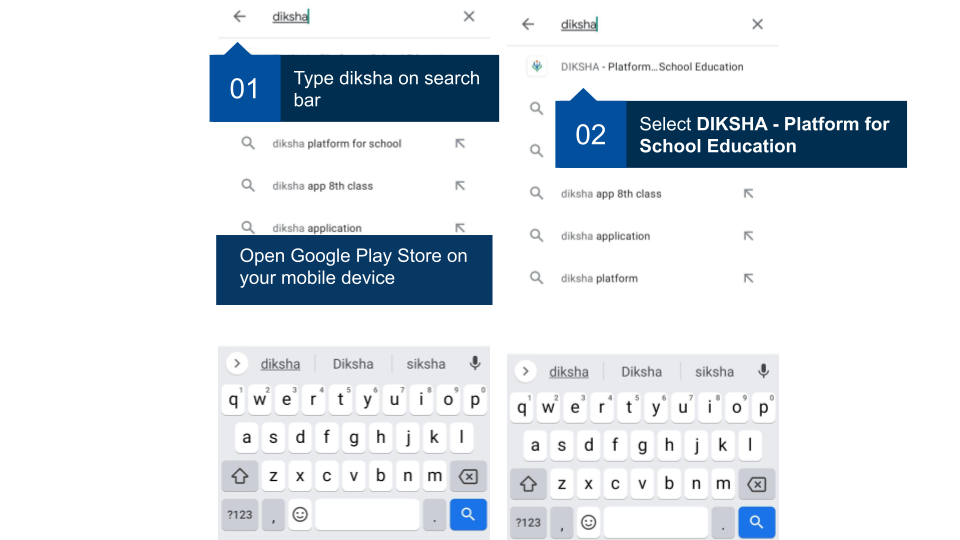
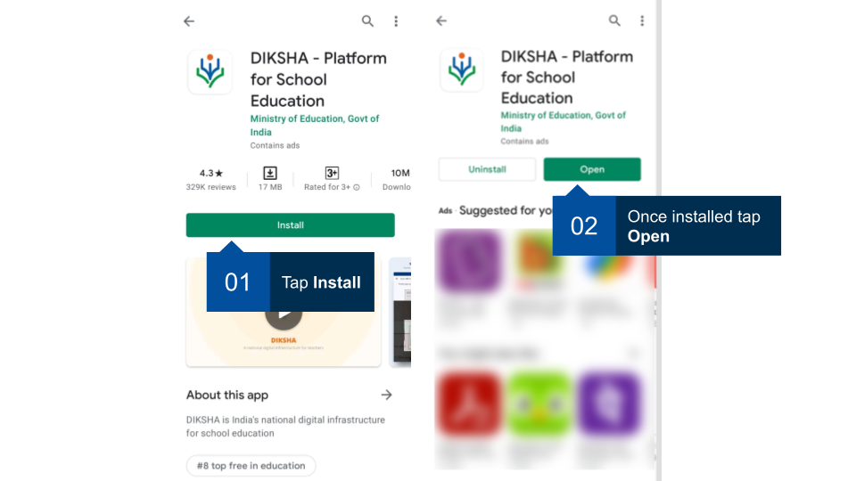
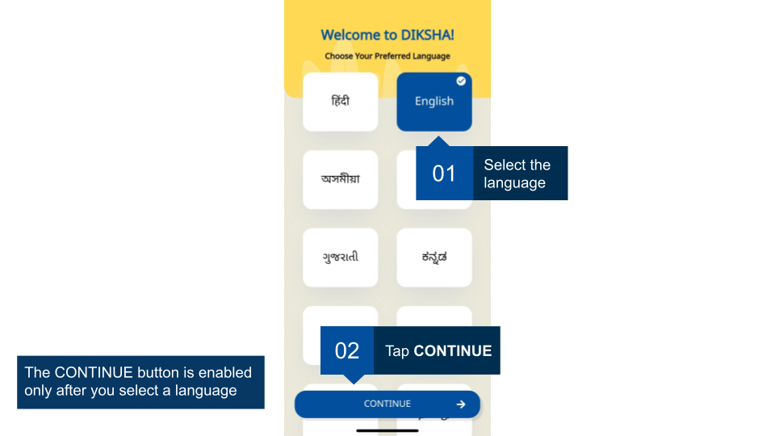
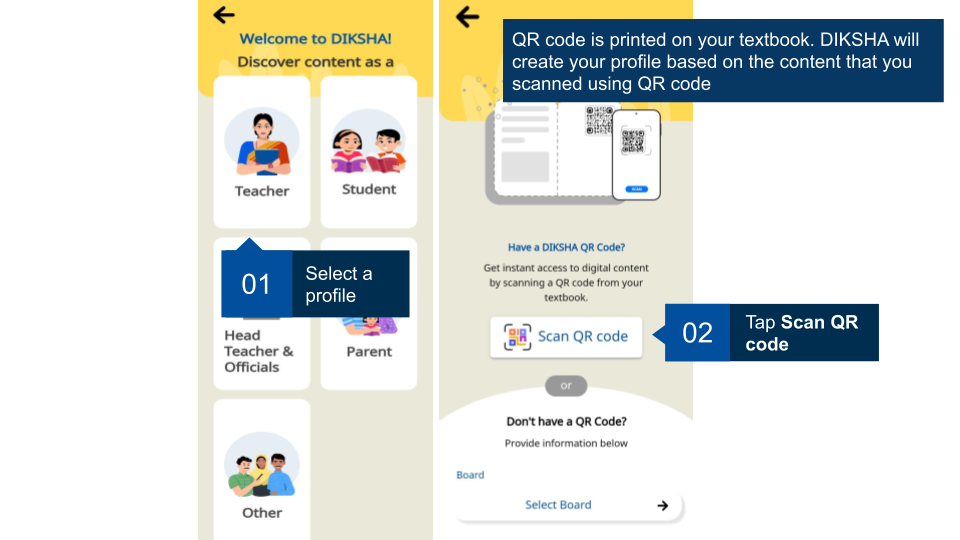
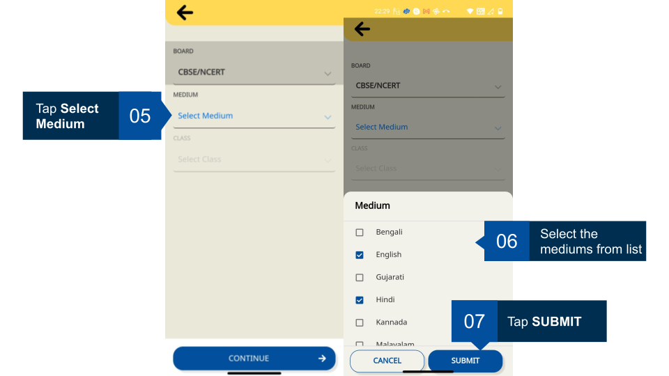
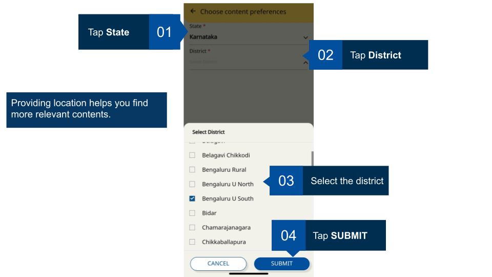
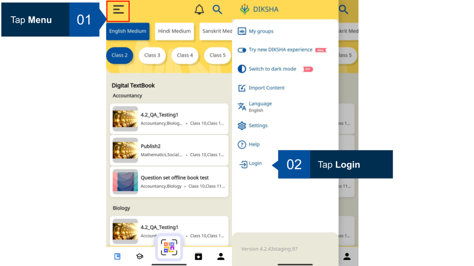
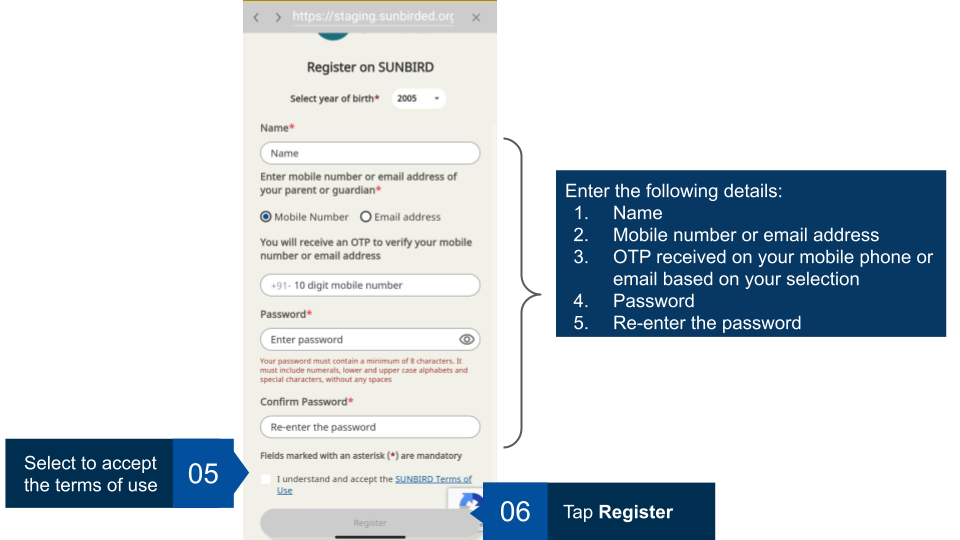

## Installing DIKSHA App

You can install the DIKSHA app using Google Play store
<table>
  <tr>
    <th style="width:35%;">Image with Instructions</th>
  </tr>
  <tr>
    <td></td>
  </tr>
  <tr>
    <td></td>
  </tr>
</table>

## Selecting Display Language for DIKSHA Mobile App

Once the DIKSHA mobile app is installed, set the display language for your app.

<table>
  <tr>
    <th style="width:35%;">Image with Instructions</th>
  </tr>
  <tr>
    <td></td>
  </tr>
</table>

## Selecting a User Profile

You can browse the DIKSHA mobile app as an anonymous user; the app displays curated content and sends topic-based notifications based on the selection of your user profile.

<table>
  <tr>
    <th style="width:35%;">Image with Instructions</th>
  </tr>
  <tr>
    <td></td>
  </tr>
  <tr>
    <td></td>
  </tr>
  <tr>
    <td></td>
  </tr>
  <tr>
    <td></td>
  </tr>
  <tr>
    <td></td>
  </tr>
</table>

## Registering on DIKSHA App

You can register on DIKSHA app using either of the following three methods:

- Google account: Login with your google account. To know more refer [Login with Google
account](./accessing-app.html#logging-in-with-google){:target="_blank"}

- State ID: Login with the user ID and password provided by the state. To know more refer [Login with State
System](./accessing-app.html#logging-in-with-state-system){:target="_blank"}

 - State ID: Login with the user ID and password provided by the state. To know more refer [Sign-in with State Credentials](./accessing-app.html#sign-in-with-state-system)

 - Self Sign-up: Create your login credentials to access DIKSHA app
- Self Register: Create your login credentials to access DIKSHA app

The <b>Register here</b> or self sign-up feature allows you to register on DIKSHA app on your own. It usually takes its
own time to start the login process. The dependency is around institutions and states to onboarding a user, data
collection, create and enable teacher accounts. To fast-track the system adoption, DIKSHA app is equipped with the self
register process.

<table>
  <tr>
    <th style="width:35%;">Image with Instructions</th>
  </tr>
  <tr>
    <td></td>
  </tr>
  <tr>
    <td></td>
  </tr>
  <tr>
    <td></td>
  </tr>
</table>