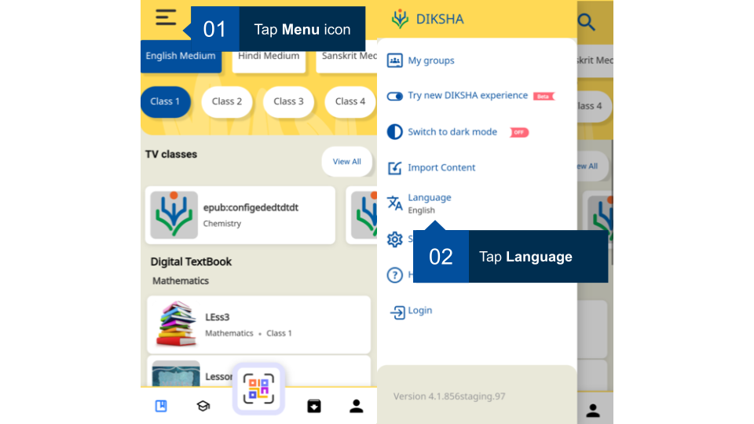
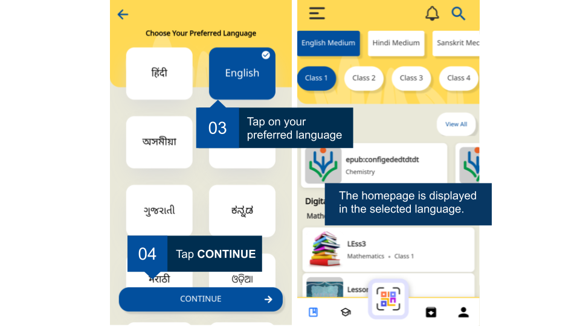

## Overview

DIKSHA mobile app is available is the following languages:

- Hindi
- English
- Assamese
- Bengali
- Gujarati
- Kannada
- Marathi
- Oriya
- Punjabi
- Tamil
- Telugu
- Urdu

<table>
<tr>
  <th>Image with instructions</th>
</tr>
<tr>
  <td></td>
  </tr>
<tr>
  <td></td>
  </tr>
</table>
