## Overview

All content resources that you have saved on your device or popular artifacts from the portal are maintained in the
Library. On the Library tab you can:

- View the library content details
- Search and filter for content available in the library
- Download content
- Play content online
- Rate content
- Share content
- Delete downloaded content from the device

### Prerequisite

- You are on <b>Library</b> tab

### Exploring and Viewing Content Details

<table>
<tr><th>Image with instructions</th></tr>
<tr><td>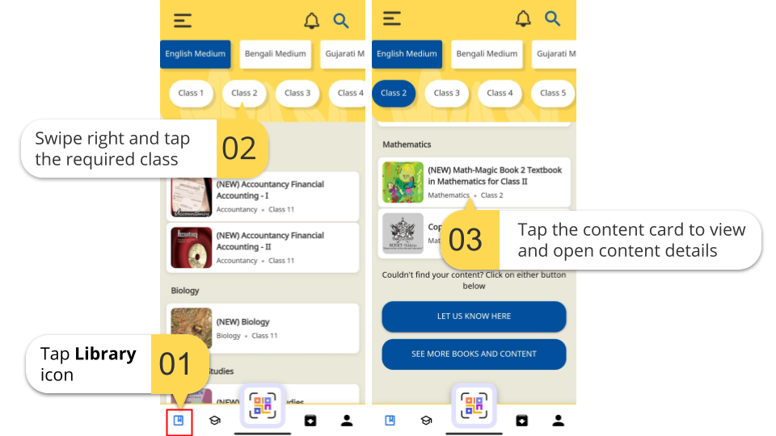</td></tr>
<tr><td>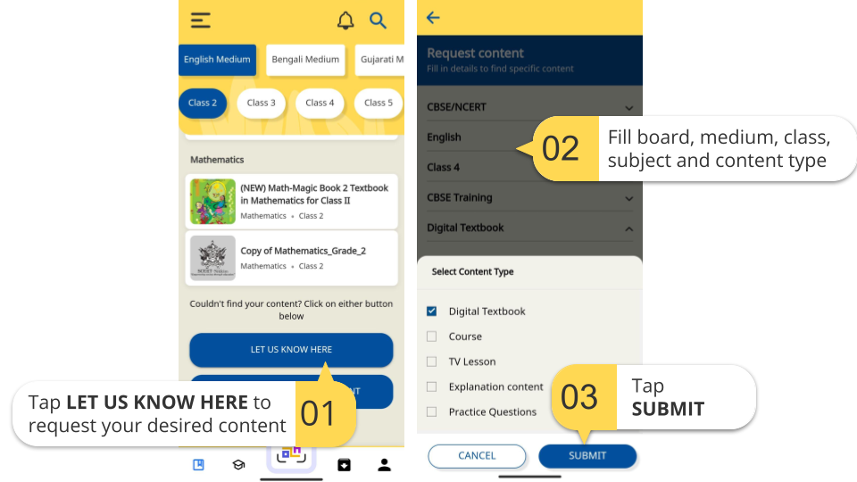</td></tr>
</table>

### Searching and Filtering Content

<table>
<tr><th>Image with instructions</th></tr>
<tr><td>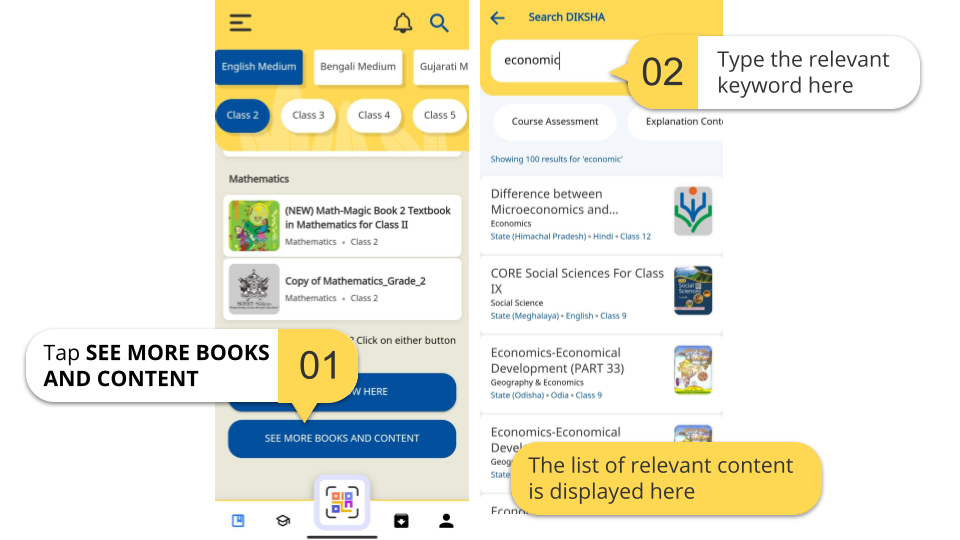</td></tr>
<tr><td>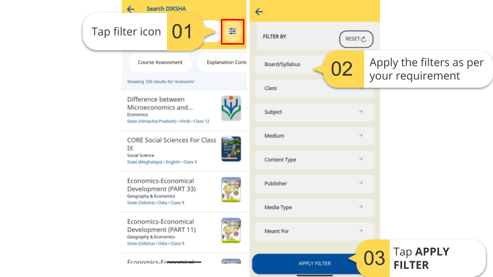</td></tr>
</table>

### Accessing Content

You can view the selected content on DIKSHA mobile app from the Library. Both anonymous and signed-in users can play and
view the content.

You can perform the following:

- <a href="#playing-content-online">Playing content online</a>
- <a href="#downloading-content">Downloading content</a>
- <a href="#sharing-content">Sharing content</a>
- <a href="#rating-content">Rating content</a>
- <a href="#deleting-content">Deleting content</a>

### Playing content online

<table>
<tr><th>Image with instructions</th></tr>
<tr><td>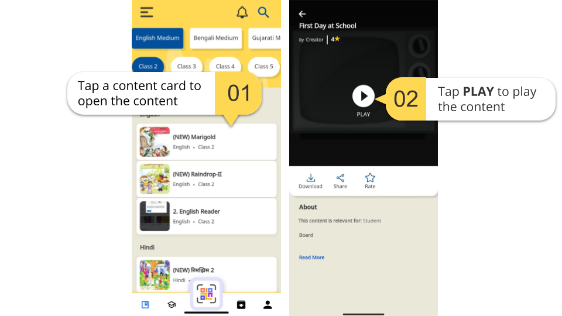</td></tr>
<tr><td>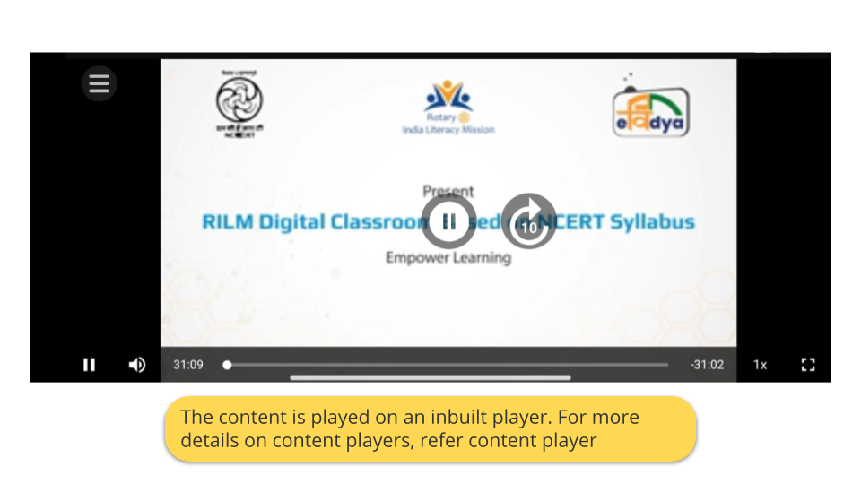</td></tr>
</table>

### Downloading content

<table>
<tr><th>Image with instructions</th></tr>
<tr><td>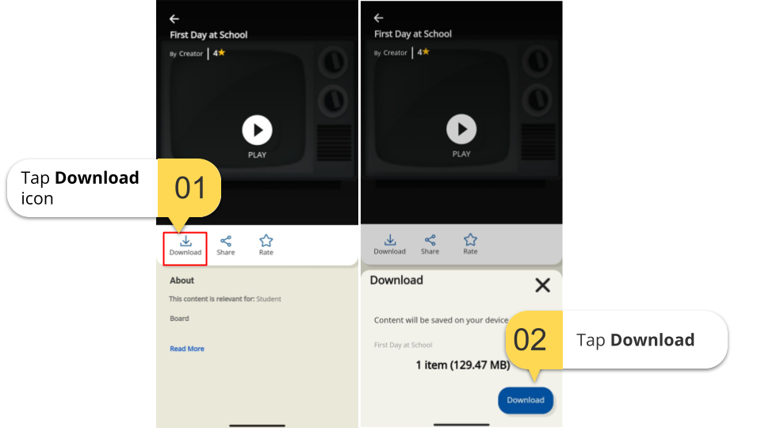</td></tr>
<tr><td>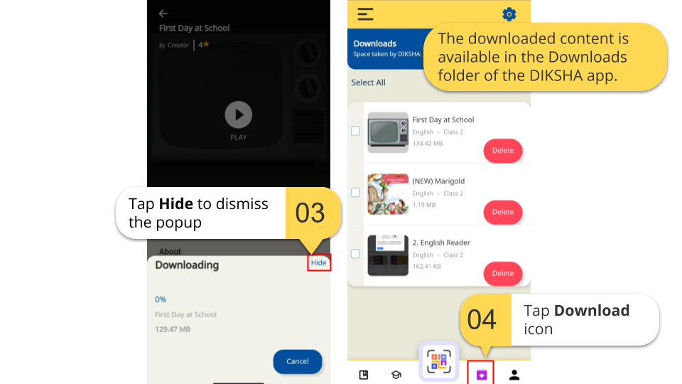</td></tr>
</table>

### Sharing content

<table>
<tr><th>Image with instructions</th></tr>
<tr><td>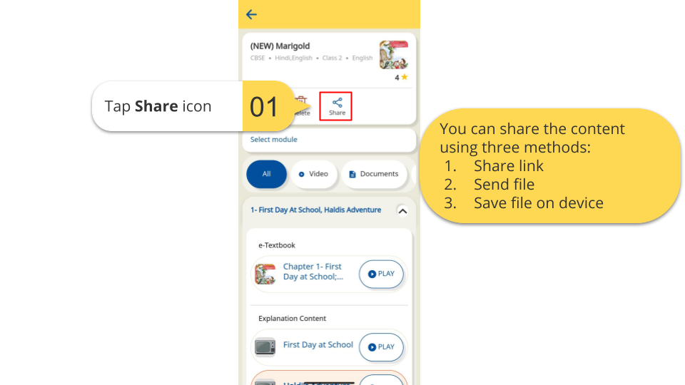</td></tr>
<tr><td>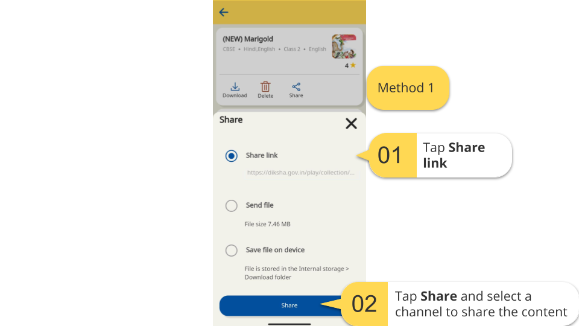</td></tr>
<tr><td>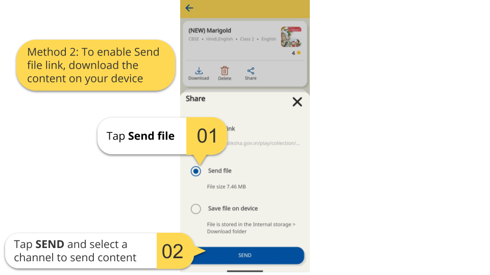</td></tr>
<tr><td></td></tr>
</table>

### Rating content

<table>
<tr><th>Image with instructions</th></tr>
<tr><td>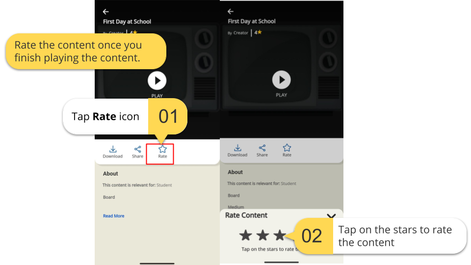</td></tr>
<tr><td>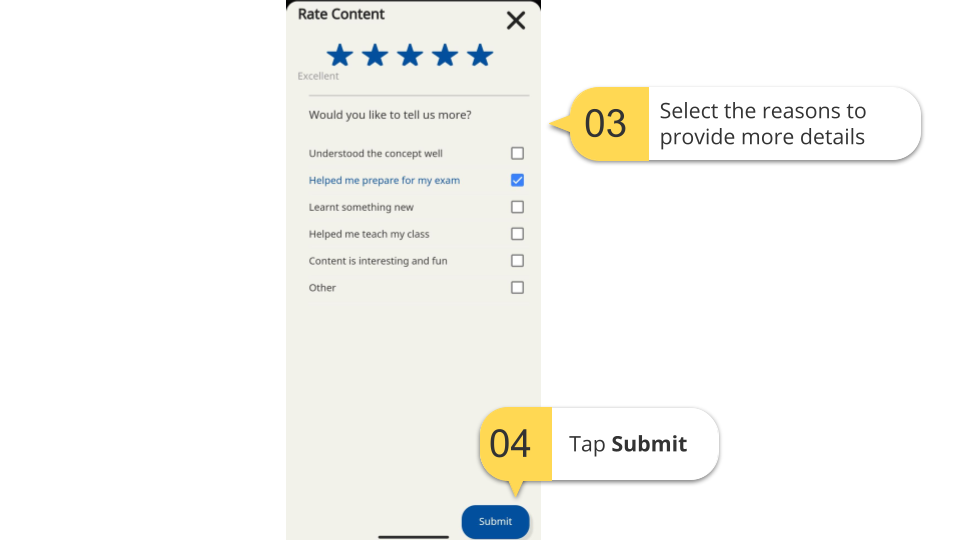</td></tr>
</table>

### Deleting content

<table>
<tr><th>Image with instructions</th></tr>
<tr><td>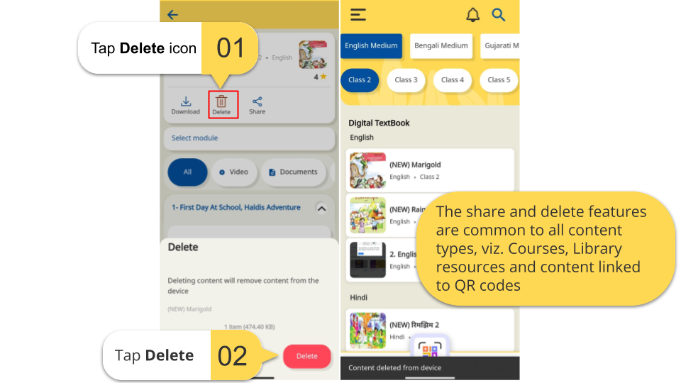</td></tr>
<tr><td>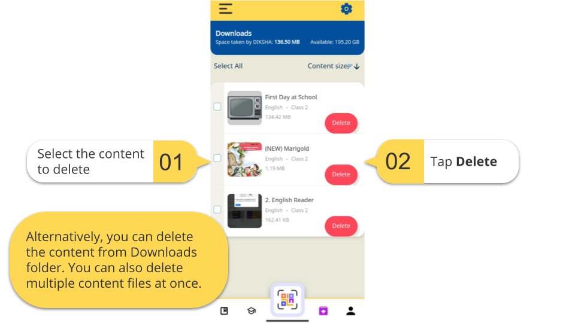</td></tr>
</table>

