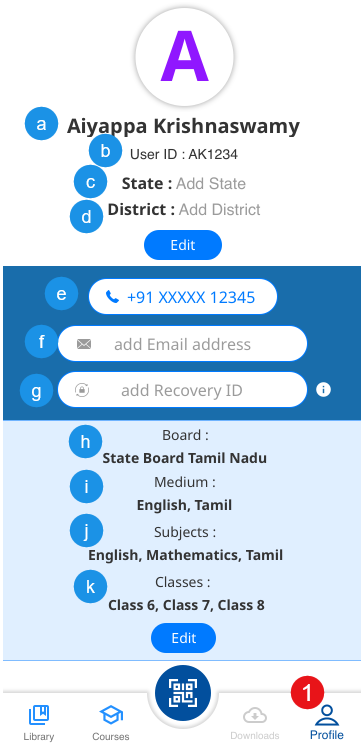
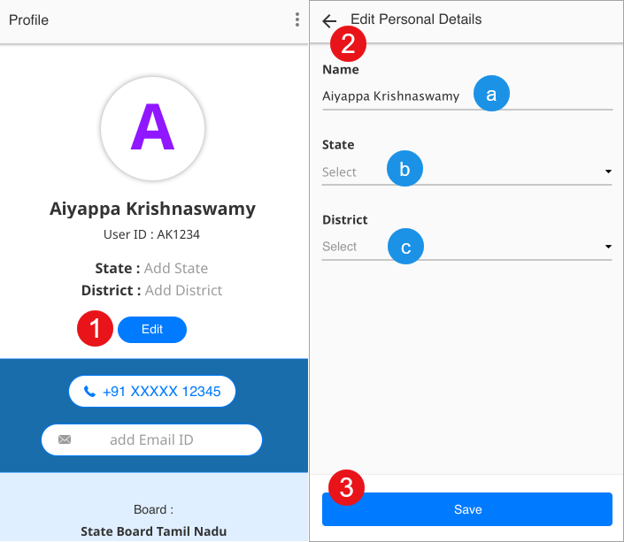
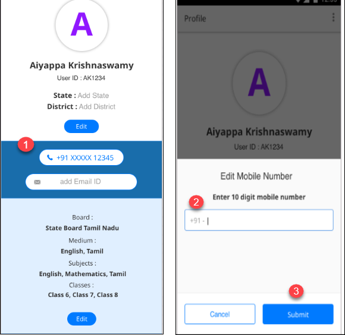
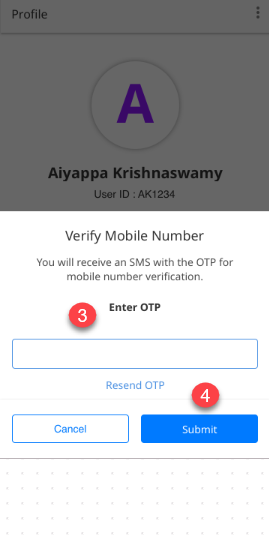
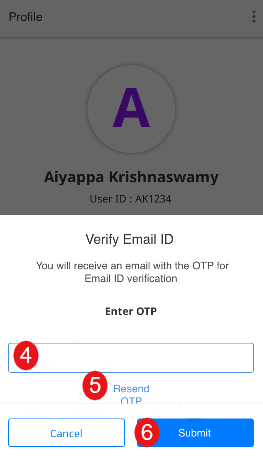
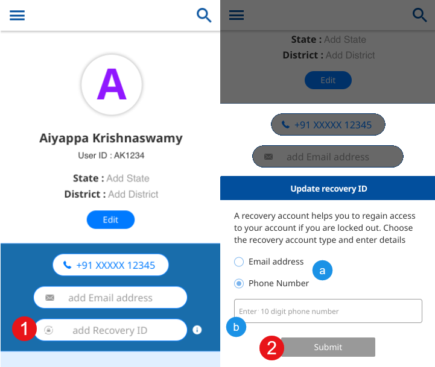
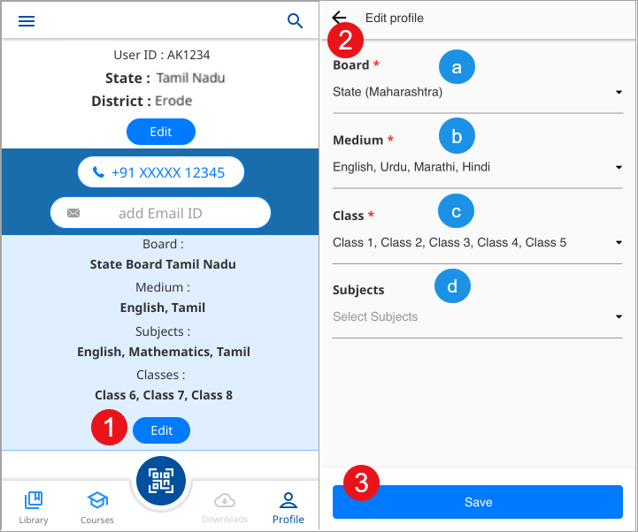
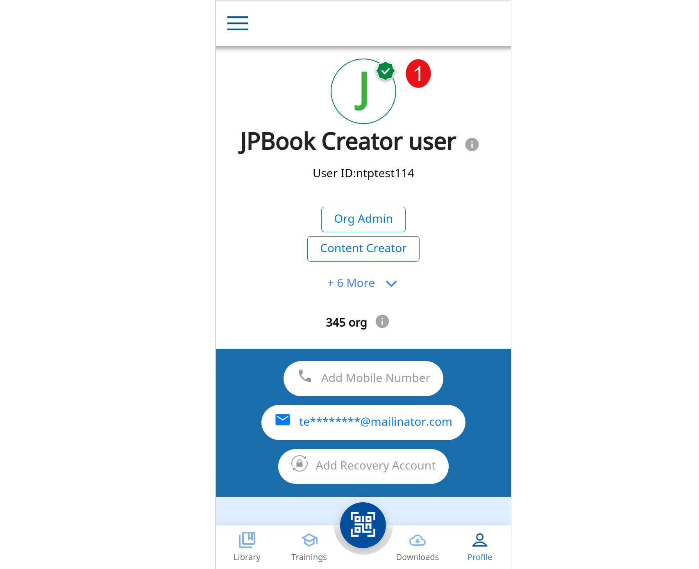
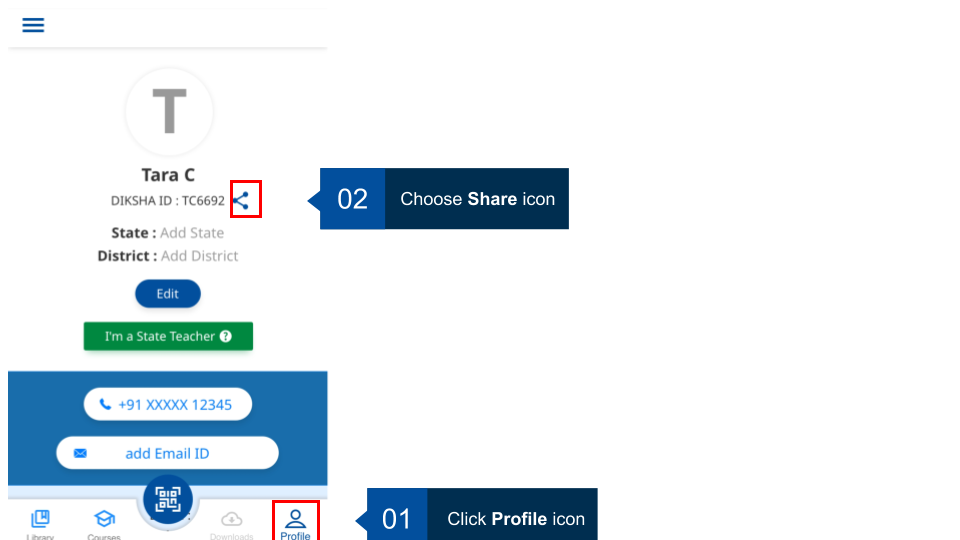

## Overview

The profile page allows you to view and edit your profile details and create new users and groups.

### Viewing Profile Details of a Registered User

You can view your profile details using the Profile tab

<table>
  <tr>
    <th style="width:35%;">Step</th>
    <th style="width:65%;">Screen</th>
  </tr>
  <tr>
    <td>1. Tap the <b>Profile</b> tab, to view the following information:
       &emsp;a. <b>Username</b>
       &emsp;b. <b>User ID</b>
       &emsp;c. <b>State</b>
       &emsp;d. <b>District</b>
       &emsp;e. <b>Mobile number</b>
       &emsp;f. <b>Email address</b>
       &emsp;g. <b>Recovery ID</b>
       &emsp;h. <b>Board</b>
       &emsp;i. <b>Medium</b>
       &emsp;j. <b>Subjects</b>
       &emsp;k. <b>Classes</b>
       <b>Note</b>: 
      <li>If you are a user associated with a state, your user role is also visible</li>
      <li>All your completed courses or courses are displayed in the <b>Courses</b> section</li>
      <li>Content that you have created is displayed in the <b>Content Created by Me</b> section</li>
      <li>Your assigned badges are displayed in the <b>Badge</b> section along with the number of badges </li>
    </td>
    <td></td>
  </tr>
</table>

### Editing Profile Details

You can edit the following details using the **Profile** tab:

- Personal details such as name, state, and district

- Contact details such as a mobile number and email address

- Other details such as board, medium, subject, and class

<table>
  <tr>
    <th style="width:35%;">Step</th>
    <th style="width:65%;">Screen</th>
  </tr>
  <tr>
    <td><b>Editing Personal Details</b> 1. Tap <b> Edit</b> to update the following details:
       &emsp;a. <b>Name</b>
       &emsp;b. <b>State</b>
       &emsp;c. <b>District</b>
       The <b> Edit details </b> window is displayed
       2. Enter the appropriate values for each of the fields based on the selected value for <b>State</b>, the value
      for the <b>District</b> drop-down is populated
       3. Tap <b>Save</b> after you edit the details</td>
    <td></td>
  </tr>
  <tr>
    <td><b> Editing and Verifying Mobile Number</b>
       1. Tap the <b>Mobile number</b> field to update your phone number. The edit mobile number pop-up is displayed
      here
       2. Edit the number
       3. Tap <b>Submit</b> after you edit the details
       You will receive an OTP through SMS to verify your phone number</td>
    <td></td>
  </tr>
  <tr>
    <td>4. Enter the OTP that you have received in the <b>Enter OTP</b> field
       5. Tap <b>Resend OTP</b> to get another OTP on your mobile number
       6. Tap <b>Submit</b>
       7. Tap <b>Cancel</b> to go back</td>
    <td></td>
  </tr>
  <tr>
    <td><b> Editing and Verifying Email Address</b>
       1. Tap the <b>Email address</b> field to update your email address. The edit email address pop-up is displayed here
       2. Edit the email address
       3. Tap <b>Submit</b>
       You will receive an OTP through email to verify your email address</td>
      <td></td>
  </tr>
  <tr>
    <td>4. Enter the OTP that you have received in the <b>Enter OTP</b> field
       5. Tap <b>Resend OTP</b> to get another OTP on your email address
       6. Tap <b>Submit</b>
       7. Tap <b>Cancel</b> to go back</td>
    <td></td>
  </tr>
  <tr>
    <td><b>Recovery ID</b>
       1. Tap <b>add Recovery ID</b> to add your mobile number or email address as your recovery account
       &emsp;a. Tap <b>Email address</b> or <b>Phone number</b>
       &emsp;b. Enter a valid email address or 10 digit mobile number
       3. Tap <b>Submit</b></td>
    <td></td>
  </tr>
  <tr>
    <td><b>Editing Other Details</b>
       1. Tap <b>Edit</b> to update the following details:
       &emsp;a. <b>Board</b>
       &emsp;b. <b>Class</b>
       &emsp;c. <b>Medium</b>
       &emsp;d. <b>Subject</b>
       A window is displayed
       2. Select the appropriate values for each of the fields
       <b>Note</b>: 1. Based on the selected value for any field, the subsequent field displays the dependent values.
      For example, selecting <b>Andhra Pradesh State Board</b>, <b>Telugu</b> appears as the <b>Medium of instruction</b>
        2. If a registered user is from an organization which is not associated with any board, then the field <b>Board</b> is not displayed to that user.
       3. Tap <b>Submit</b></td>
    <td></td>
  </tr>
<tr>
    <td>A state registered user is not allowed to edit the name and the organization details. An information icon is displayed next to these fields. Click the information icon, a message "<b>As per state records</b>" is displayed </td>
    <td></td>
  </tr>
</table>

#### Sharing DIKSHA ID 

You can share your DIKSHA ID with the group admin from your Profile page. You can choose the modes such as SMS, WhatsApp, email for sharing your ID. 

<table> 
<tr>
  <th>Image with instructions</th>
</tr>
<tr>
  <td></td>
  </tr>
</table>
