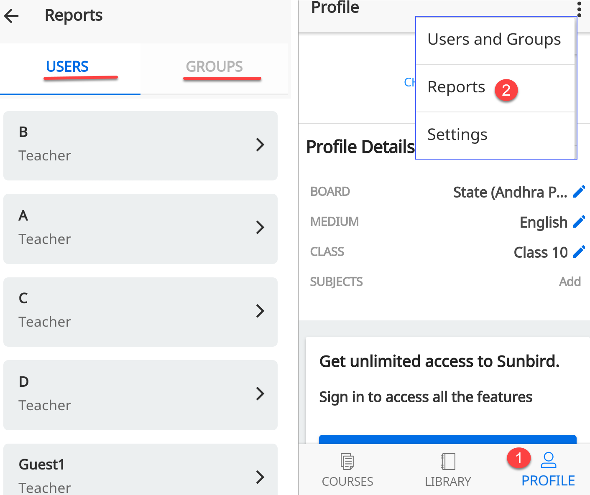
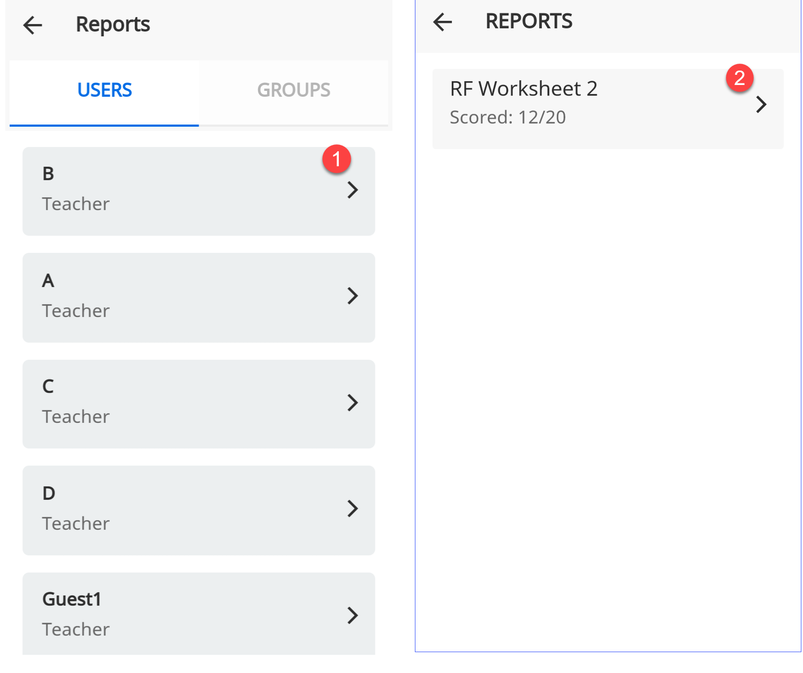
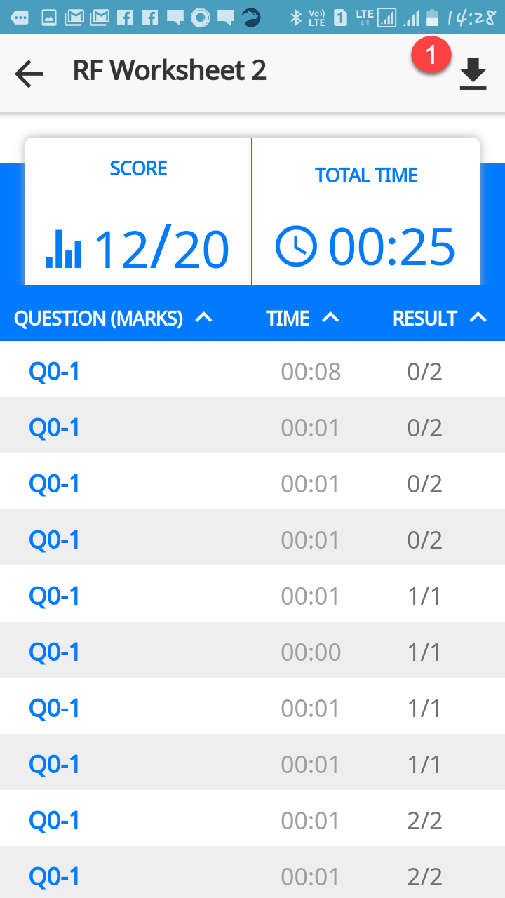
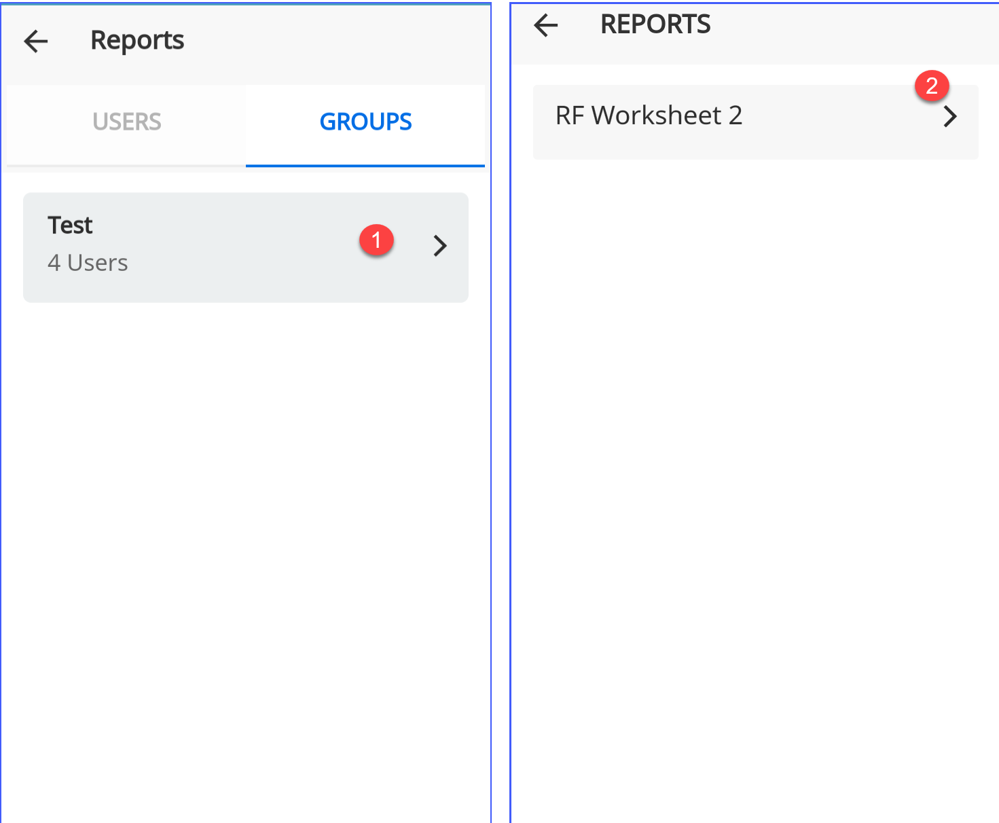

## Overview

Reports allow you to view and download the reports of user and group that are created by you. You can even view and
download reports of assessments taken by the users and groups created by you.

## Viewing and Downloading Report

<table>
  <tr>
    <th style="width:35%;">Step</th>
    <th style="width:65%;">Screen</th>
  </tr>
  <tr>
    <td>You can only view and download the reports of users and groups that are created by you
     To download the report:
     1. Tap <b>Profile</b>
     2. Tap <b>Report</b> from the burger menu. A window is displayed with two tabs:
     <b>User</b>: You can view all reports of all the users created by you, but you can only download the assessment report of a user if the user has taken up any assessment
     <b>Groups</b>: You can view and download the report for a group that you have created for an assessment</td>
    <td></td>
  </tr>
  <tr>
    <td>To view and download report of assessments taken by a user:
     1. Tap the arrow icon beside a username. It opens the assessment which is taken by the user
     2. Tap the arrow icon beside the assessment. It opens the assessment result</td>
    <td></td>
  </tr>
  <tr>
    <td><b>Downloading User Report</b>
     1. Tap the download icon to download the report. The report is saved in your local folder</td>
    <td></td>
  </tr>
  <tr>
    <td>To view and download report of assessment for a group:
     1. Tap the arrow icon beside a group. It opens the assessment taken by the group
     2. Tap the arrow icon beside the assessment. It opens the assessment result</td>
    <td></td>
  </tr>
  <tr>
    <td><b>Downloading Group Report</b>
     1. Tap the download icon to download the report. The report is saved in your local folder</td>
    <td></td>
  </tr>
</table>