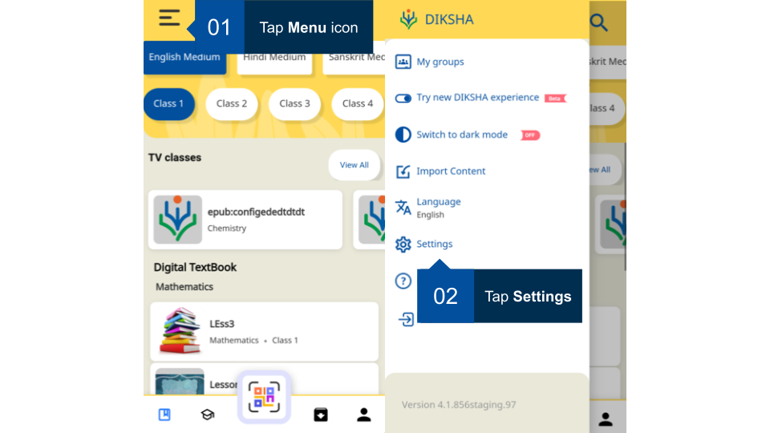
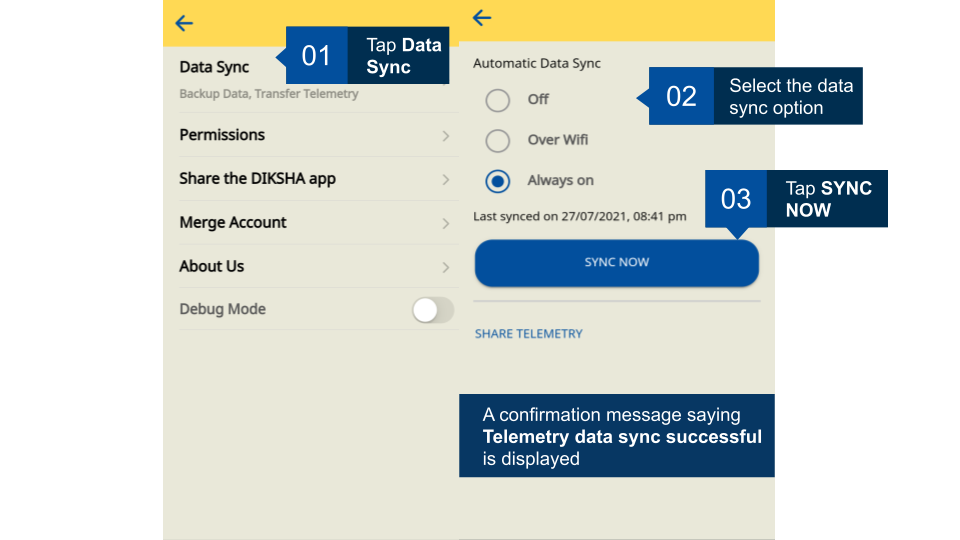
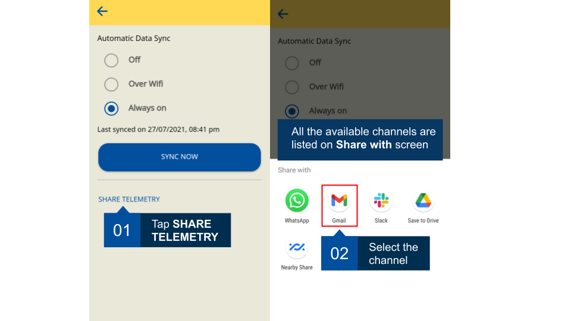
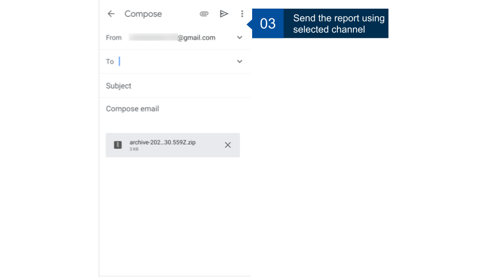
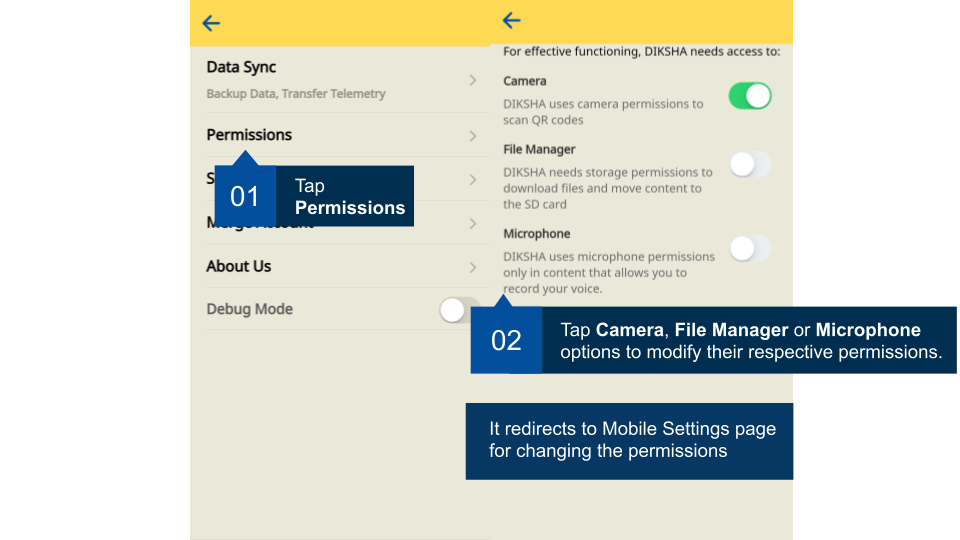
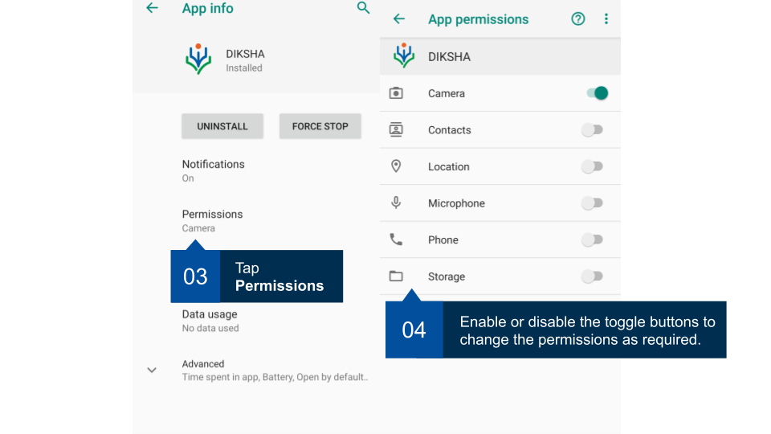
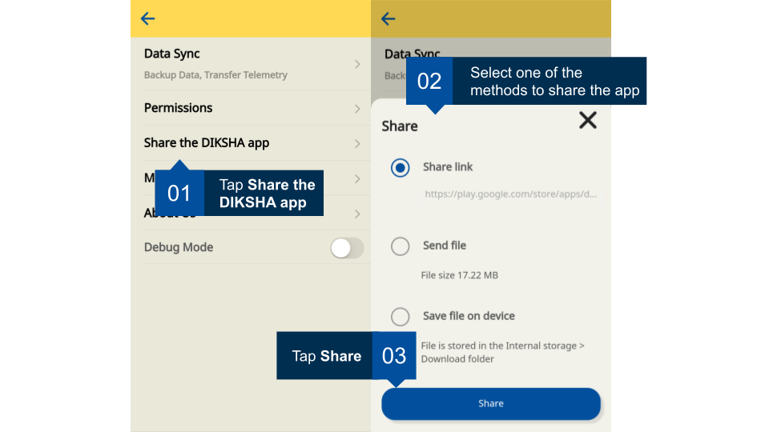
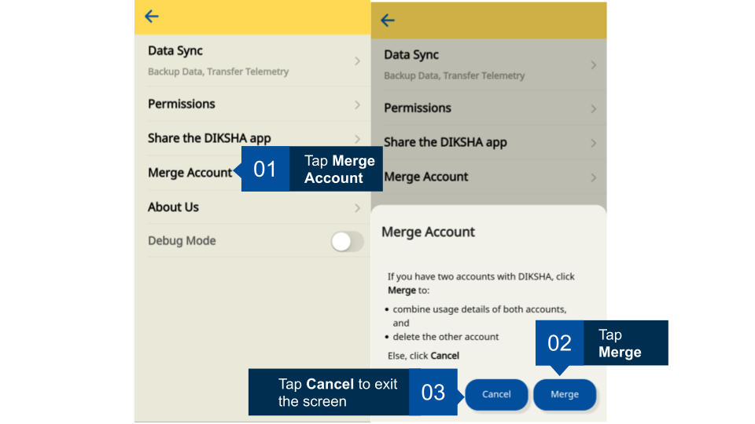
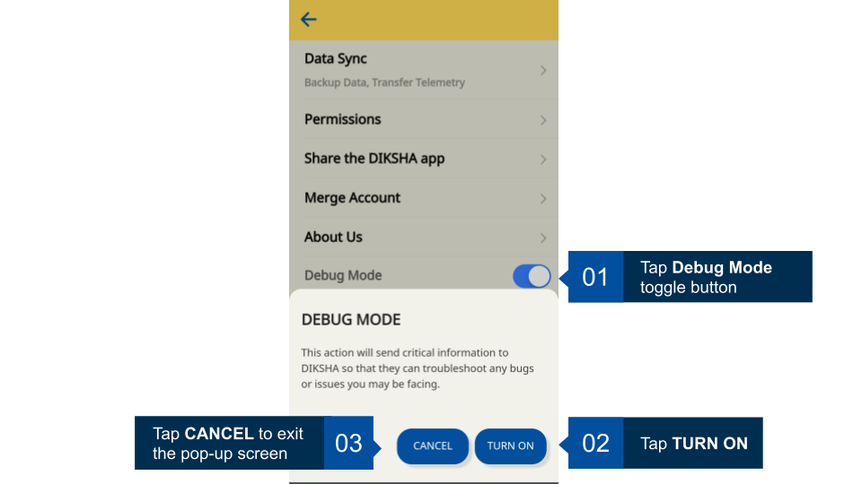
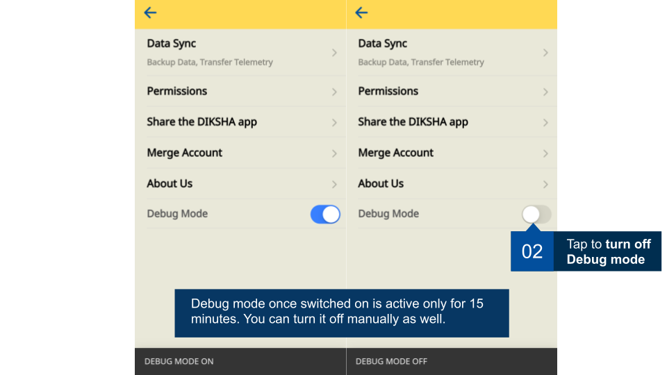

The setting allows you to backup and sync telemetry data, know about your device ID and app version, contact support, merge account, share DIKSHA app with others, and debug mode.

## Prerequisites

<table>
<tr>
  <th>Image with instructions</th>
</tr>
<tr>
  <td></td>
</tr>
</table>

## Exploring Application Settings
You can perform the following actions using the settings option: 
1. Data Sync
2. Permission
3. Share the DIKSHA App
4. Merge Account
5. About Us
6. Debug Mode

### Syncing Data and Sharing Telemetry Report

DIKSHA allows you to sync data for back up and share telemetry data.

<table>
<tr>
  <th>Image with instructions</th>
</tr>
<tr>
  <td></td>
</tr>
<tr>
  <td></td>
</tr>
<tr>
  <td></td>
</tr>
</table>

### Managing Permission

For effective use of DIKSHA, you must allow DIKSHA app to use your phone's camera, file manager, and microphone. You can allow or deny the permission at the time of installing the app. You can modify the permissions later using the app setting feature. 
If you deny permissions while installing the app, you can allow them at the time of using the feature.

<table>
<tr>
  <th>Image with instructions</th>
</tr>
<tr>
  <td></td>
</tr>
<tr>
  <td></td>
</tr>
</table>

### Sharing DIKSHA App 

<table>
<tr>
  <th>Image with instructions</th>
</tr>
<tr>
  <td></td>
</tr>
</table>

### Merging Accounts 

This feature allows you to merge your state account with your self-signed up account. To know more, refer <a href ="../user-profile/merge-accounts.html" target="_blank">Merge Accounts</a> 
<table>
<tr>
  <th>Image with instructions</th>
</tr>
<tr>
  <td></td>
</tr>
</table>

### Knowing About the App

<table>
<tr>
  <th>Image with instructions</th>
</tr>
<tr>
  <td></td>
</tr>
</table>

### Debug Mode

DIKSHA provides the debug mode feature in order to provide better user support. Once you turn on the debug mode, it will send critical information to DIKSHA so that they can resolve any issues you may be facing.
<table>
<tr>
  <th>Image with instructions</th>
</tr>
<tr>
  <td></td>
</tr>
<tr>
  <td></td>
</tr>
</table>