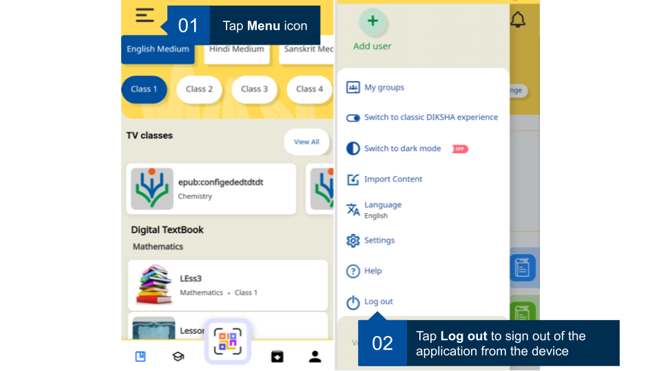

## Log out from DIKSHA Mobile App 

The DIKSHA app supports multiple users on the same device. Before you login with any other credentials on the device ensure you log out from your current account and the subsequent session. To protect any unauthorised access to your account on DIKSHA app, you must log out from DIKSHA mobile app on a device. 

<table>
<tr>
  <th>Image with instructions</th>
</tr>
<tr>
  <td></td>
  </tr>
</table>