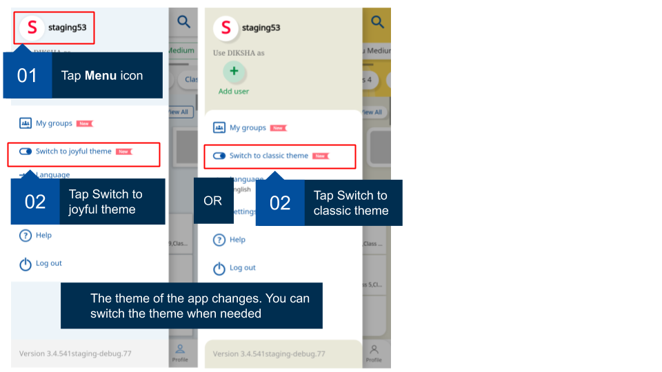

## Overview

The help section within the DIKSHA mobile app assists users to change the look and feel of the application. You can switch the themes to the new joyful theme or the classic theme using this option. You can access the themes section from the main app menu. 

<table>
<tr>
  <th>Image with instructions</th>
</tr>
<tr>
  <td></td>
  </tr>
</table>
