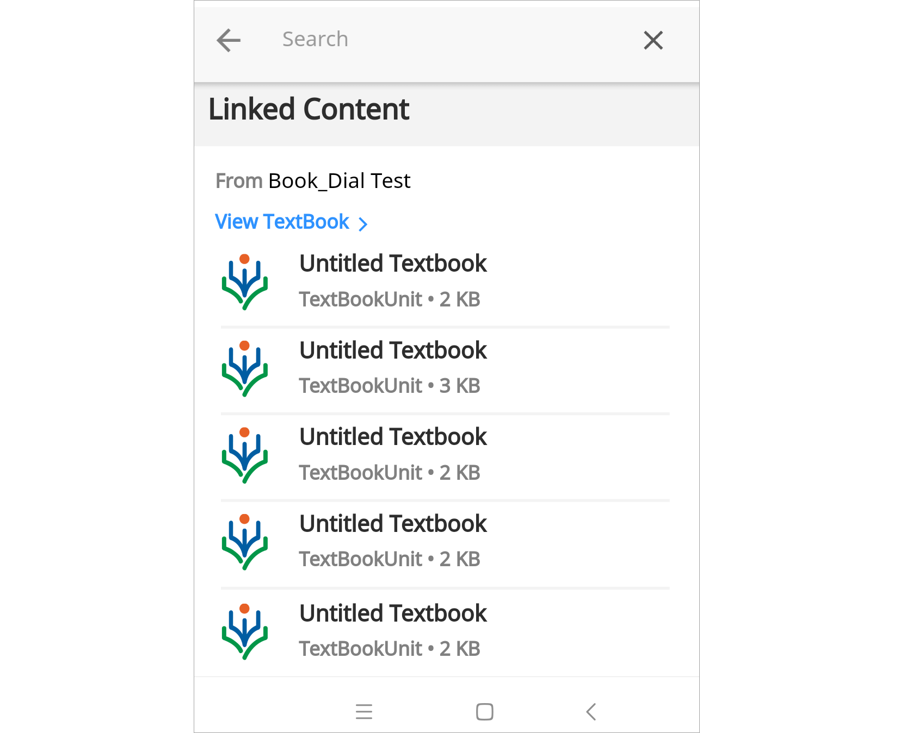

## Overview

A QR code is an image with patterns of black and white squares that can be read by an electronic device with a scanner. QR codes are positioned appropriately and printed on the textbooks to make it easier to access the relevant content and understand the topics better. The scan results across all content types (courses, textbooks, individual content).

You can scan the QR code using the DIKSHA mobile app (both registered or guest user) on your

- Smartphone 
- Tablet
- Laptop using Chrome browser

When you scan a QR code of a unit or a content that exists on your device (downloaded) on your device, the QR scan will display relevant content, irrespective of whether you are online or offline.

## Scanning QR Code

To scan the QR code using DIKSHA app:

<table>
  <tr>
    <th style="width:35%;">Step</th>
    <th style="width:65%;">Screen</th>
  </tr>
  <tr>
    <td>1. Tap the <b>QR code</b> scanner icon on the homepage of the app
     2. Focus the scanner over the printed QR code to scan it</td>
    <td></td>
  </tr>
  <tr>
    <td>If there are more than one content for the same QR code, the user is presented with a list of results else the user is automatically taken to the content details page of the content linked to the scanned QR code. 
    <b>Note</b>: You can scan QR codes from the homepage (except while consuming a content or editing details on the Profile page)
     &emsp; While registering on the app, if the user does not update the Board, Medium and Grade information, the QR code scan determines the profile information. Even when the scan is invalid, the most relevant search result is displayed.</td>
    <td></td>
  </tr>
</table>
