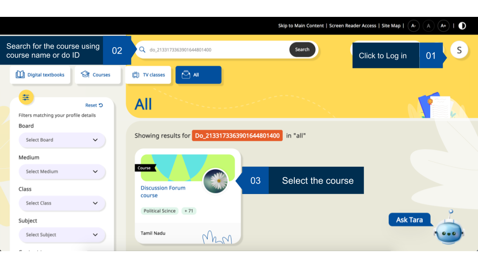
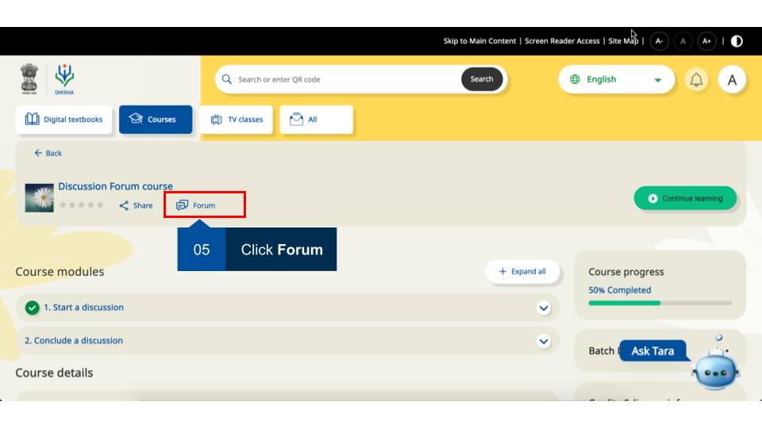
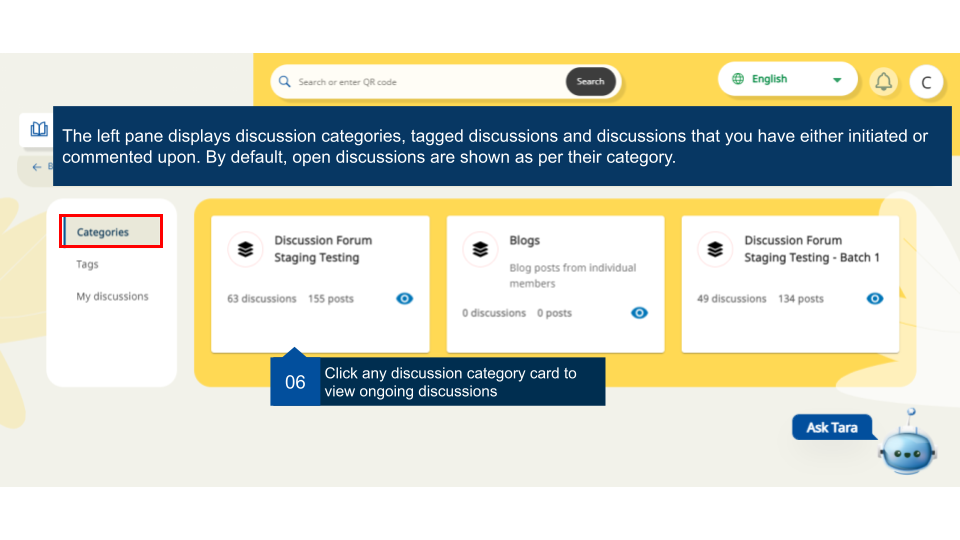
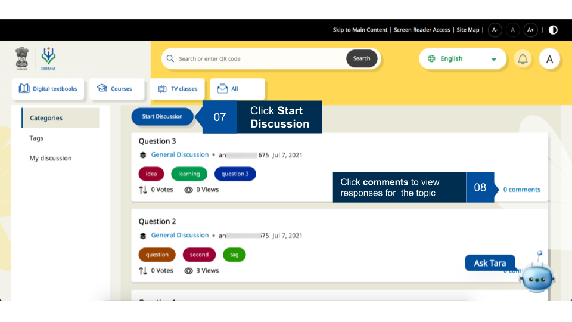
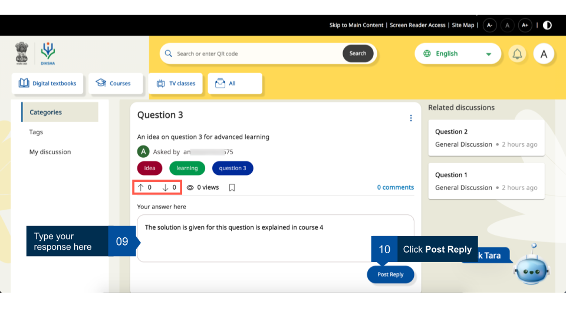
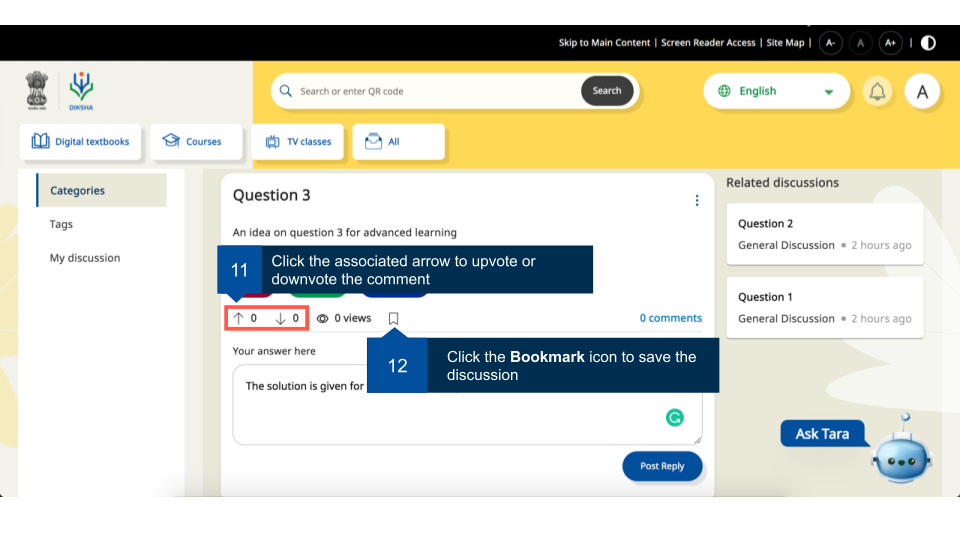
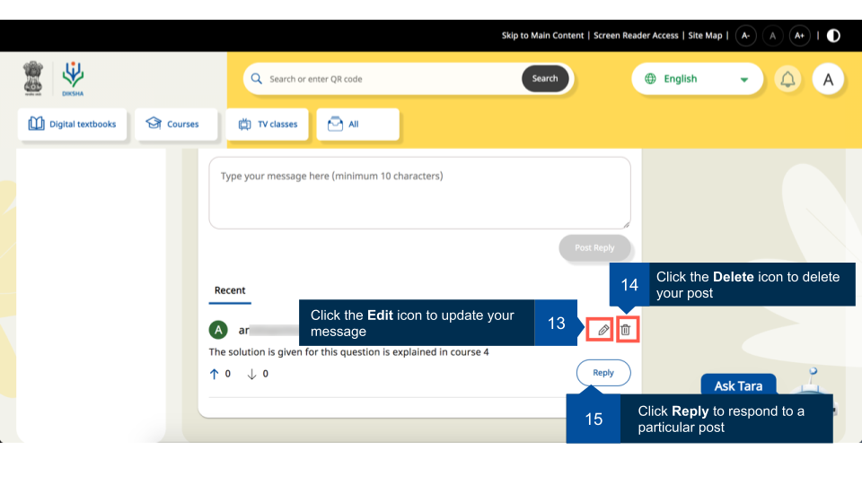
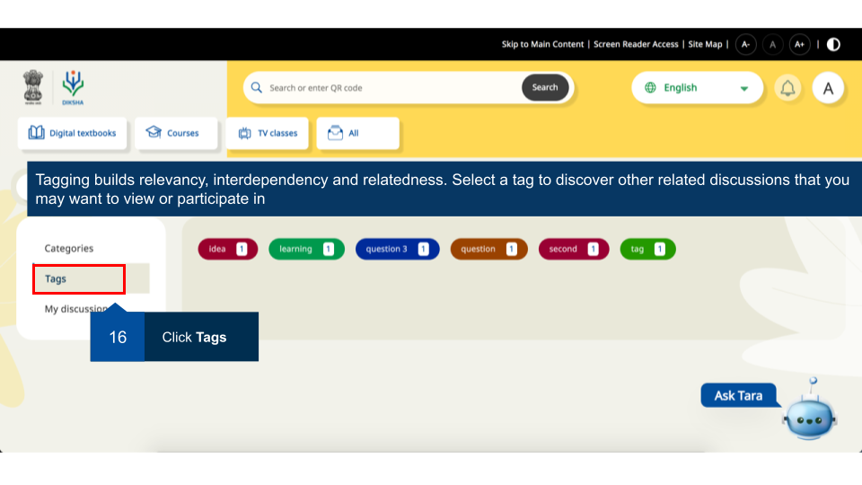
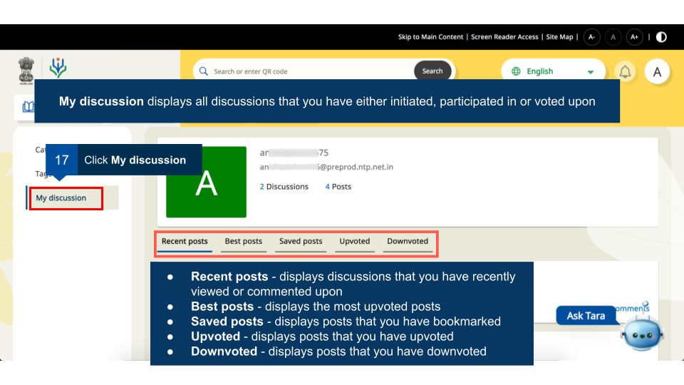

## Overview

Currently user's interaction with the platform is primarily limited to consuming the content. This can be significantly enriched if user's interact with their peers using discussion forums and in this process learn through collaboration. A course creator can enable or disable discussion forum for courses to enable or restrict the members to participate in discussions. 

The discussion forums are enabled for the following capabilities to the users:  

  - Discussion forums for a course batch or groups by the  
  - Broadcast notifications to the users   
  - Initiate discussion topic/participate in existing discussions  

<table>
<tr><th>Image with instructions</th></tr>
<tr><td></td></tr>
<tr><td></td></tr>
<tr><td>Before starting the chosen course, the user needs to agree to the terms and policies of DIKSHA. The 'Continue' button on the pop-up is enabled only after the user checks the box. The user cannot exit the pop-up without agreeing.</td></tr>
<tr><td></td></tr>
</table>

## Accessing Discussion Forum 

Registered users can join any available batch of a course. These courses may have discussion forums enabled by the course creator. User can view discussions around different categories, tag them with appropriate label for increasing their searchability, and the discussion started by them or any comments they have made.
   
<table>
<tr><th>Image with instructions</th></tr>
<tr><td></td></tr>
</table>

### Discussion Categories

<table>
<tr> <th>Image with instructions</th></tr>
<tr>  <td></td></tr>
</table>

#### Start a Discussion

<table>
<tr>  <th>Image with instructions</th></tr>
<tr>  <td></td></tr>
<tr>  <td></td></tr>
<tr>  <td></td></tr>
<tr>  <td></td></tr>
</table>

### View Tags for Discussion

<table>
<tr>  <th>Image with instructions</th></tr>
<tr>  <td></td></tr>
</table>

### View My Discussion

<table>
<tr>  <th>Image with instructions</th></tr>
<tr>  <td></td></tr>
</table>

