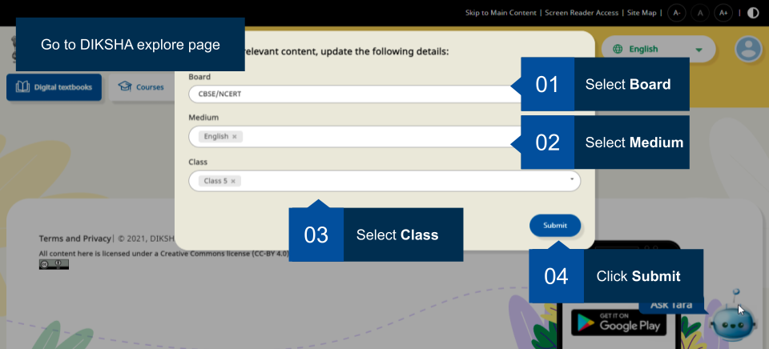
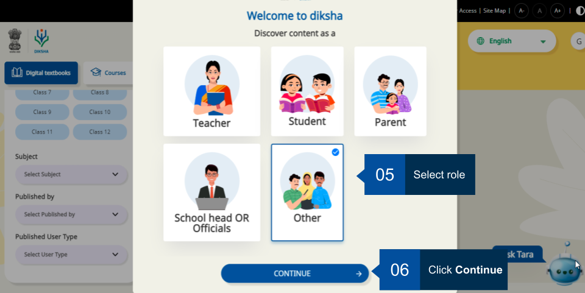
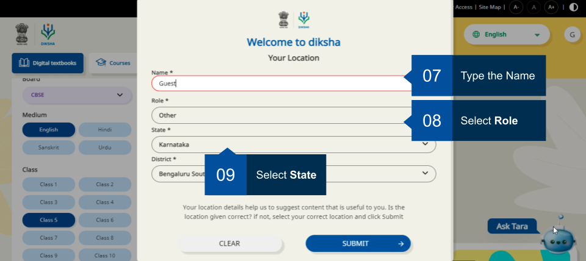
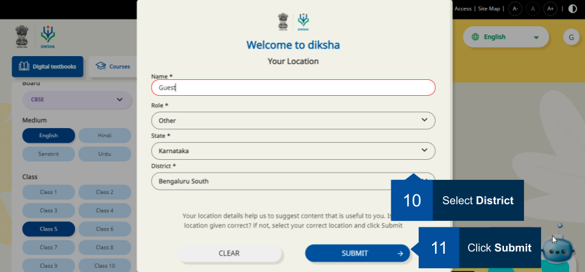
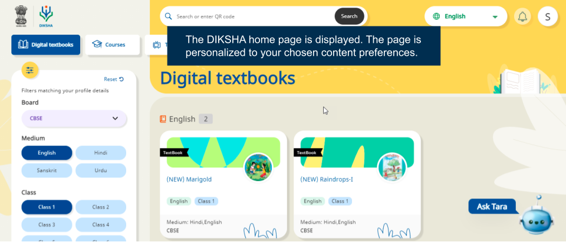
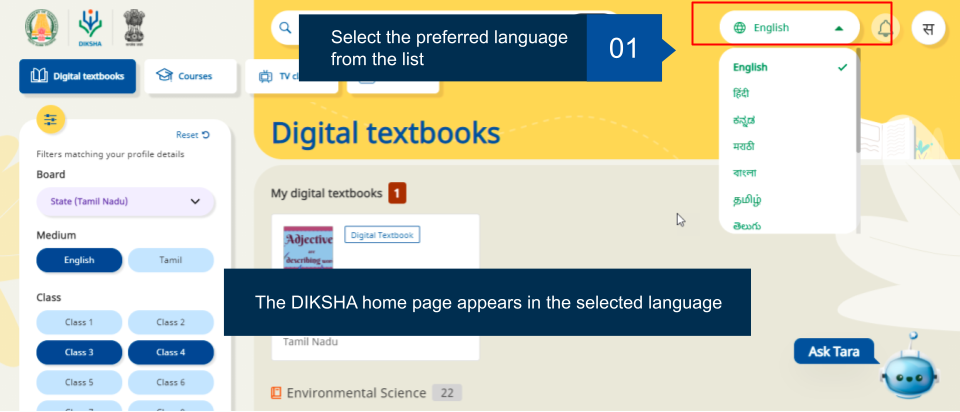
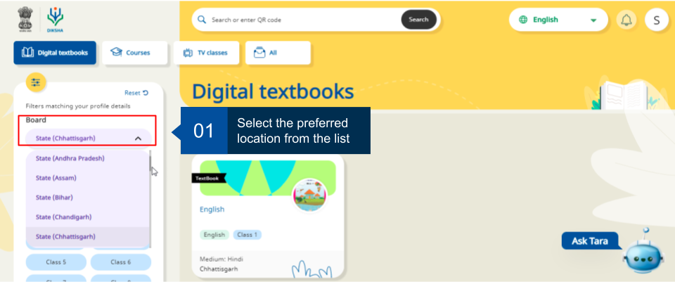
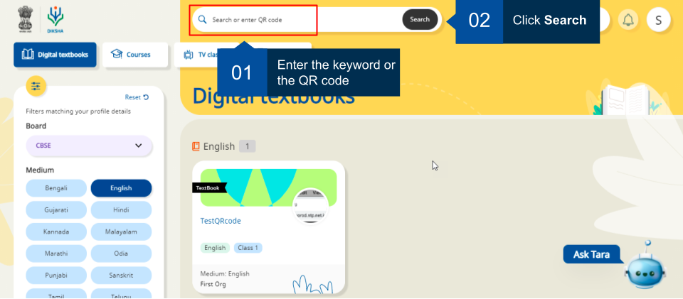
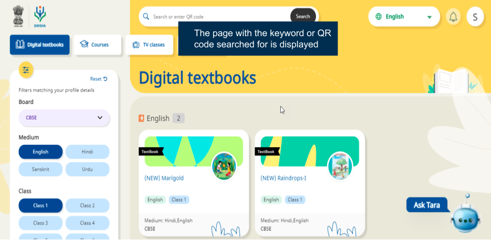

An anonymous user can explore DIKSHA and access the content available in the repository. 

## Exploring Content 

DIKSHA has a repository of content that can be used by teachers and students. It is recommended that you select a user profile so that content relevant to you is displayed thereby enhancing your search results and overall accessibilty of content.

To explore content on DIKSHA, type [diksha.gov.in](diksha.gov.in) in the browser, and follow the below steps:	

<table>
  <tr>
    <th style="width:35%;">Image with instructions</th>
 </tr>
  <tr>
    <td></td>
    </tr>
  <tr>
    <td></td>
    </tr>
   <tr>
    <td></td>
    </tr>
    <tr>
    <td></td>
    </tr>
    <tr>
    <td></td>
    </tr>
</table>

## Selecting Language

The DIKSHA portal is available in the following languages:

- English
- Hindi 
- Kannada
- Bengali
- Marathi
- Tamil 
- Telugu
- Urdu
- Assamese  
- Gujarati
- Odiya  
- Punjabi

<table>
  <tr>
    <th style="width:35%;">Image with instructions</th>
 </tr>
  <tr>
    <td></td>
    </tr>
</table>

## Selecting Location

One final step before exploring the variety of content is to update your location.

<table>
  <tr>
    <th style="width:35%;">Image with instructions</th>
 </tr>
  <tr>
    <td></td>
    </tr>
</table>

### Searching Content on DIKSHA Portal

On DIKSHA you can search for content using the Search bar, QR codes or Explore Content options. You may search and choose the content based on the interests and needs. Using a combination of filters to get to specific content. These search filters are now saved and bookmarked to be able to work seamlessly across all platforms and devices (portal, mobile or desktop). Also, the links provided through WhatsApp, Tara chatbot, posters works across any device or platform.

<table>
  <tr>
    <th style="width:35%;">Image with instructions</th>
 </tr>
  <tr>
    <td></td>
    </tr>
  <tr>
    <td></td>
    </tr>
</table>

 For more details on Library section refer <a href="/help/getting-started/library/index.html" target="_blank">Library</a> 
 For more details on Courses section refer <a href="/help/getting-started/courses/index.html" target="_blank">Taking a Course</a>

### Navigating DIKSHA Portal

On DIKSHA you can now navigate DIKSHA portal pages using your keyboard. This is applicable for both old and new theme. You can also navigate with the help of screen reader tool (e.g. NVDA) and use these keyboard buttons to select and unselect: 

**Tab** key - move to different options on the page using tab key. i.e. use tab key to jump from **Digital textbooks** to **Courses** and then to **TV classes** and so on.    

**Up** and **Down** key - move the entire page up or down with your keyboard up and down keys. 

**Enter** Key - to open the selected option on the screen.

**Spacebar** - to select or unselect the checkbox.  
