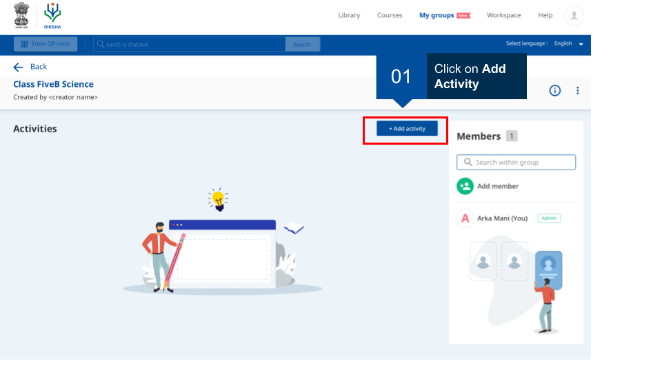
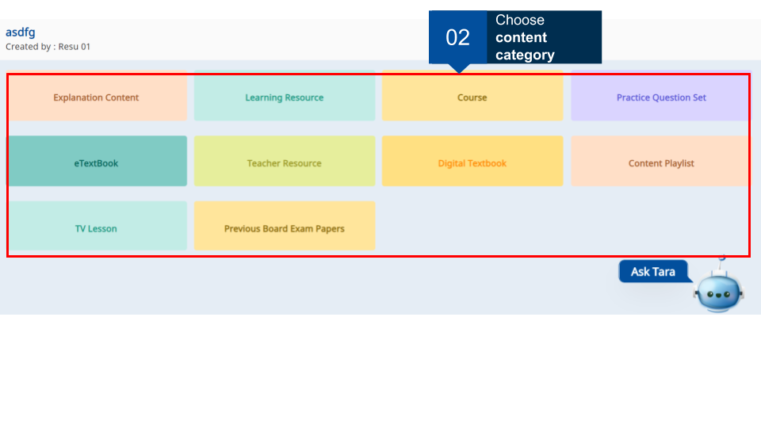
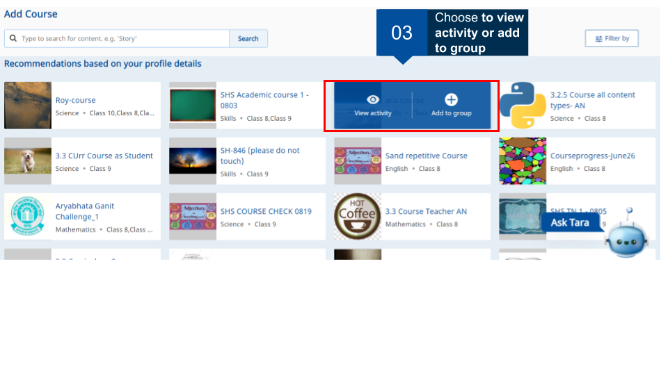
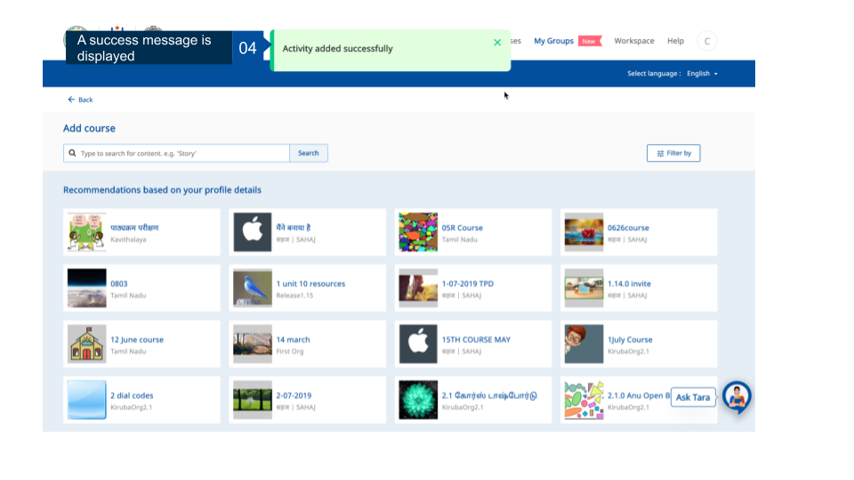

## Overview

As a group administrator, you can add activities for the group. A maximun of 50 activities can be added. Courses too are added as activities. Members can join and complete these courses. This page provides step-by-step instruction on how to add activities for the group.

<table>
  <tr>
    <th style="width:35%;">Image with instructions</th>
 </tr>
  <tr>
  <td></td>
  </tr>
 <tr>
  <td></td>
  </tr>
  <tr>
  <td></td>
  </tr>
  <tr>
  <td></td>
  </tr>
  </table>

