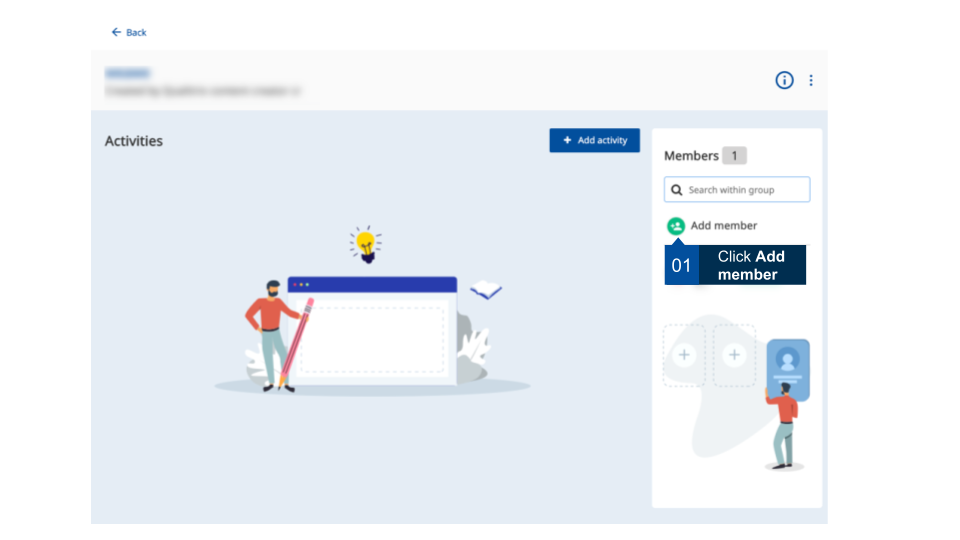
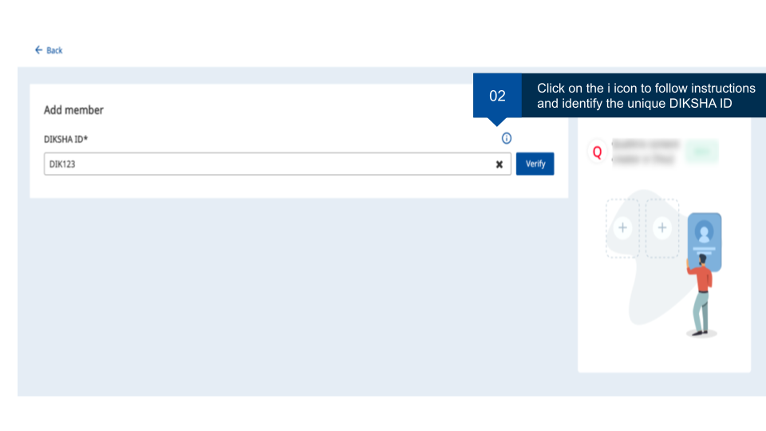
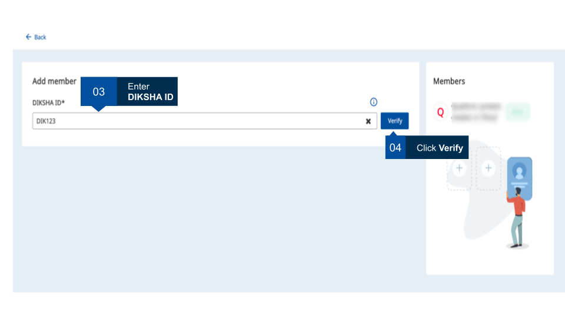
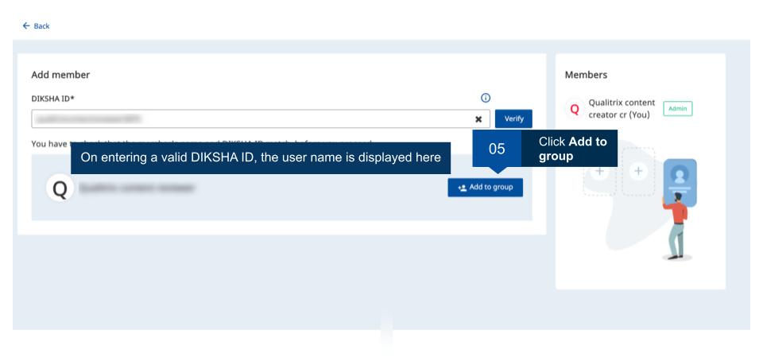
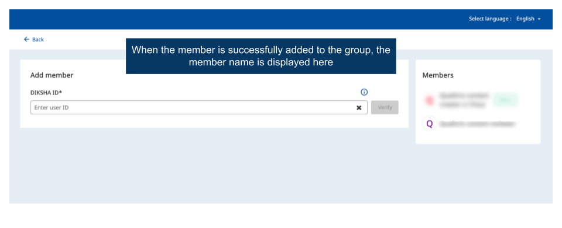

## Overview

As a group administrator, you can add members to your groups. A maximun of 50 members can be added to a group. Ensure you have the valid DIKSHA ID of all users that you would like to add as members. This page provides step-by-step instruction on how to add members to a group

<table>
  <tr>
    <th style="width:35%;">Image with instructions</th>
 </tr>
  <tr>
  <td></td>
  </tr>
 <tr>
  <td></td>
  </tr>
  <tr>
   <td></td>
  </tr>
  <tr>
  <td></td>
  </tr>
  <tr>
  <td></td>
  </tr>
  </table>

