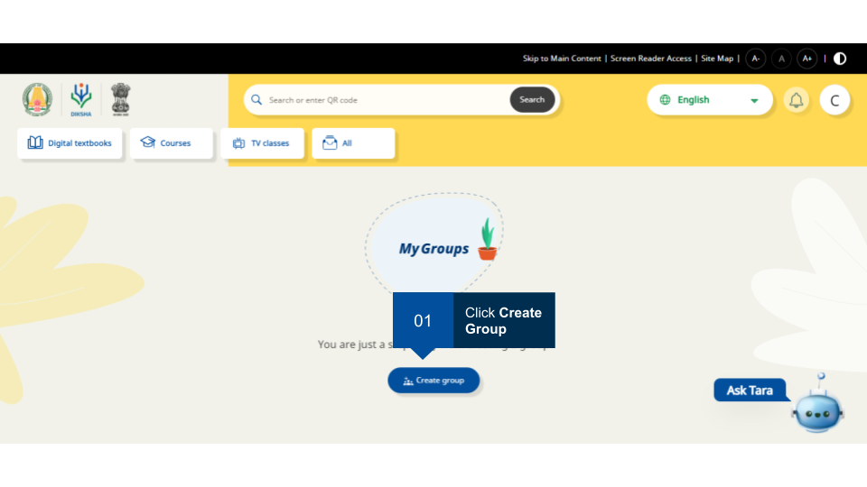
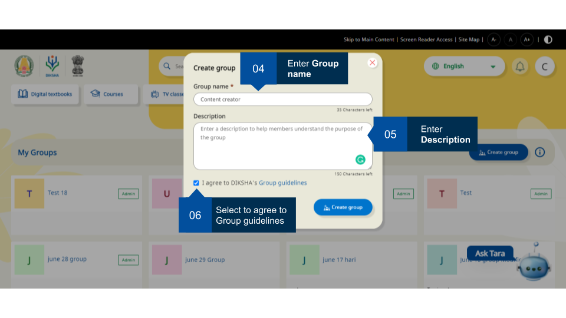
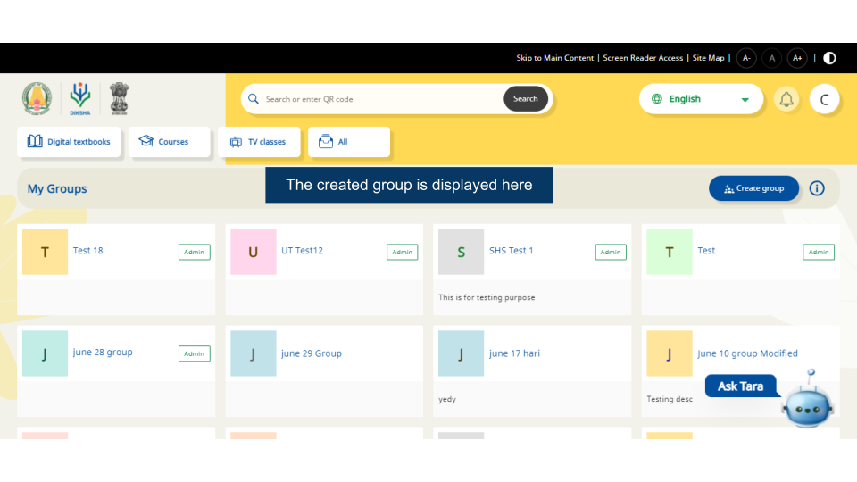
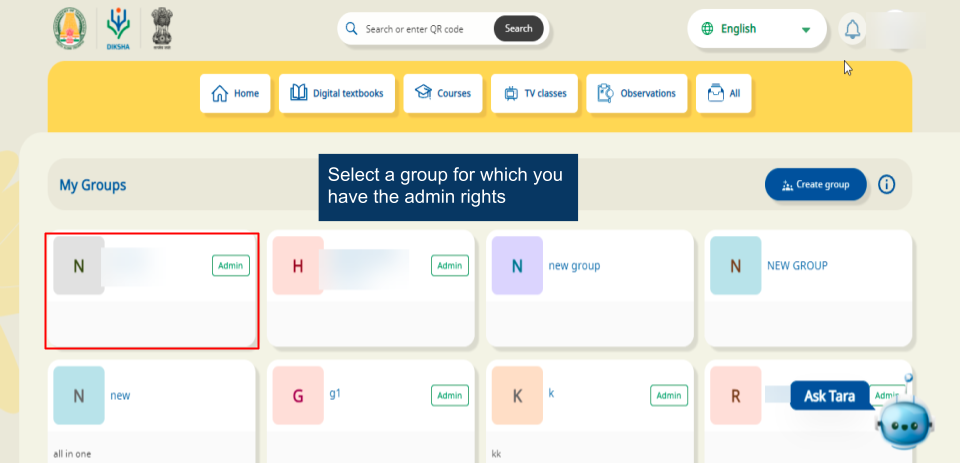
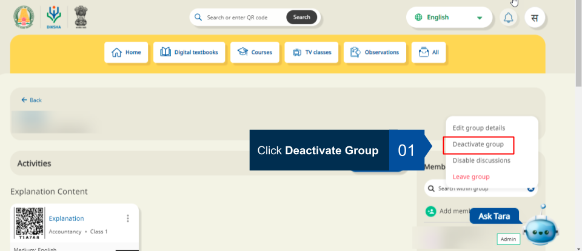
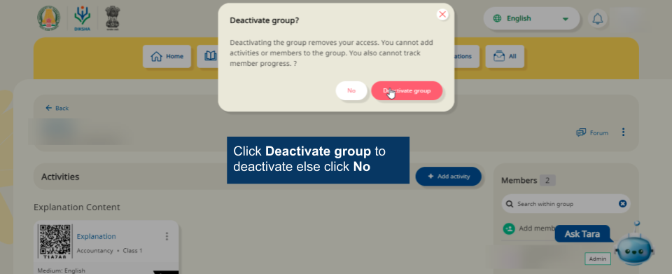
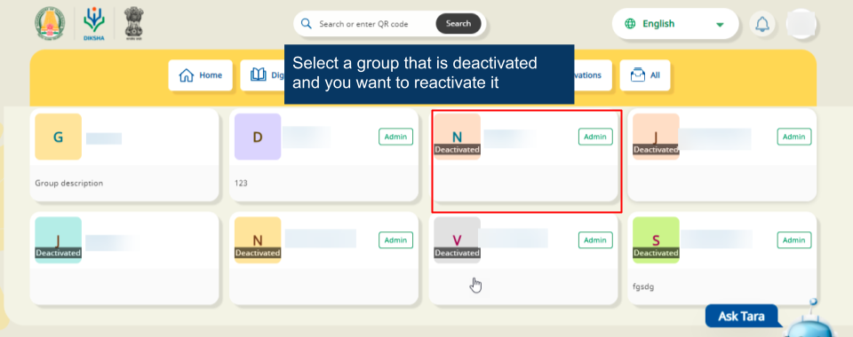
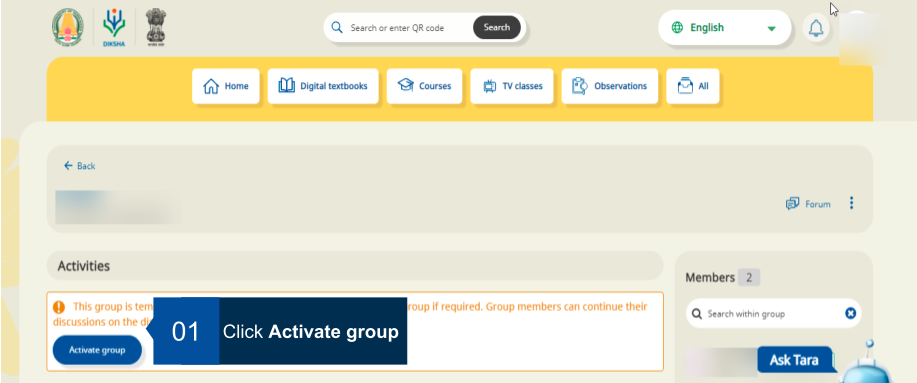
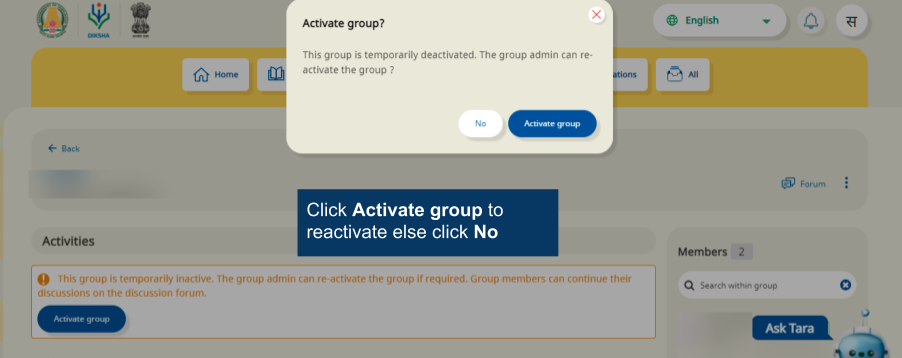

## Overview

Any registered user can create groups. The user who creates the group automatically becomes the group administrator. A maximum of 50 groups can be created. 

A group administrator can 

- add members to the group
- designate another user as administrator
- monitor group
- share content with other members
- monitor member activity for usage, progress and performance statistics of each activity assigned to the group.

This page provides step-by-step instruction on how to create groups on DIKSHA.

**Note**: It is mandatory to accept DIKSHA's terms of use to create a group. An error message is displayed when trying to create a group without accepting the terms of use.

<table>
  <tr>
    <th style="width:35%;">Image with instructions</th>
 </tr>
 <tr>
  <td></td>
  </tr>
  <tr>
    <td></td>
  </tr>
  <tr>
    <td></td>
  </tr>
  </table>

## Deactivate group

A group can be deactivated. Follow the instructions to deactivate a group,

<table>
  <tr>
    <th style="width:35%;">Image with instructions</th>
 </tr>
 <tr>
  <td></td>
  </tr>
  <tr>
    <td></td>
  </tr>
  <tr>
    <td></td>
  </tr>
  </table>

## Reactivate group

A group can be reactivated. Follow the instructions to reactivate a group,

<table>
  <tr>
    <th style="width:35%;">Image with instructions</th>
 </tr>
 <tr>
  <td></td>
  </tr>
  <tr>
    <td></td>
  </tr>
  <tr>
    <td></td>
  </tr>
  </table>