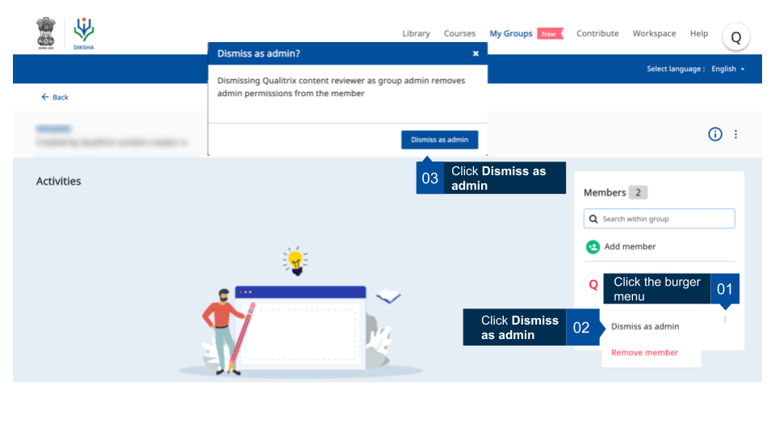

## Overview

The registered user who creates a group is the default group administrator. Only the default group administrator can take away group admin status from other members who are designated group administrators. This page provides step-by-step instruction on how to remove a  member's the admin status.

<table>
  <tr>
    <th style="width:35%;">Image with instructions</th>
 </tr>
 <tr>
  <td></td>
  </tr>
  </table>

