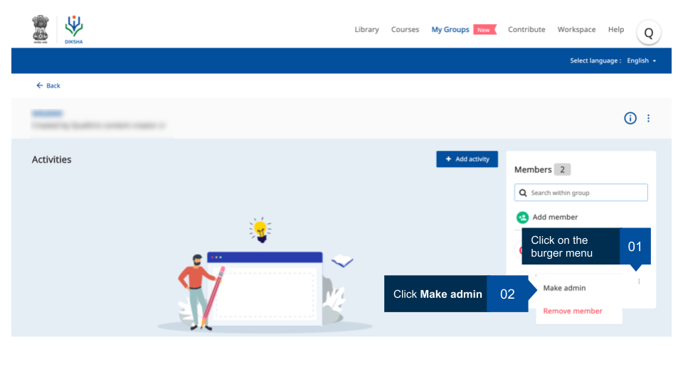
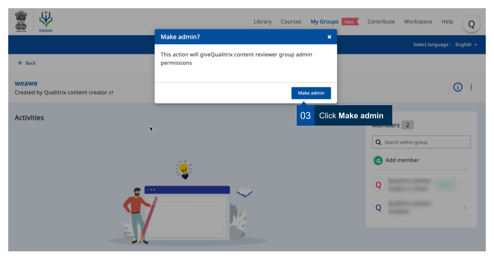
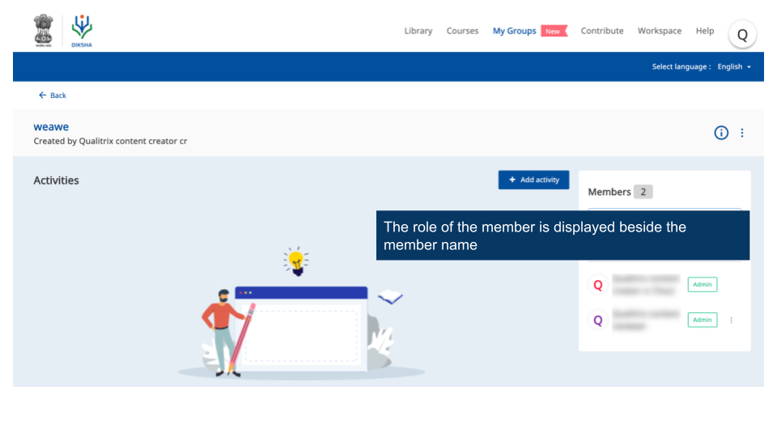

## Overview

The default group administrator (the group creator) can promote group members as group admins thereby giving them additional rights and permissions. This page provides step-by-step instruction on how to make a group member a group administrator.

<table>
  <tr>
    <th style="width:35%;">Image with instructions</th>
 </tr>
 <tr>
  <td></td>
  </tr>
  <tr>
    <td></td>
  </tr>
  <tr>
    <td></td>
  </tr>
  </table>

 