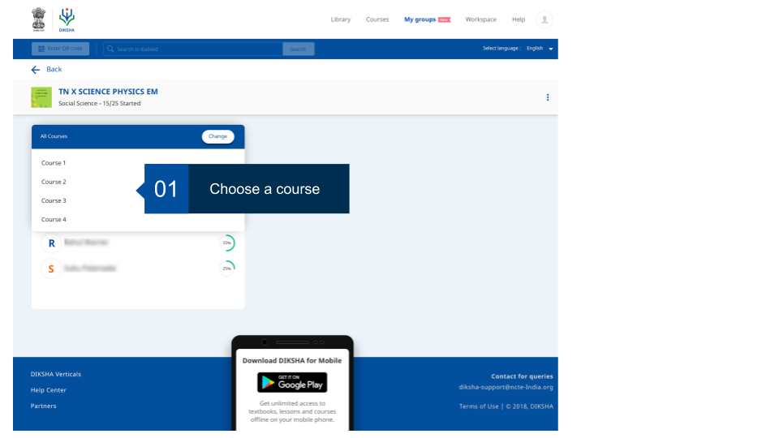
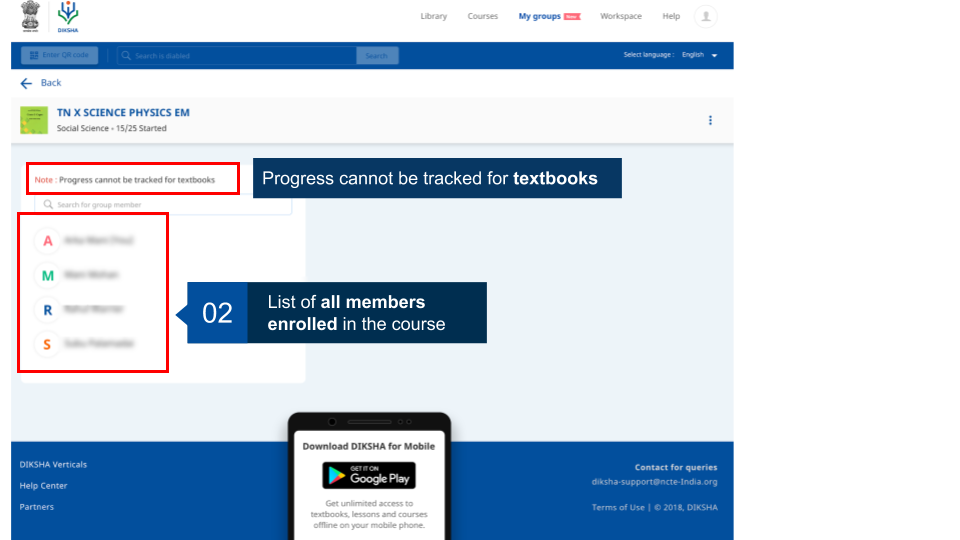
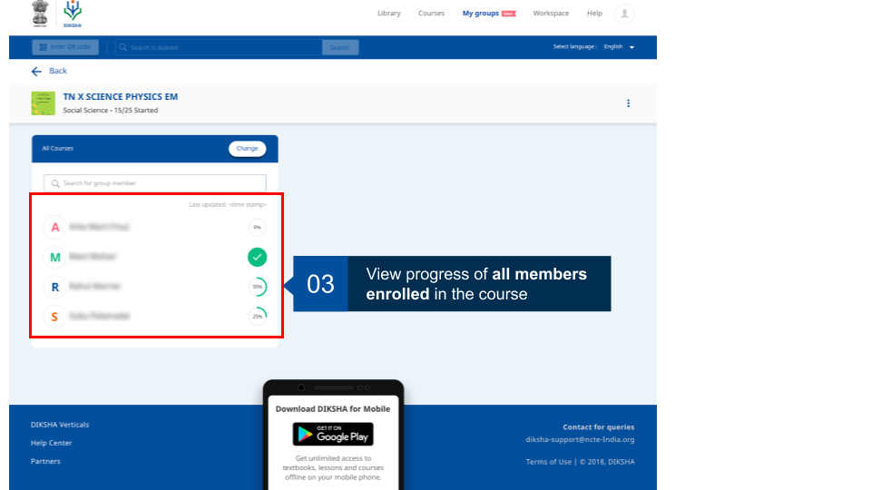

## Overview

After a Group Admin assigns a course, he is able to check progress of an individual member while they undertake a course. The Group Admin can see an indication when the progress was last updated for individual courses.

<table>
  <tr>
  </tr> 
    <tr>
   
    </tr>
     <tr>
     
    </tr>
    <tr>
  
        </tr>
</table>

Group admins can download and share a .csv file containing the progress of group member and their activities 

  
       