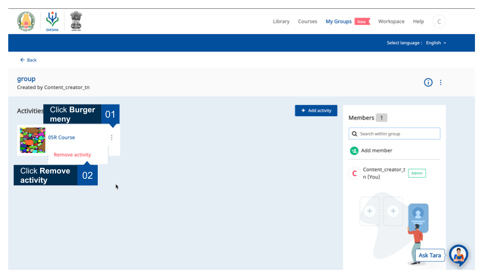
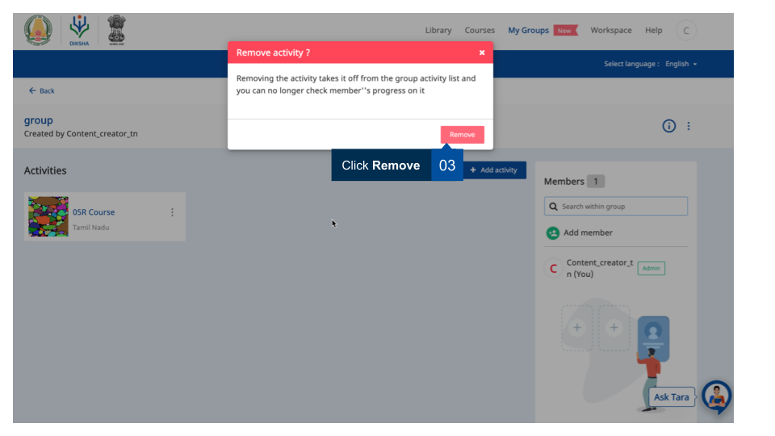
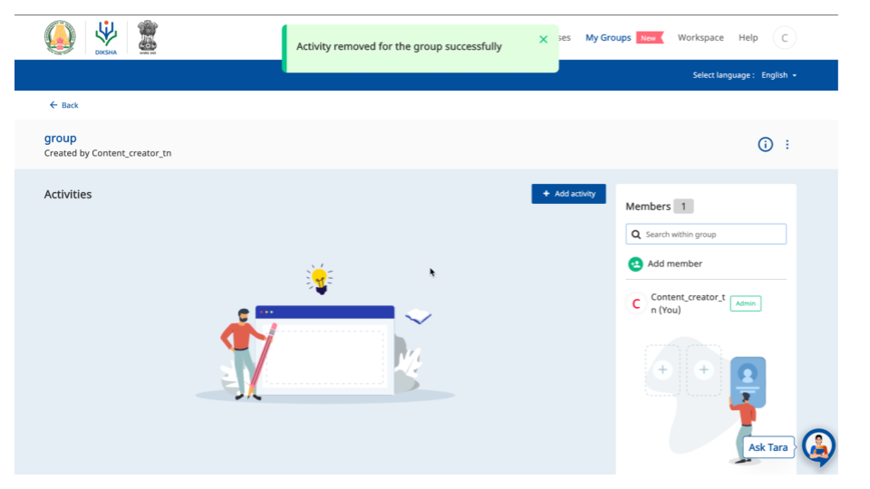

## Overview

Group adminstrators can remove any activity that has been added for the group. This page provides step-by-step instruction on how to remove activities from the group.

<table>
  <tr>
    <th style="width:35%;">Image with instructions</th>
 </tr>
  <tr>
  <td></td>
  </tr>
 <tr>
  <td></td>
  </tr>
  <tr>
  <td></td>
  </tr>
  </table>

