## Overview

A Library typically refers to a space, housing a large collection of books, resources or information. Extending the literary meaning, **Library**, a key module of DIKSHA displays all content created or uploaded on the platform. The library is accessible to all registered users.

This page elaborates the various user interface elements of the **Library**

### Prerequisites
<table>
  <tr>
    <th style="width:35%;">Step</th>
    <th style="width:65%;">Screen</th>
  </tr>
  <tr>
    <td>1. You are logged in  2. Click on the drop-down icon to change the language. The portal is available in the following languages:  &emsp;a) English  &emsp;b) Hindi  &emsp;c) Marathi  &emsp;d) Tamil  &emsp;e) Telugu  &emsp;f) Kannada  &emsp;g) Bengali  &emsp;h) Urdu  &emsp;i) Assamese  &emsp;j) Gujarati  &emsp;k) Odiya  &emsp;l) Punjabi </td>
      <td>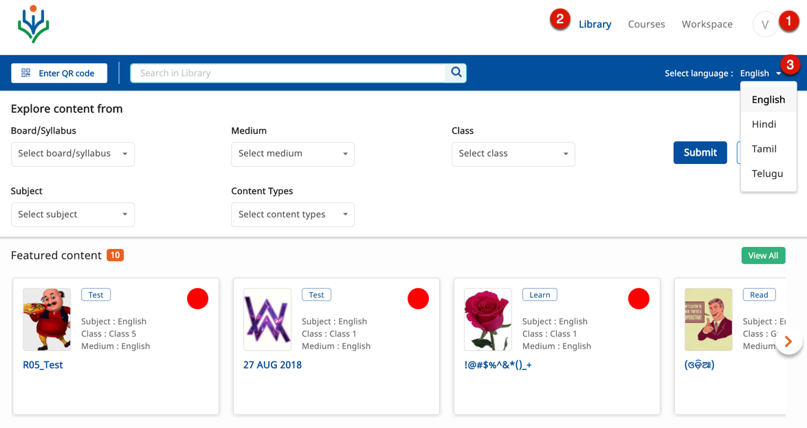</td>
  </tr>
  </table>

### Exploring the Library

Content is displayed under the following categories in the Library:

- Featured content
- Textbooks
- Teaching material
- Learning material
- Practice and test material

### Exploring Content

<table>
  <tr>
    <th style="width:35%;">Step</th>
    <th style="width:65%;">Screen</th>
  </tr>
  <tr>
    <td>You can explore content in the Library section using either of the following options:  1. QR Codes   2. Search bar    3.Filters as follows:   
        A.  Board/Syllabus - You can filter content by known publishers like NCERT and, State or Central school boards
          B. Class - You can filter content based on the class in which you study   C. Subject - You can filter based on the subject for which you need content   D.  Medium </td>
	<td>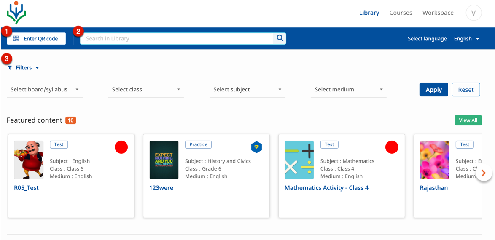</td>
	</tr>
    <tr>
    <td><b>Using QR Codes</b> 
     1. Click <b>Enter QR Code</b>  2. Enter the QR Code key  3. Click <b>Submit</b>. Content tagged to the given QR is displayed </td>
        <td></td>
        </tr>
</table>

### Viewing Content

Users with registered credentials can view and download content from the Library. The textbooks are displayed in the alphabetical order.

<table>
  <tr>
    <th style="width:35%;">Step</th>
    <th style="width:65%;">Screen</th>
  </tr>
  <tr>
   <td>1. Scroll to check the listed content  2. Click on any content card to view the content</td> 
  <td>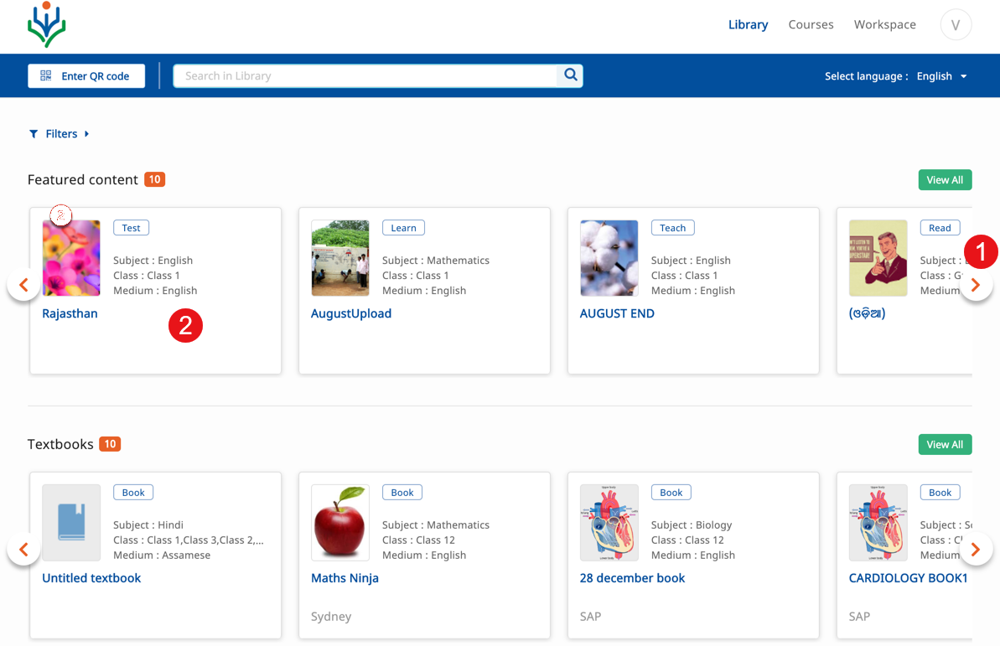</td>
    </tr>
  <tr>
  <td>1. Click the content you wish to view. The content is displayed within the inbuilt content player. 
     2. Description and  details of the creator, organization, license etc are displayed below the content player.
     3. Click the share icon to share this content
     4. Click <b>Copy</b> to copy this content
     5. The option <b>Copy as course</b> appears only if the content type is a textbook. Click this option to copy the textbook as a course
  </td>
	<td>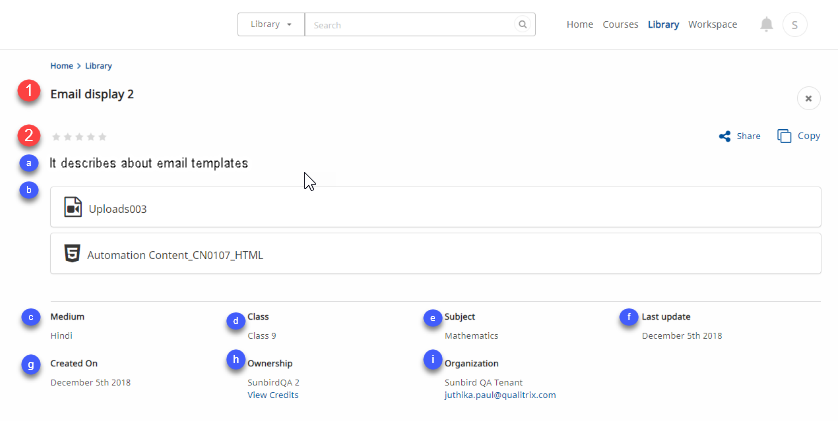</td>
	</tr>
	</table>

### Sharing Stories

<table>
  <tr>
    <th style="width:35%;">Step</th>
    <th style="width:65%;">Screen</th>
  </tr>
  <tr>
   <td>1. Click the <b>Share</b> icon to share the story
   </td>
  <td>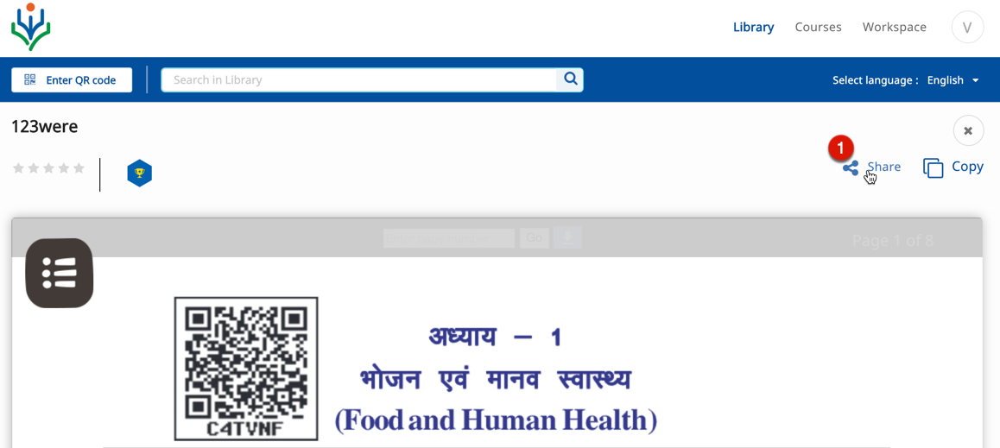</td>
  </tr>
  <tr>
    <td>2. A screen with the link to the story is displayed
     3. Click <b>COPY LINK</b> to copy the link
	   4. Click <b>X</b>, close icon to go back to the content player
   </td>
  <td></td>
  </tr>
  </table>
### Copying Content

  <table>
  <tr>
    <th style="width:35%;">Step</th>
    <th style="width:65%;">Screen</th>
  </tr>
  <tr>
  <td>1. Select any content from the <b>Library</b> to view the content
	 <b>Note:</b> Users with creation rights can copy any content available in the Library
  </td>
	<td>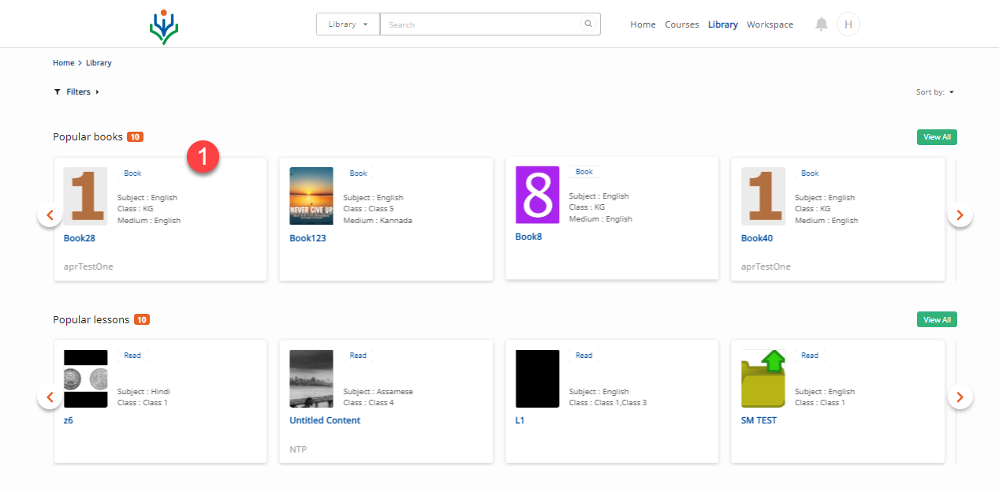</td>
	</tr>
	<tr>
  <td>1. Click <b>Copy</b> icon to copy content 
    The content is copied into the <b>Draft</b> folder
		 <b>Note:</b> The following are the attributes of all copied content:
		&emsp;<li>All copied content resides in the <b>Draft</b> folder</li>
		<li>The copied content is tagged with the prefix <b>Copy of</b> before the original content name</li>
		<li>The user, organisation details, copy type, and source information are also copied</li>
		<li>The links to the assets and objects remain intact</li>
	</td>
	<td>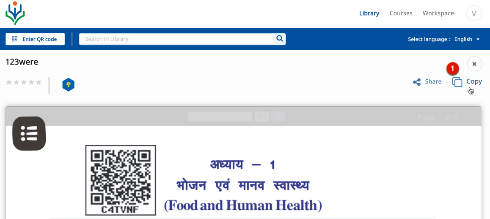</td>
	</tr>
</table>

### Taking Notes

<table>
  <tr>
    <th style="width:35%;">Step</th>
    <th style="width:65%;">Screen</th>
  </tr>
    <tr>
  <td>Click on a course content. The content player window is displayed  1. Click <b>TAKE NOTE</b> icon or link to take notes while viewing the story
	    	</td>
	<td>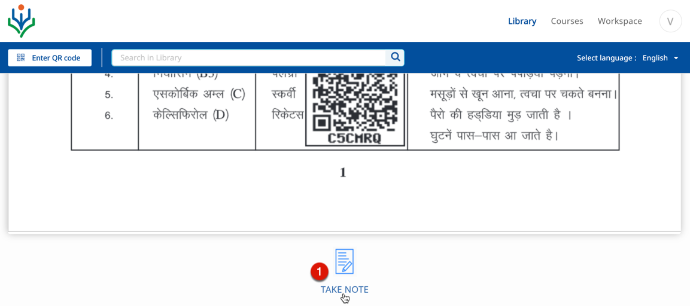</td>
	  </tr>
	   <tr>
	<td>1. Enter <b>Title</b>
   2. Enter <b>Description</b>
   3. Use various formatting options to format the description
   4. Click <b>Clear</b> to clear the note
   5. Click <b>Save</b> to save the note
   6. Click <b>Close</b> icon to exit the page
	</td>
	<td>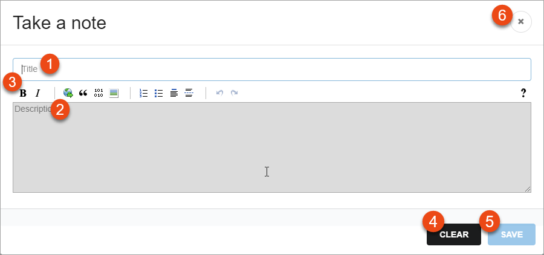</td>
	</tr>
</table>

### Playing and Rating Content

User (signed in or anonymous) is able to rate any content. The rating option is enabled after a user finishes playing content.

<table>
  <tr>
    <th style="width:35%;">Step</th>
    <th style="width:65%;">Screen</th>
  </tr>
  <tr>
  <td> 1. Click <b>Play</b> or <b>Replay</b> to consume the content 
   Once you complete playing the content a pop-up screen is displayed here.
   2. Click the <b>Star</b> icons to rate the content</td>
  <td>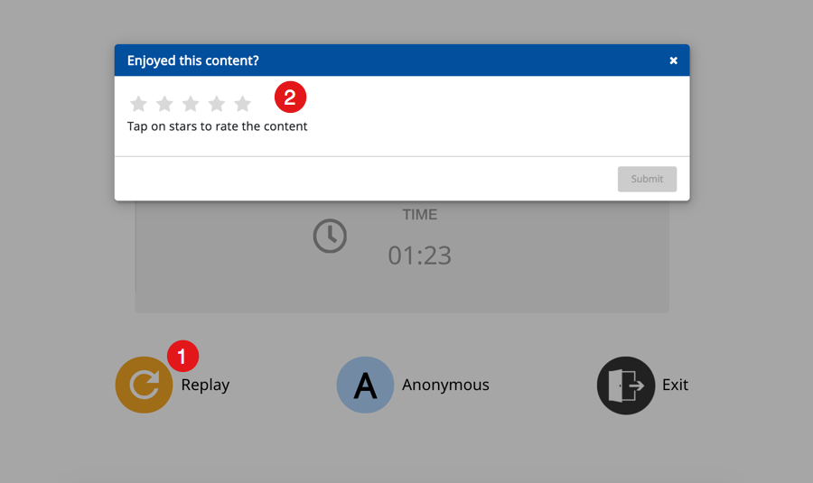</td>
  </tr>
  <tr>
  <td>
   3. Select the relevant options to provide detailed feedback
   4. Click <b>Submit</b> to share your rating 
   After you successfully rate a content, a message "<b>Thank you for rating this content!</b>" is displayed
   <b>Note</b>: Anonymous or guest user can also rate a content</td>
  <td>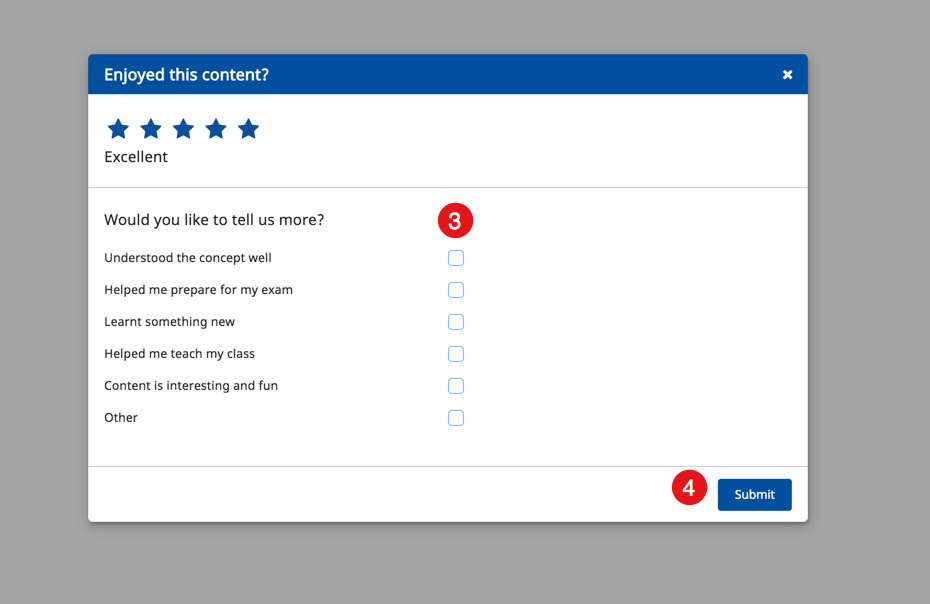</td>
  </tr>
</table>

### Downloading Content

The download button appears while viewing textbook, webm and mp4 content. When downloading a textbook, the option to download individual content within the book is disabled and after the download, the entire textbook is saved on your device. 

<table> 
  <tr>
    <th style="width:35%;">Step</th>
    <th style="width:65%;">Screen</th>
  </tr>
  <tr>
	<td>To download a content:
   1. Click on the burger menu
	 2. Click the <b>Download</b> button or press <b>Ctrl+S</b> to download file in a new tab
   The file gets downloaded on your the device
   <b>Note</b>: In case there is not enough space on your device to download and extract the file, the “<b>Insufficient space on disk</b>” pop-up message is displayed</td>
    <td>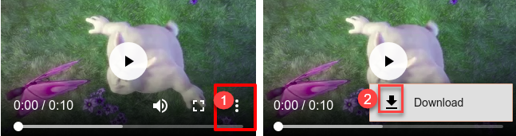</td>
  </tr>
</table>

### Printing Content

DIKSHA allows you to save the content as PDF files so that they can be printed and users can access them offline 

<table>
  <tr>
    <th style="width:35%;">Step</th>
    <th style="width:65%;">Screen</th>
  </tr>
  <tr>
  <td>Click a content card which contains practice set
   1. Open the content details page
  </td>
    <td>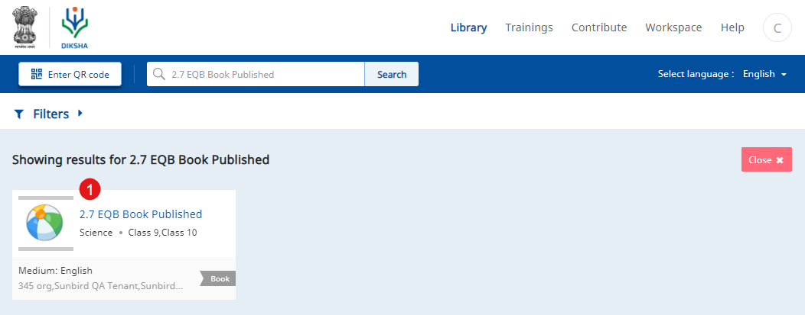</td> 
  </tr>  
  <tr>
  <td>
   2. Click <b>Print</b>. The print preview of the practice set opens as a PDF file in another tab 
 </td>
    <td>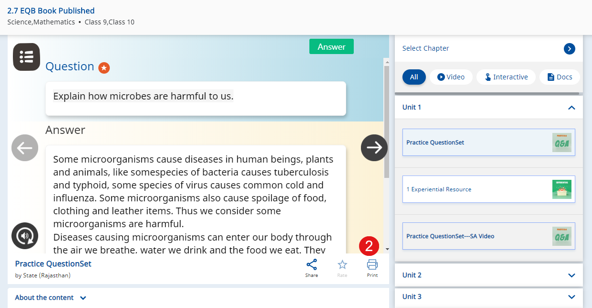</td>
  </tr>
  <tr>
    <td>3. Click <b>Download</b> to download the content
     <b>Note:</b> i. You can preview the practice set offline if your content is already downloaded
     ii. You can also preview the PDF file directly without downloading the complete content
    </td>
    <td>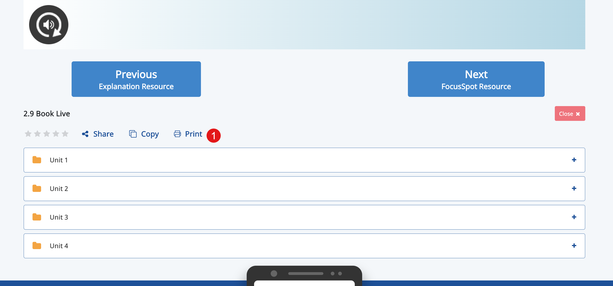</td>
  </tr>
</table>

