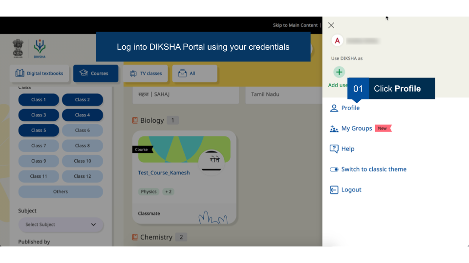
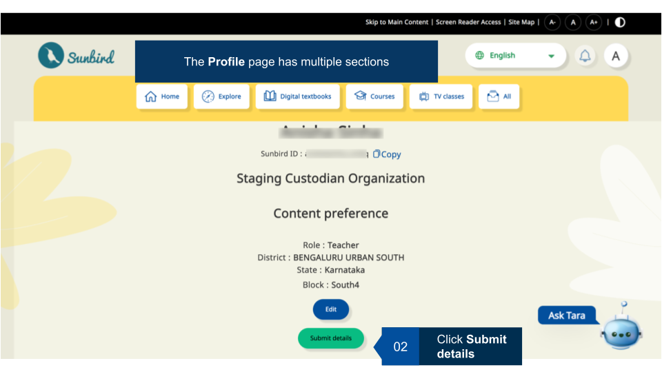
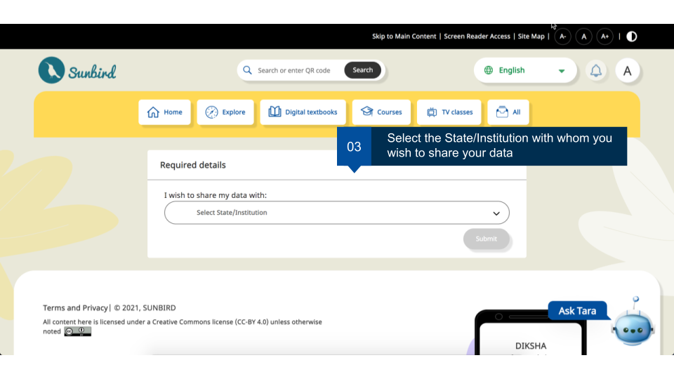
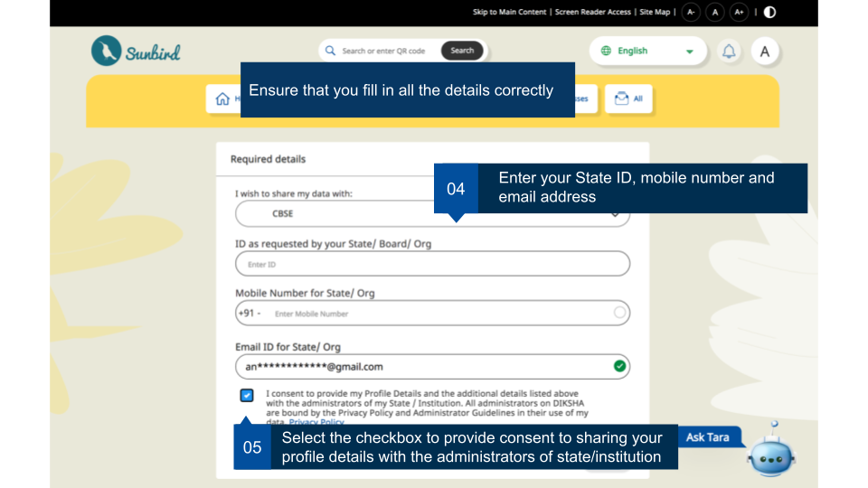
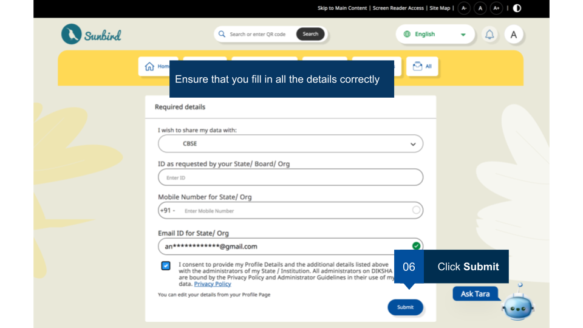
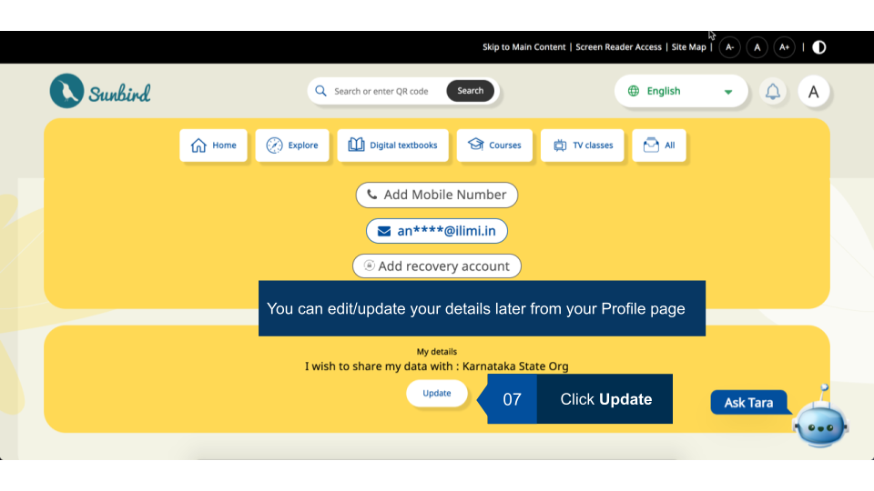

## Overview

DIKSHA mandates its logged-in users to declare their details.
Users can submit all necessary information through their profile on DIKSHA.

The following are the fields the user has to fill out :

- State ID: User to provide valid state ID

- Terms acceptance checkbox : The user has to agree to a different set of terms to provide consent to share their data with the state for validation purposes. The credentials shared by them will be available to state admins for download. 

This page provides step-by-step instructions on how to fill your consent form.

### Consent Form

<table>
<tr>
  <th>Image with instructions</th>
</tr>
<tr><td>
</td>
</tr>
<tr><td>
</td>
</tr>
<tr><td>
</td>
</tr>
<tr><td>
</td>
</tr>
<tr><td>
</td>
</tr>
<tr><td>
</td>
</tr>
</table>

