## Overview

Any individual with a registered DIKSHA account can login to DIKSHA. For details, refer to <a href="https://diksha.gov.in/help/getting-started/login/sign-up.html" target="_blank"> Registering on DIKSHA</a>.

As the member of an organization, Central or State education board, you may receive DIKSHA login credentials from your respective organization. Use the same to login.

Logged in users can access resources from their own education boards as well as other Central and State education organizations.  For example; if you are logged in as a student of Class four from State A, you can see the textbooks, courses, TV classes, and so on for your State and Class by default. However, you may also discover resources put up by other States and NCERT. This is not possible if you are using DIKSHA as a guest.
You can log in to DIKSHA using any of the following methods:
* Any Email ID
* A mobile number
* A Google Account
* A State System Account

### Prerequisites

You must be registered on DIKSHA.

### Logging in with any email ID

Users can now log in to DIKSHA portal with any email ID.
<table>
<tr>
  <th>Image with instructions</th></tr>
<tr><td>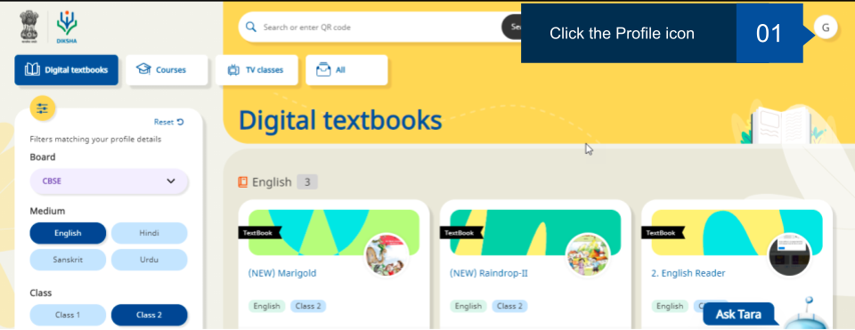
</td></tr>
<tr><td>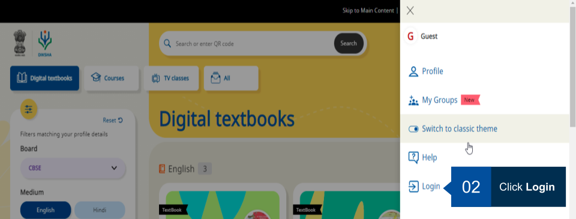
</td></tr>
<tr><td></td></tr>
<tr><td></td></tr>
</table>

### Logging in with a mobile number

Users can now log in to DIKSHA portal with their mmobile number.
<table>
<tr>
  <th>Image with instructions</th></tr>
<tr><td>
</td></tr>
<tr><td>
</td></tr>
<tr><td>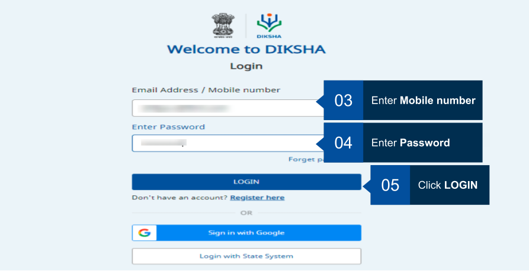</td></tr>
<tr><td></td></tr>
</table>

### Logging in with a Google Account

Users can now log in to DIKSHA portal with their Google account credentials. 

<table>
<tr>
  <th>Image with instructions</th></tr>
<tr><td>
</td></tr>
<tr><td>
</td></tr>
<tr><td>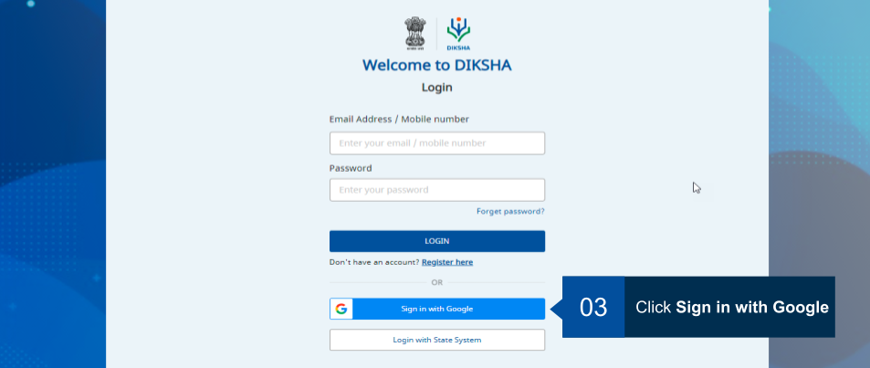</td></tr>
<tr><td>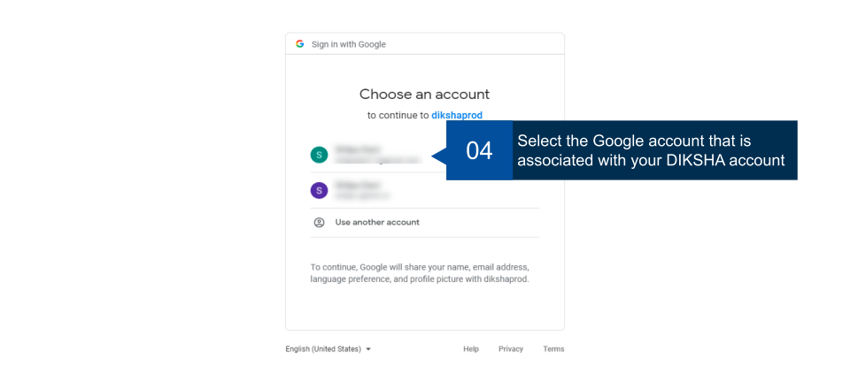</td></tr>
<tr><td>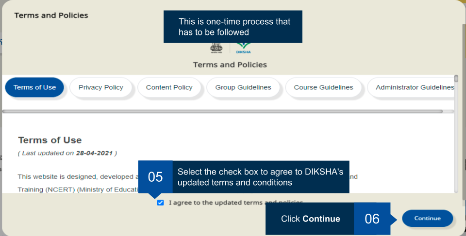</td></tr>
<tr><td></td></tr>
</table>

### Logging in with a State System

You can log in to DIKSHA portal with your State account credentials. 

<table>
<tr>
  <th>Image with instructions</th></tr>
<tr><td>
</td></tr>
<tr><td>
</td></tr>
<tr><td>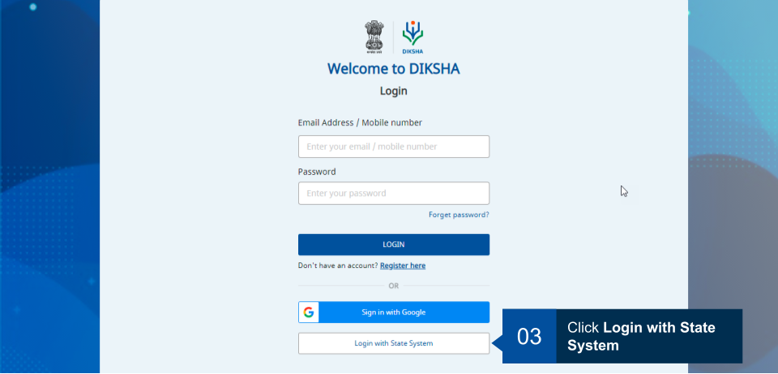</td></tr>
<tr><td>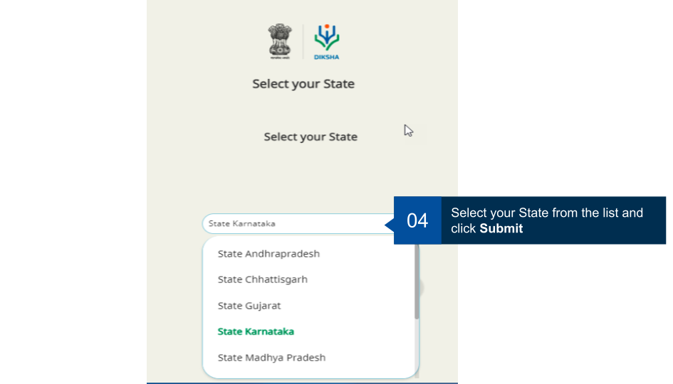</td></tr>
<tr><td>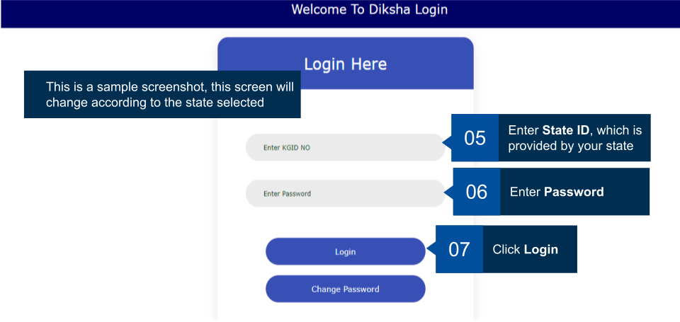</td></tr>
</table>

### Retrieving password

If the user has forgotten the password, the passowrd can be retrieved using the Forget Password. 
Follow the below steps to retrive the password.
<table>
<tr>
  <th>Image with instructions</th></tr>
<tr><td></td></tr>
<tr><td>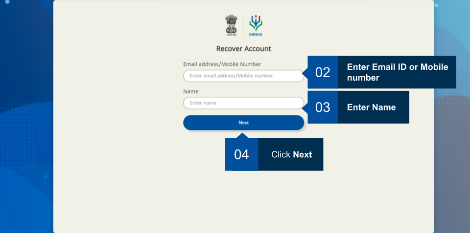</td></tr>
<tr><td>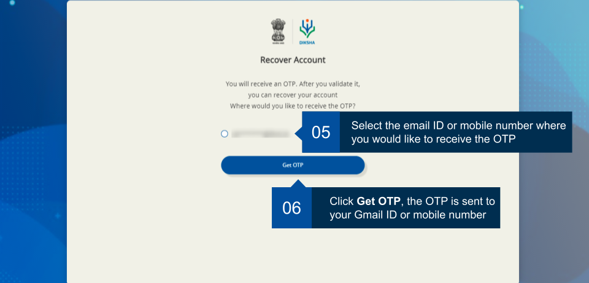</td></tr>
<tr><td>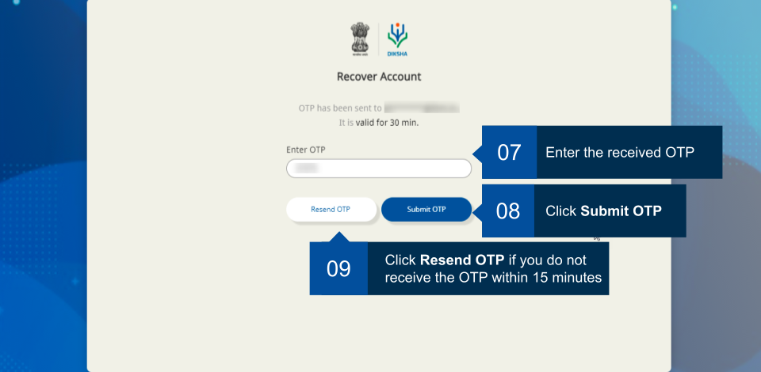</td></tr>
<tr><td>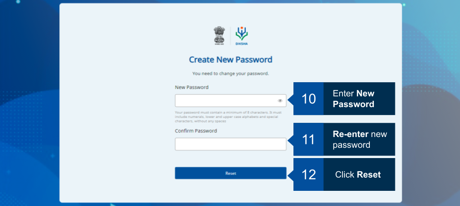</td></tr>
<tr><td>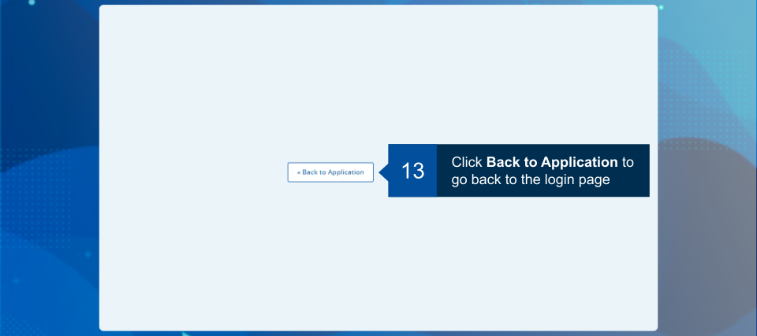</td></tr>
<tr><td>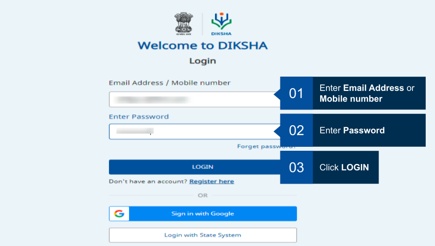</td></tr>
<tr><td></td></tr>
</table>
