## Overview

Any organisation, recognized education or learning body or individual user can register on the portal. 

## Registering on DIKSHA Portal with a mobile number

Follow the below steps to register on DIKSHA with your mobile number:

<table>
<tr>
  <th>Image with instructions</th></tr>
<tr><td>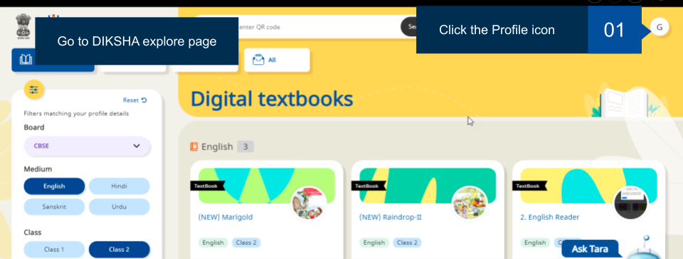</td></tr>
<tr><td>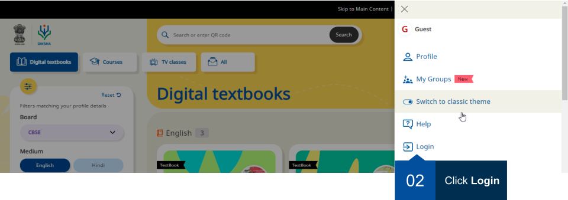</td></tr>
<tr><td>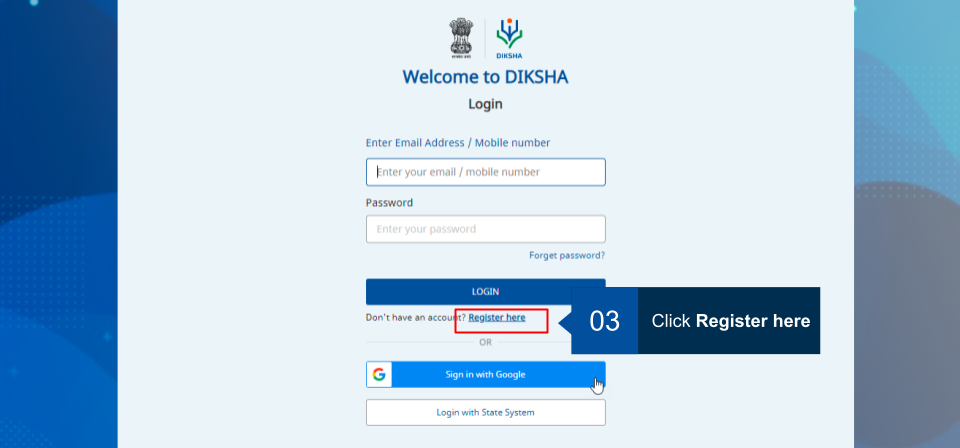</td></tr>
<tr><td>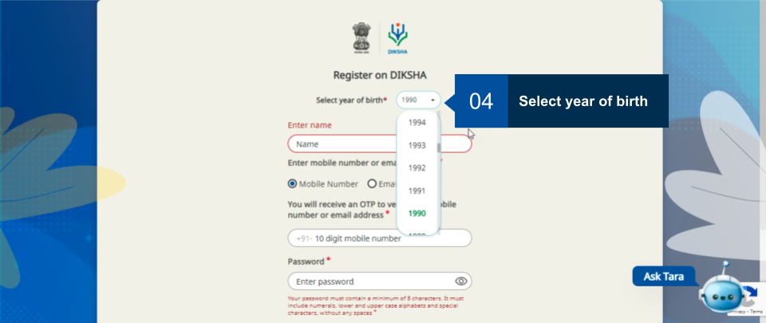</td></tr>
<tr><td>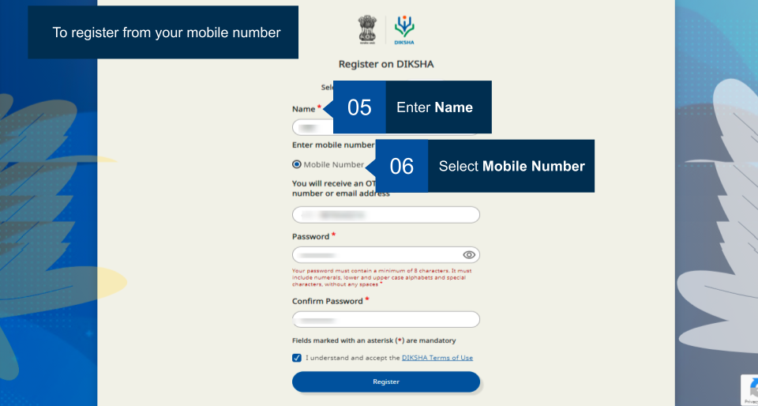</td></tr>
<tr><td>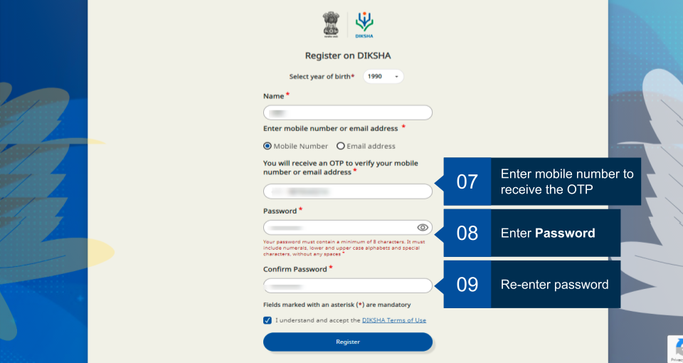</td></tr>
<tr><td>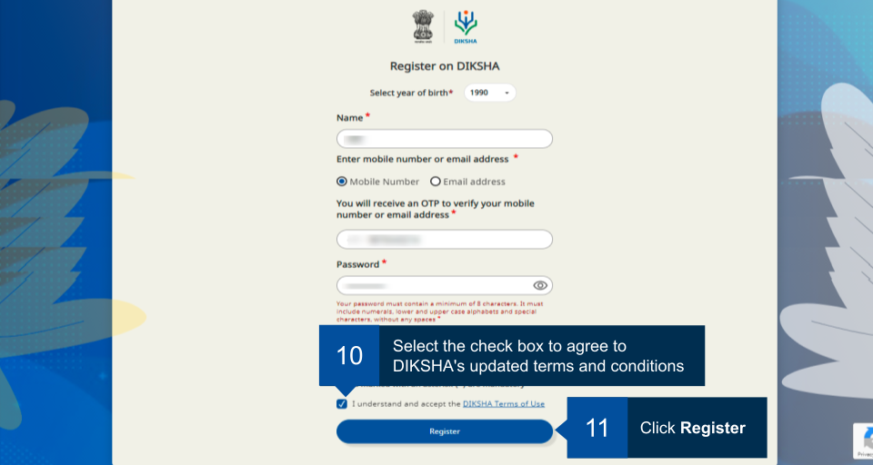</td></tr>
<tr><td>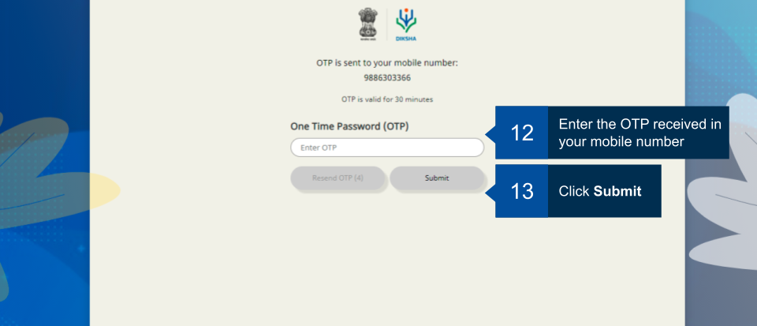</td></tr>
<tr><td>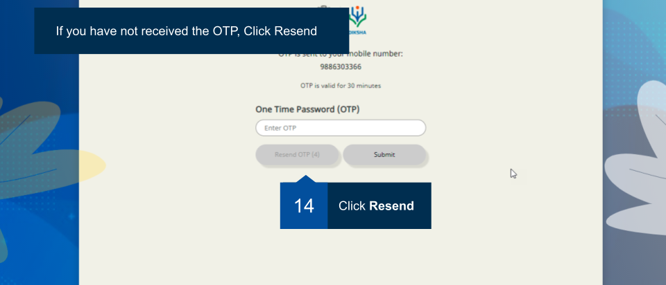</td></tr>
<tr><td>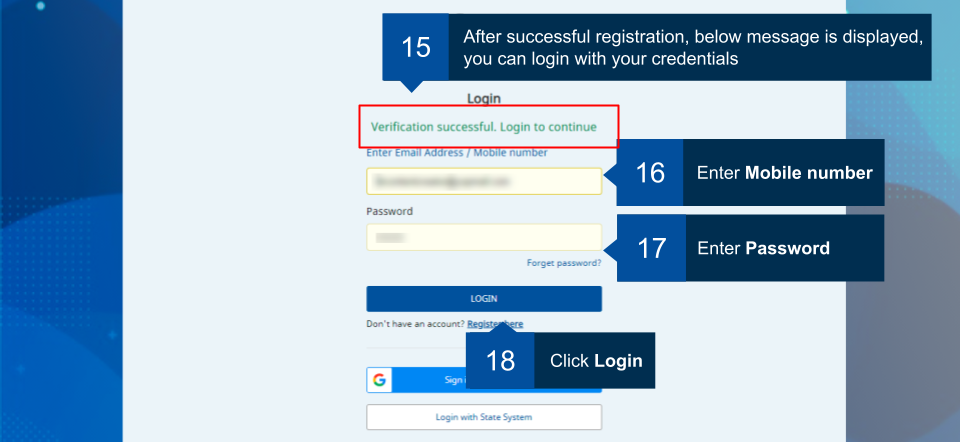</td></tr>
<tr><td>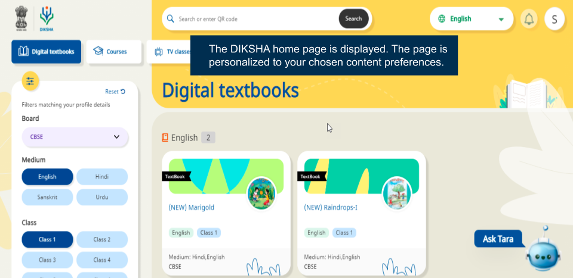</td></tr>
</table>

## Registering on DIKSHA Portal with an email ID

Follow the below steps to register on DIKSHA with your email ID:

<table>
<tr>
  <th>Image with instructions</th></tr>
<tr><td></td></tr>
<tr><td></td></tr>
<tr><td></td></tr>
<tr><td></td></tr>
<tr><td>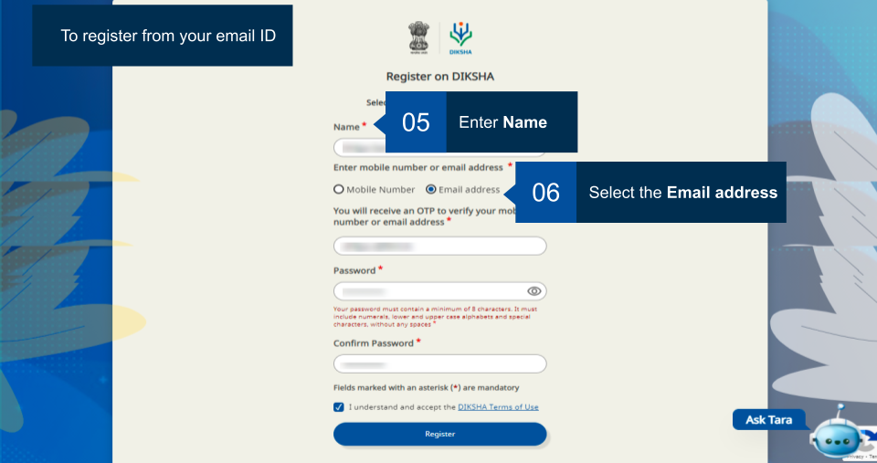</td></tr>
<tr><td>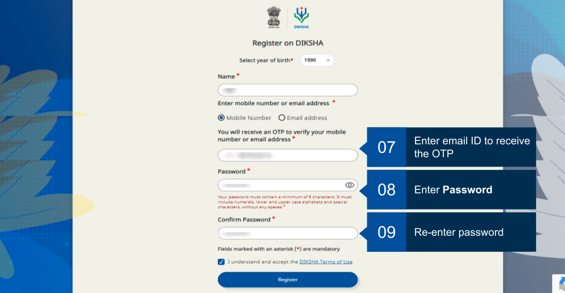</td></tr>
<tr><td>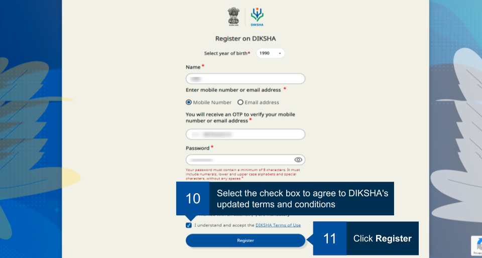</td></tr>
<tr><td>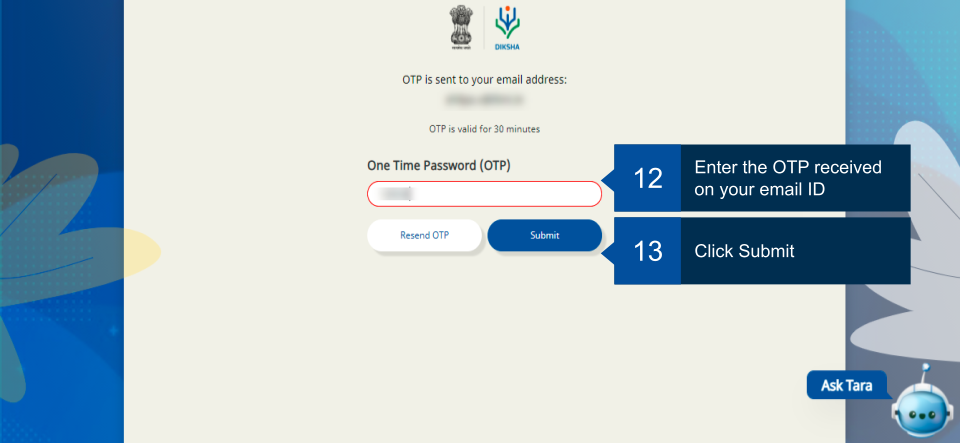</td></tr>
<tr><td>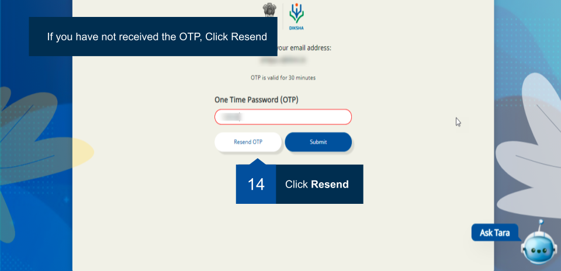</td></tr>
<tr><td>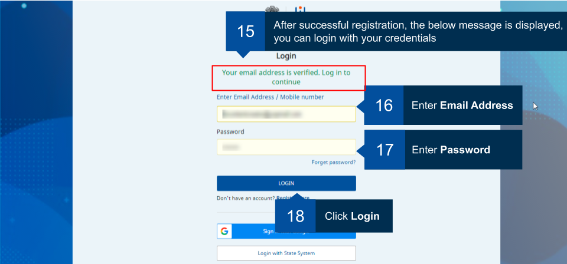</td></tr>
<tr><td></td></tr>
</table>