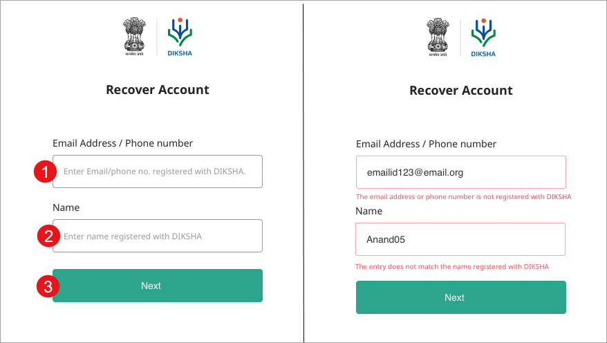
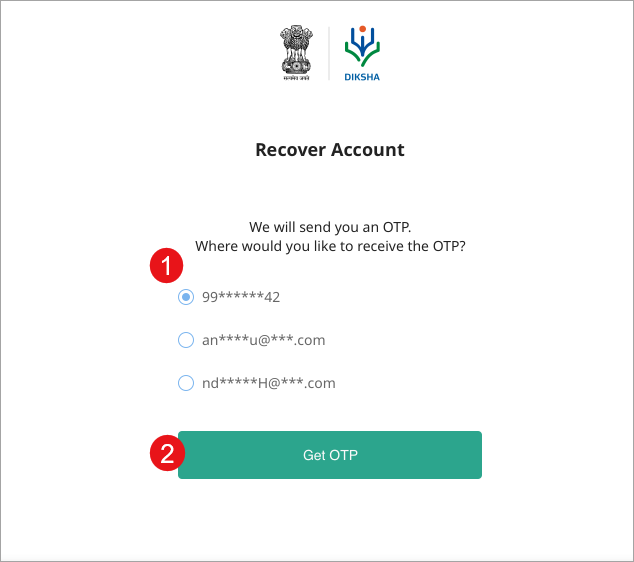
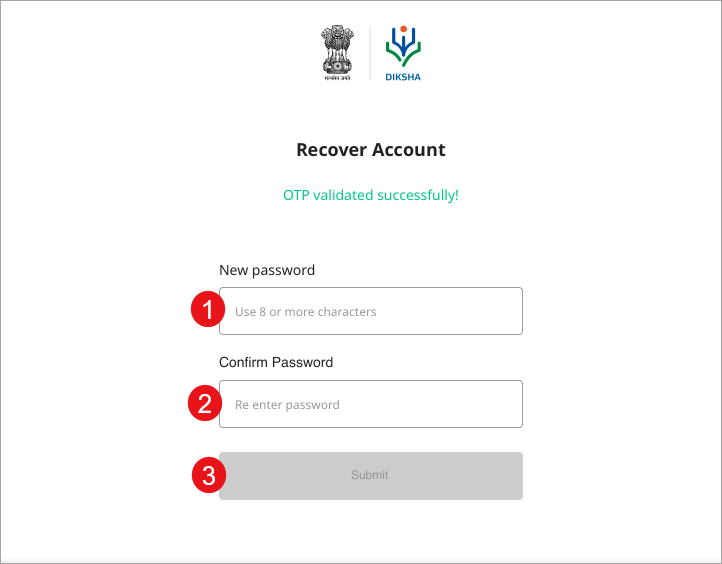

You can recover your DIKSHA account, if you have forgotten the password. To recover your password you must enter your email address and the user name that you provided while signing on DIKSHA. You will receive an OTP to reset your password and recover your account. 

### Recovering Account
 
<table>
  <tr>
    <th style="width:35%;">Step</th>
    <th style="width:65%;">Screen</th>
  </tr>
  <tr>
    <td>1. Click <b>Forgot?</b> to recover or reset your password</td>
    <td></td>
  </tr>
  <tr>
    <td>
       1. Enter your registered <b>Email Address</b>/<b>Phone number</b>
       Ensure to enter the same email address/phone number that is registered with DIKSHA. To know more refer <a href="../login/index.html">Sign in</a>
       2. Enter the user name in <b>Name</b>
       3. Click <b>Next</b></td>
    <td></td>
  </tr>
  <tr>
    <td>1. Select the email address or the phone number where you would like to recieve the OTP
       2. Click <b>Get OTP</b>
    </td>
    <td></td>
  </tr>
  <tr>
    <td>1. Enter the <b>OTP</b> received
     2. Click <b>Submit</b>
       3. Click <b>Resend OTP</b> in case you have not recieved the OTP
    </td>
    <td></td>
  </tr>
  <tr>
    <td>On entering the correct OTP, you can change the password
     1. Enter <b>New Password</b>. The password should be of 8 or more characters
     2. Re-enter the password in <b>Confirm Password</b>
     3. Click <b>Submit</b> to change the password
     Sign in with your user name and the new password to recover your account</td>
    <td></td>
  </tr>
</table>