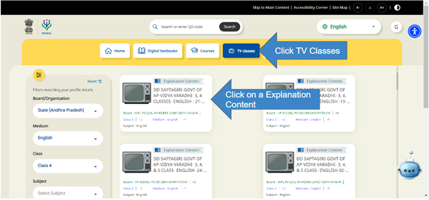
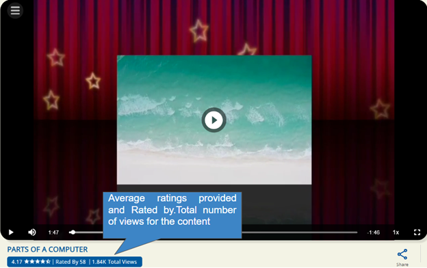

## Overview

TV Classes is a new medium of instruction as per MHRD. Classes are available in the form of TV episodes. These episodes are uploaded on DIKSHA, and the episodes can directly be opened on the inbuilt content player. The content player supports a maximum file size of 500 MB. 

Here are step-by-step instructions to access TV classes.

### TV CLASSES

<table>
  <tr>
    <td>
      
    </td> 
  </tr>
  <tr>
    <td>
      
    </td>
  </tr>
</table>

