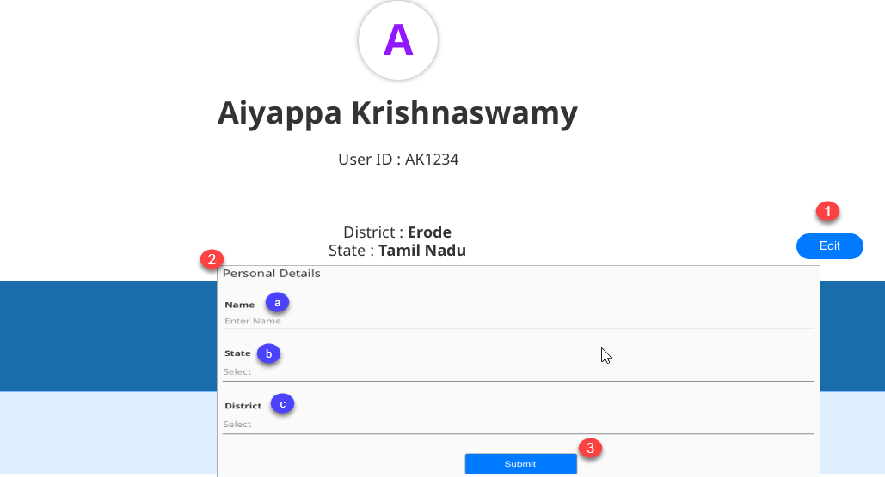
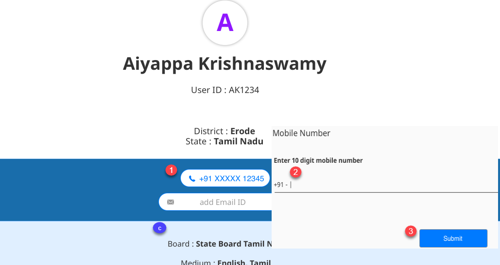
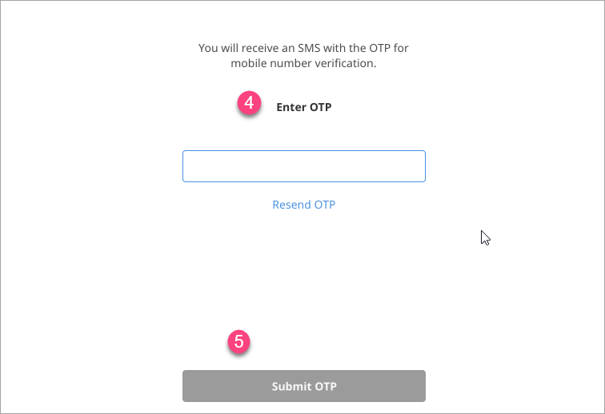
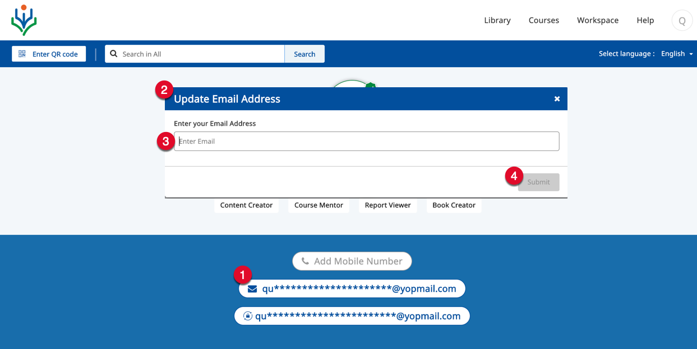
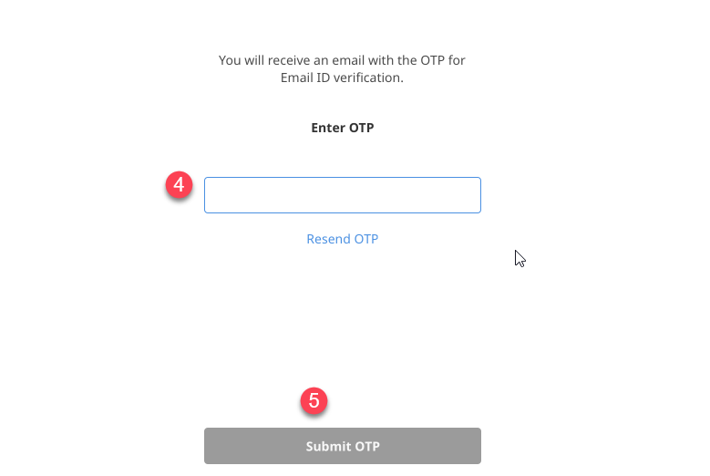
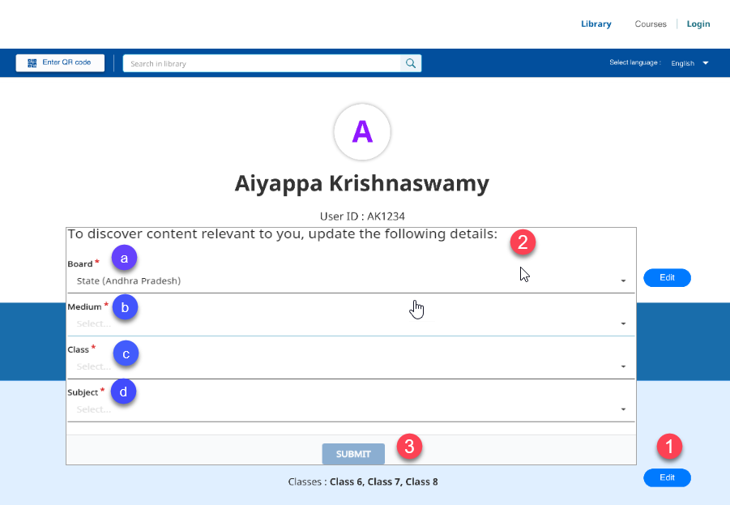
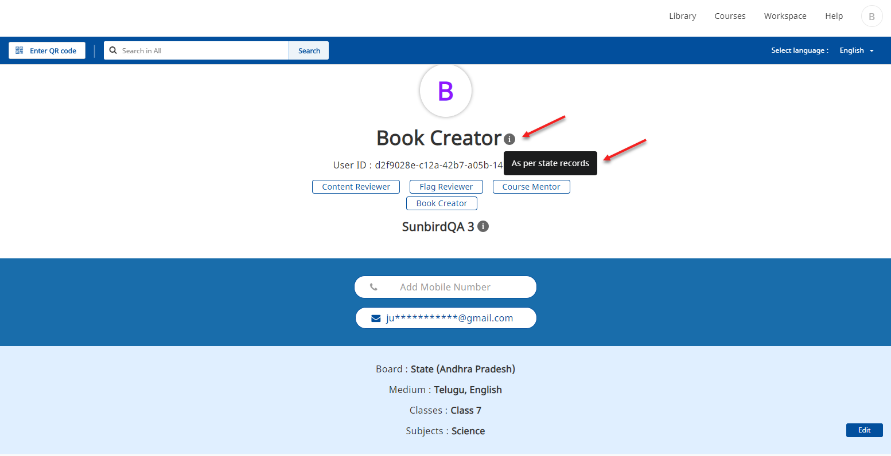

## Overview

All user profile details can be edited as per requirements. Contributions and Courses attended are automatically updated when a user contributes content or completes a course on DIKSHA.

## Editing Profile Details

 You can edit the following details using the **Profile** tab: 
  - Personal details such as Name, State, and District
  - Contact details such as a mobile number and email address
  - Other details such as board, medium, subject, and class

  <table>
  <tr>
    <th style="width:35%;">Step</th>
    <th style="width:65%;">Screen</th>
  </tr>
  <tr>
  <td><b>Editing Personal Details</b> 1. Click <b> Edit</b>. The <b>Edit Details</b> window appears
   2. Enter the appropriate values for each field:
     <li><b>Name</b></li>
  <li><b>State</b></li>
  <li><b>District</b></li>
   <b>Note</b>: Based on the selected value for the <b> State</b>, the value for the <b>District</b> drop-down is populated
    3. Click <b>Submit</b> after you edit the details
  </td>
  <td></td>
  </tr>
  <tr>
  <td><b>Editing and Verifying Mobile Number</b> 1. Click on the <b>Mobile number</b> field to update your mobile number.
  The <b>Update Mobile Number</b> pop-up is displayed here
   2. Edit the mobile number
   3. Click <b>Submit</b> 
  You will receive an OTP through SMS to verify your mobile number</td>
  <td></td>
  </tr>
  <tr>
  <td>4. Enter the OTP that you have received in the <b>Enter OTP</b> field
   5. Click <b>Submit OTP</b></td>
  <td></td>
  </tr>
  <tr>
  <td><b> Editing and Verifying Email Address</b> 1. Click the <b>Email Address</b> field to update your email address
   2. A window is displayed
   3. Enter your new email address
   4. Click <b>Submit OTP</b> 
  You will receive an OTP through email to verify your email address
  </td>
  <td></td>
  </tr>
  <tr>
  <td>4. Enter the OTP that you have received in the <b>Enter OTP</b> field
   5. Click <b>Submit</b></td>
  <td></td>
  </tr>
  <tr>
  <td><b>Editing Other Details</b>
   1. Click <b>Edit</b>. The <b>Edit Profile</b> window is displayed
   2. Select the appropriate values for the following fields:
     <li><b>Board</b></li>
  <li><b>Class</b></li>
  <li><b>Medium</b></li>
  <li><b>Subject</b></li>
   <b> Note: </b>
   1. Based on the selected value for any field, the subsequent field displays the dependent values. For example, selecting <b>Andhra Pradesh State Board</b>, <b>Telugu</b> is displayed as the <b>Medium of instruction</b>
   2. If a registered user is from an organization which is not associated with any board, then the field <b>Board</b> is not displayed to that user.
   3. Click <b>Submit</b>
  </td>
  <td></td>
  </tr>
  <tr>
  <td>
  A registered user is not allowed to edit their name and the organization details. An information icon is displayed next to these fields to indicate that these details are "<b>As per state records</b>" 
  </td>
  <td>
  
  </td>
  </tr>
</table>

