## Overview

Creating and updating a profile on DIKSHA platform is a seamless process. It allows registered users to extend and provide information related to their experience, skills, education, awards, etc. Providing this information helps the system provide personalized recommendations for courses to upgrade your skills, selects you for custom programs, connects you to others in the community, build bridges for collaboration, etc. You may choose to create, update or edit your profile information at any time.

**Note**: Fields marked with (*) are mandatory fields. Enter details in all mandatory fields. You cannot submit the form in case you miss out entering details in any of the mandatory fields. In such a case, an error message is displayed. Close the message box and provide the required details, before you proceed to submit the form.

## Accessing Profile Details

<table>
  <tr>
    <th style="width:35%;">Image with instructions</th>
 </tr>
 <tr>
  <td>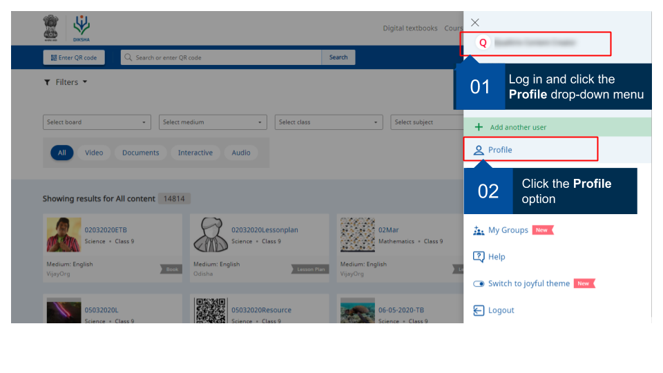</td>
  </tr>
  </table>
  

## Viewing Profile Details

The profile page allows you to view and edit your personal profile details.

<table>
  <tr>
    <th style="width:35%;">Image with instructions</th>
  </tr>
  <tr>
  <td><b>Personal Details</b></td>
  </tr>
  <tr>
  <td>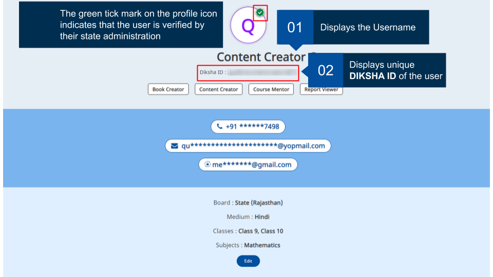</td>
  </tr>
   <tr>
  <td><b>Contact Details</b></td>
  </tr>
  <tr>
  <td>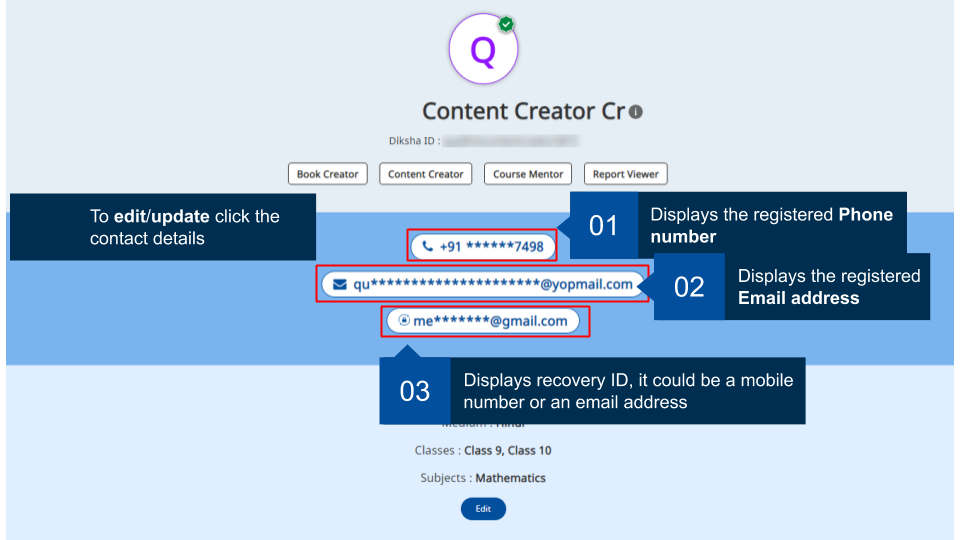</td>
  </tr>
  <tr>
    <td><b>Geolocation and Other Details</b></td>
  </tr>
  <tr>
  <td>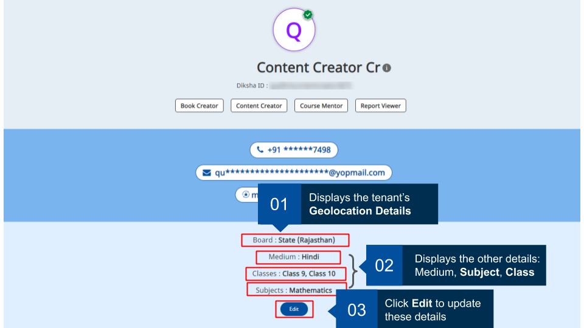</td>
  </tr>
  <tr><td><b>Contribution and course Details</b>
   If you have published or contributed in any of the content on DIKSHA, it is displayed in the <b>Contributions</b> section 
   The learnings you attended or completed on DIKSHA are displayed in the <b>My Learning</b> section</td>
  </tr>
  <tr> <td>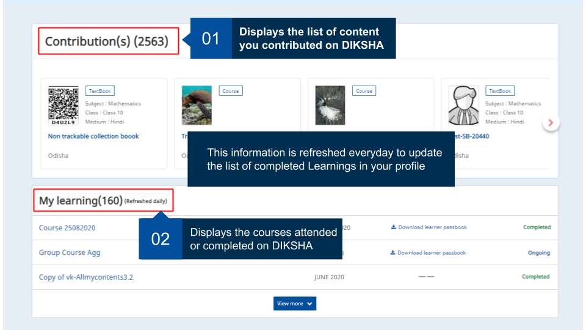</td>
  </tr>
  <tr> <td>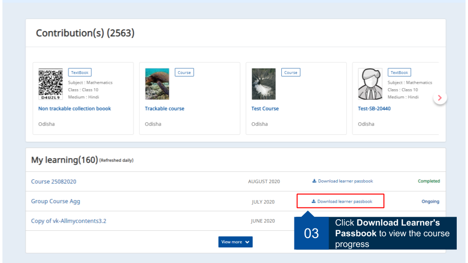</td>
  </tr>
  <tr><td>Learning certificates can be in SVG and/or PDF format</td></tr>
  <tr> <td>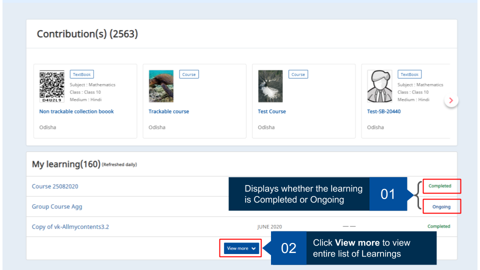</td>
  </tr>
</table>

### Organizations Details

<table>
  <tr>
    <th style="width:35%;">Image with instructions</th>
  </tr>
  <tr>
    <td> 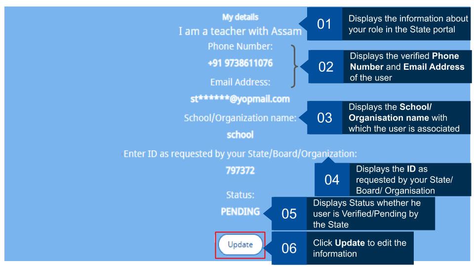  </td>
  </tr>
</table>

## Editing Profile Details

 You can edit the following details using the **Profile** tab: 
  - Personal details such as Name, State, and District
  - Contact details such as a mobile number and email ID
  - Other details such as board, medium, subject, and class

For details refer <a href ="./edit-profile.html">how to edit profile details</a>

### Add Recovery ID

<table>
  <tr>
    <th style="width:35%;">Image with instructions</th>
  </tr>
  <tr>
    <td>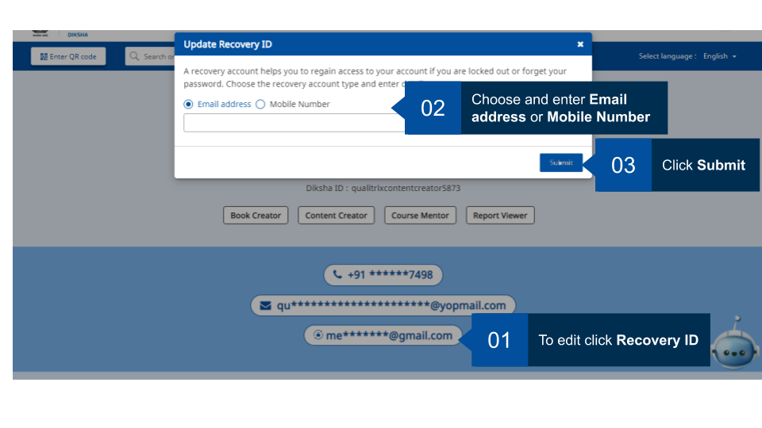</td>
  </tr>
</table>

### Switching Themes

DIKSHA users have the option of choosing between two themes. Switching between the two themes is a seamless process. Here are step-by-step instructions on how to change themes.

<table> 
  <tr>
    <th style="width:35%;">Image with instructions</th>
  </tr>
  <tr>
  <td><b>Switch from Joyful theme to Old theme</b></td>
  </tr>
  <tr><td>
   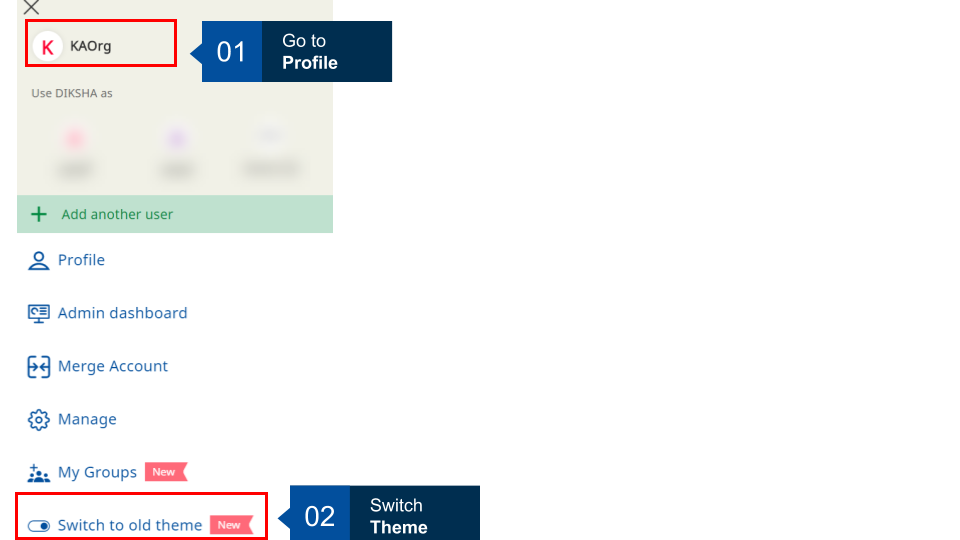</td>
  </tr>
  </table>
  
### Copying DIKSHA ID

Logged-in users can copy their DIKSHA ID and share it with others. For example, group admins require DIKSHA IDs to add members. The admins can request members to copy and share their DIKSHA IDs.

Users can now go to their profile and access their DIKSHA code easily 

<table> 
  <tr>
    <th style="width:35%;">Image with instructions</th>
  </tr>
  <tr><td>
   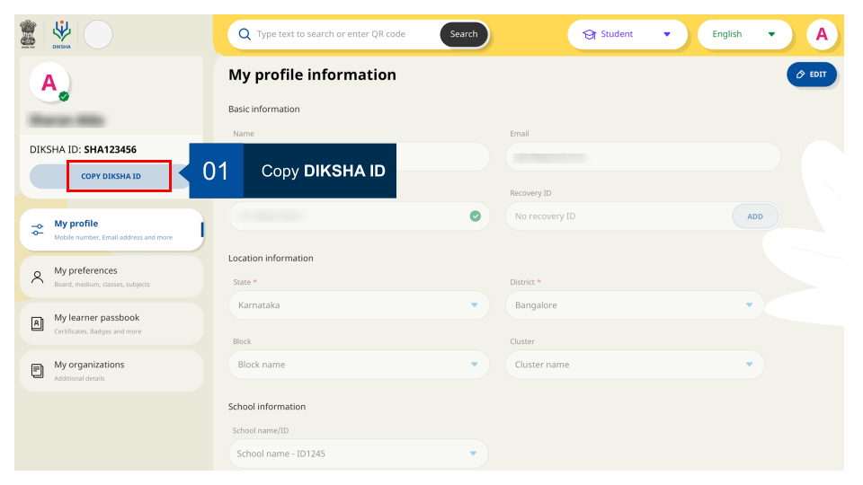</td>
  </tr>
  </table>