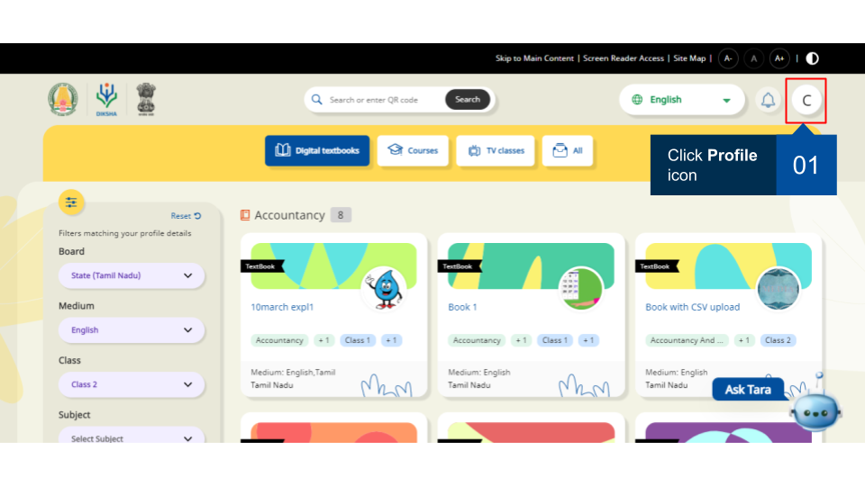
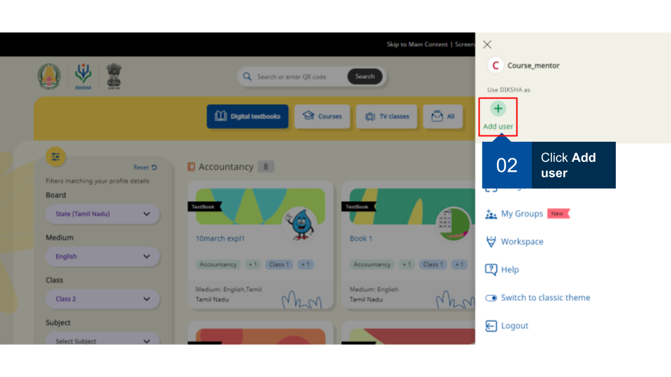
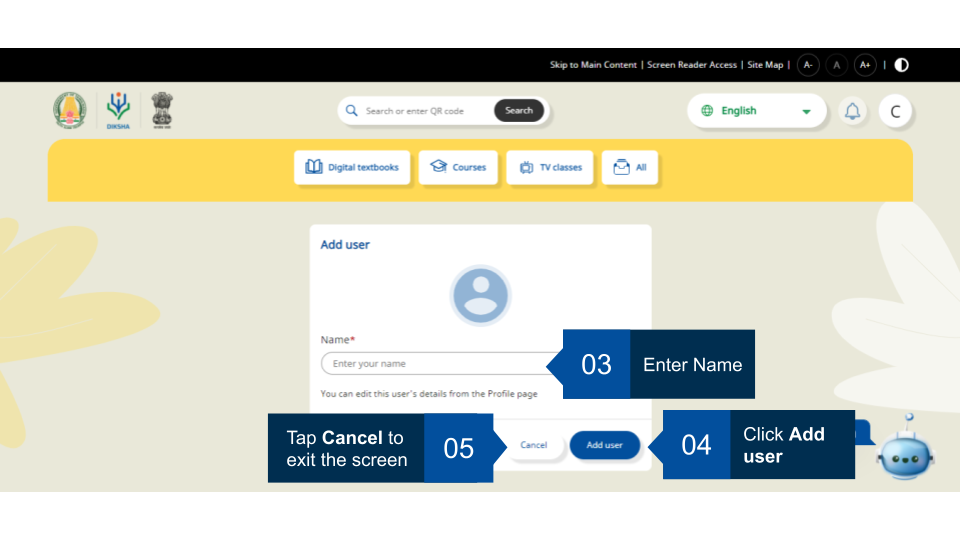
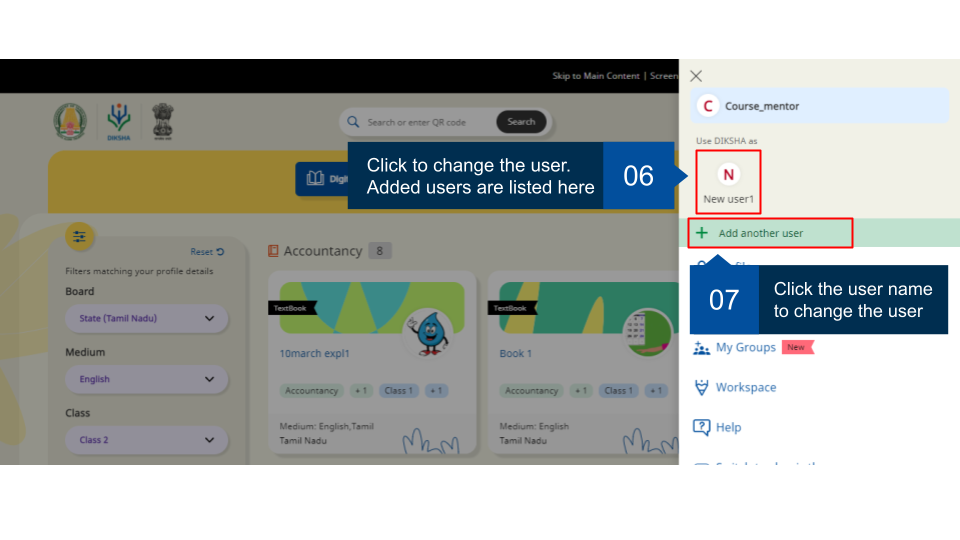
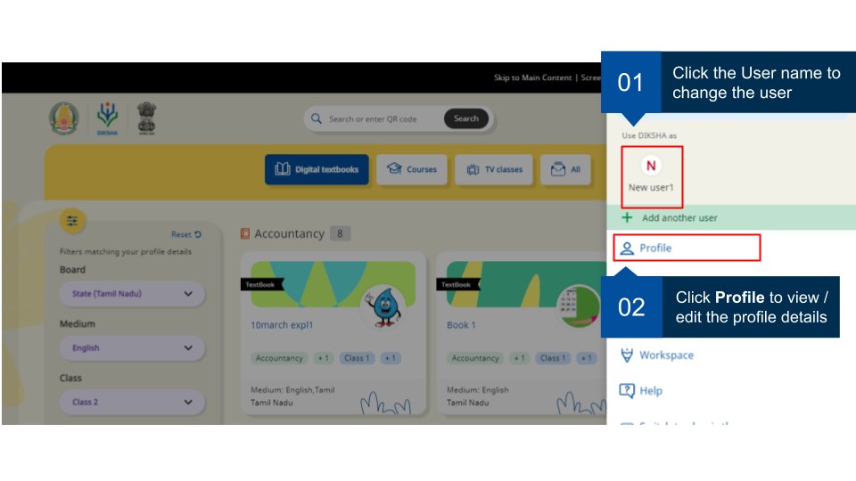

## Overview

You can create multiple user profiles under the same persona; it helps to keep track of the activities completed by each user. Courses attended by the users are automatically updated when a user completes a course on DIKSHA. Users can edit the user profile details as per requirement. 

## Adding a user 

You can add another user with an existing user.
  
<table>
  <tr>
    <th style="width:35%;">Image with instructions</th>
 </tr>
  <tr>
    <td></td>
    </tr>
  <tr>
    <td></td>
    </tr>
   <tr>
    <td></td>
    </tr>
    <tr>
    <td></td>
    </tr>
</table>  
  
## Switching user and updating profile

You can switch the user with an existing user and view or update their profiles.
  
<table>
  <tr>
    <th style="width:35%;">Image with instructions</th>
 </tr>
  <tr>
    <td></td>
    </tr>
</table>   

