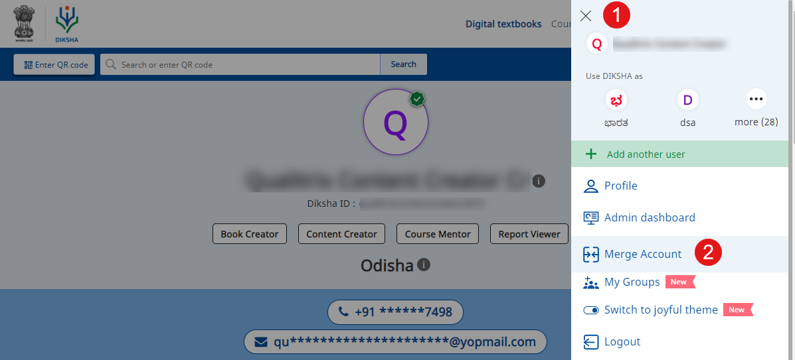
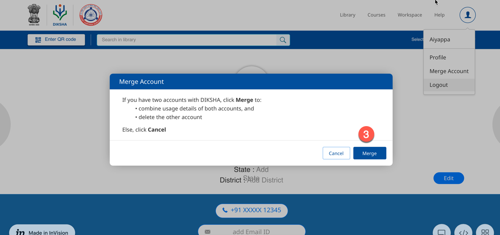
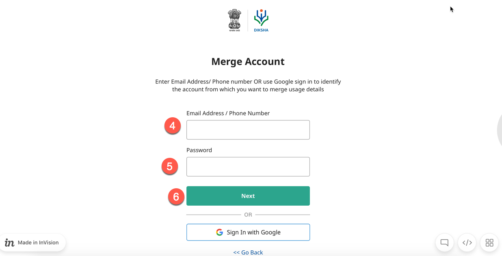
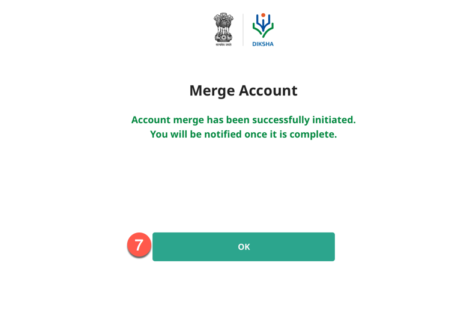

## Overview

On Diksha users can create accounts in three ways:
1. Signing with Google Account
2. Signing with State System
3. First Time User Sign up

For more details on account creation, refer <a href="../login/index.html" target="_blank">Sign In</a>

For example, let us consider a user has taken a course on DIKSHA by logging in using either their Google account or self-signed up account. The user now wants to reflect those usage details in his/her state account, in such scenario DIKSHA provides a feature of "Merge Account" using which the user can combine the usage details.

The Merge Account feature enables users to:
- combine the usage details of both the accounts and
- delete the other account from DIKSHA records

Note:
Account merge can be initiated only from a valid active account registered in the State system.

## Prerequisites

Ensure you have a valid email address/phone number registered on DIKSHA with its corresponding password.

<table>
   <tr>
      <th style="width:35%;">Step</th>
      <th style="width:65%;">Screen</th>
   </tr>
   <tr>
      <td>1. Click the <b>Profile</b> icon
          2. Select the <b>Merge Account</b> option from the list
      </td>
      <td></td>
   </tr>
   <tr>
     
      <td>3. Click <b>Merge</b> in the <b>Merge Account</b> pop-up box to combine the usage details of both accounts and delete the other account
      </td>
      <td></td>
   </tr>
   <tr>
      <td>4. Enter your <b>Email Address</b>/<b>Phone Number</b> or use Google sign in registered on DIKSHA to identify
         the account from which you want to merge usage details
          5. Enter your <b>password</b>
          6. Click <b>Next</b></td>
      <td></td>
   </tr>
   <tr>
      <td>7. Click <b>OK</b>. Account merge is initated if the email address or phone number entered matches the details
         in DIKSHA records. In case, account merge fails, re-check and enter email address/phone number as registered on
         DIKSHA</td>
      <td></td>
   </tr>
</table>