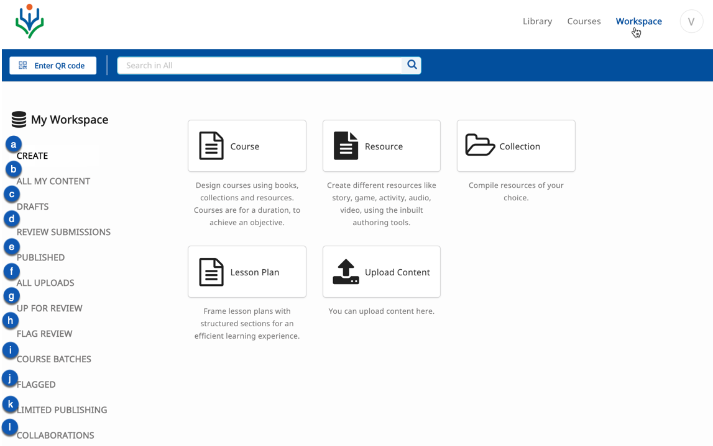
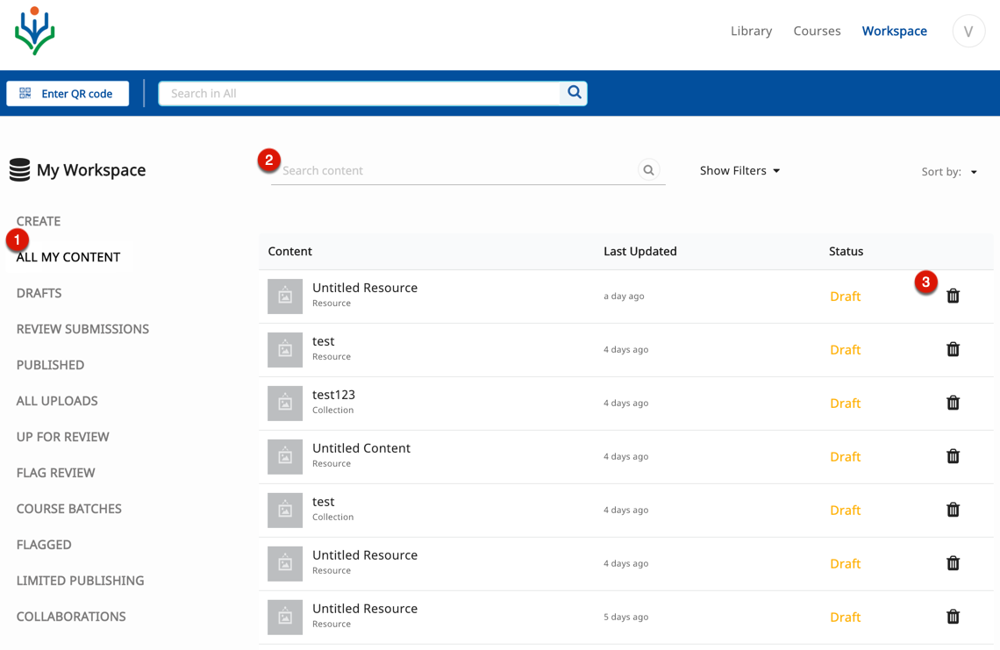
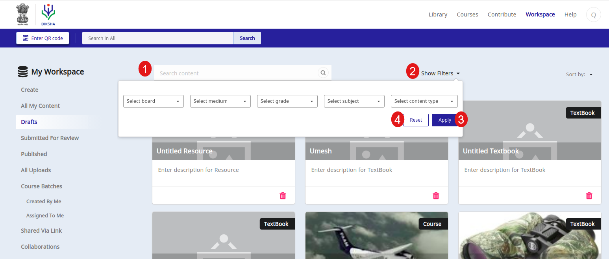

## Overview

There are various user roles on DIKSHA. Each user has a unique role to play in their respective organizations. Organization administrators assign one or many responsibilities to users on DIKSHA. Extending the literal meaning of workspace, a space to work, DIKSHA provides a unique workspace to suit the work needs of each user.  

## Prerequisites

<table>
  <tr>
    <th style="width:35%;">Step</th>
    <th style="width:65%;">Screen</th>
  </tr>
  <tr>
    <td>1. You are logged in  2. You have clicked on <b>Workspace</b> tab 
       </td>
      <td></td>
  </tr>
  </table>

## Understanding your Workspace

The workspace interface varies based on the role assigned to the user. For instance, a book reviewer has only the create book tile, while a content content would have all the tiles viz., collection, course, lesson plan, and, resource. The image used displays all the options in the workspace as it would appear for an organization administrator.

<table>
  <tr>
    <th style="width:35%;">Step</th>
    <th style="width:65%;">Screen</th>
  </tr>
  <tr>
    <td>In your Workspace you can:  a. Create Book, Course, Resource, Collection, Lesson plan  b. View list of content created by you  c. View content drafts which are not send for review  d. View list of content submitted for review  e. View published content  f. View all uploaded content  g. View list of content submitted for your review. This option is available only for a content reviewer  h. View list of flagged content that have to be reviewed. This option is available only for flag reviewers. i. View all the course batches you are enrolled in  j. View list of content that you have flagged  k. View list of content that have been shared to a specific audience. To read more on limited sharing feature, refer <a href="/help/creator/common/limitedpublishnshare.html" target="_blank">Limited Publishing and Sharing</a>  l. View list of content that you colloboratively working on with other creators
    </td>
    <td></td>
  </tr>
  </table>

## Deleting Content 

<table>
  <tr>
    <th style="width:35%;">Step</th>
    <th style="width:65%;">Screen</th>
  </tr>
  <tr>
  <td>1. Click <b>All My Content</b> to view all the content you have created 
   2. Type on the <b>Search Bar</b> to search for content in the displayed list 
   3. Click <b>Delete</b> icon to delete the content
   <b>Note:</b> Content creator can delete only content created by them
  </td>
  <td></td>
  </tr>
</table>
 

## Searching and Filtering Content

You can discover the content in drafts and published section using search and filter options

<table>
  <tr>
    <th style="width:35%;">Step</th>
    <th style="width:65%;">Screen</th>
  </tr>
  <tr>
    <td><b>Searching Content</b>
    1. You can also search for content by using the filter options
     <b>Applying Filters</b>
     2. You can also discover content using the filter options. Click <b>Show Filters</b> and select the following from their respective drop-down menus: 
         &emsp;a. <b>Board</b> 
         &emsp;b. <b>Medium</b> 
         &emsp;c. <b>Grade</b> 
         &emsp;d. <b>Subject</b> 
         &emsp;e. <b>Content Type</b> 
     3. Click <b>Apply</b> to apply the filters 
     4. Click <b>Reset</b> to clear the filters </td>
        <td></td>
    </tr>
</table>

