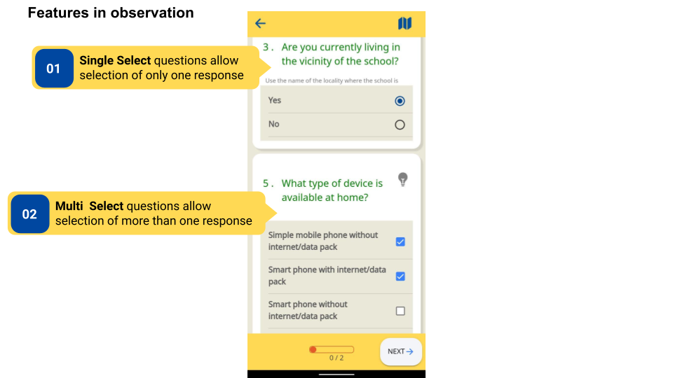
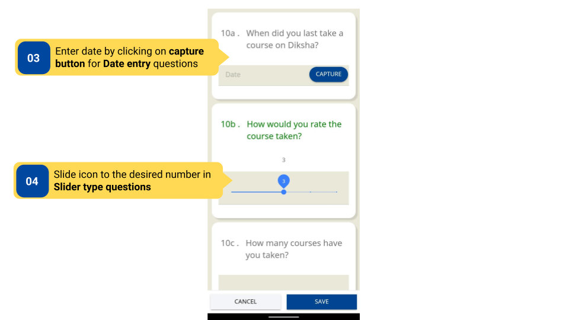
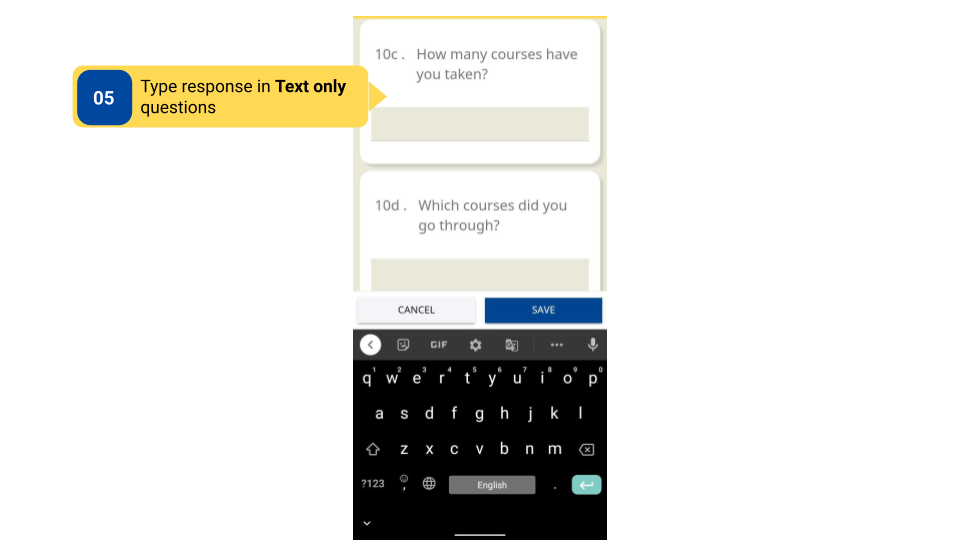
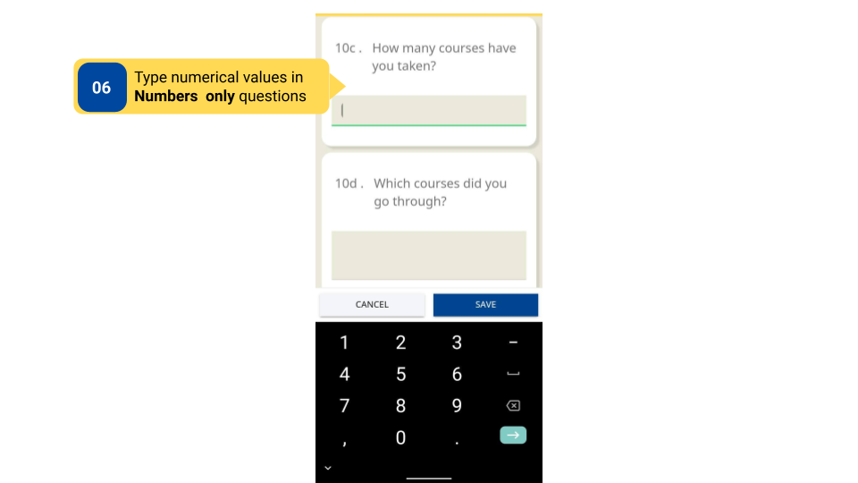
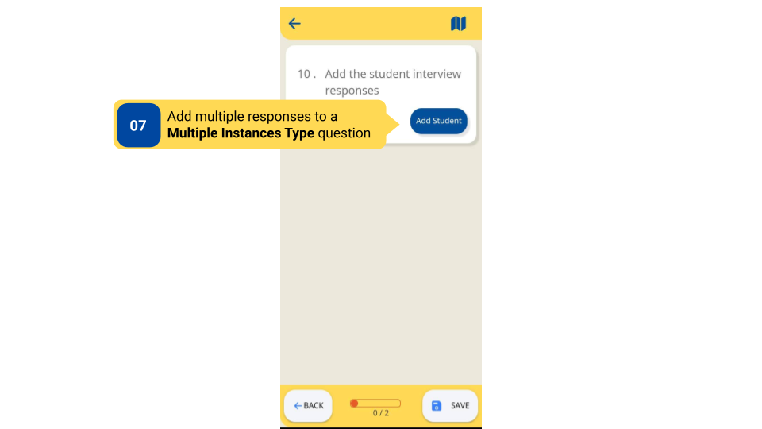
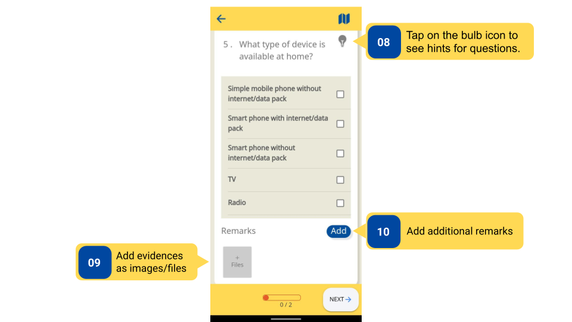
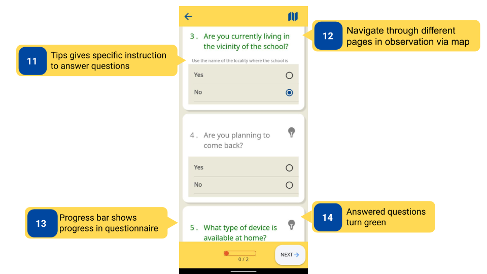
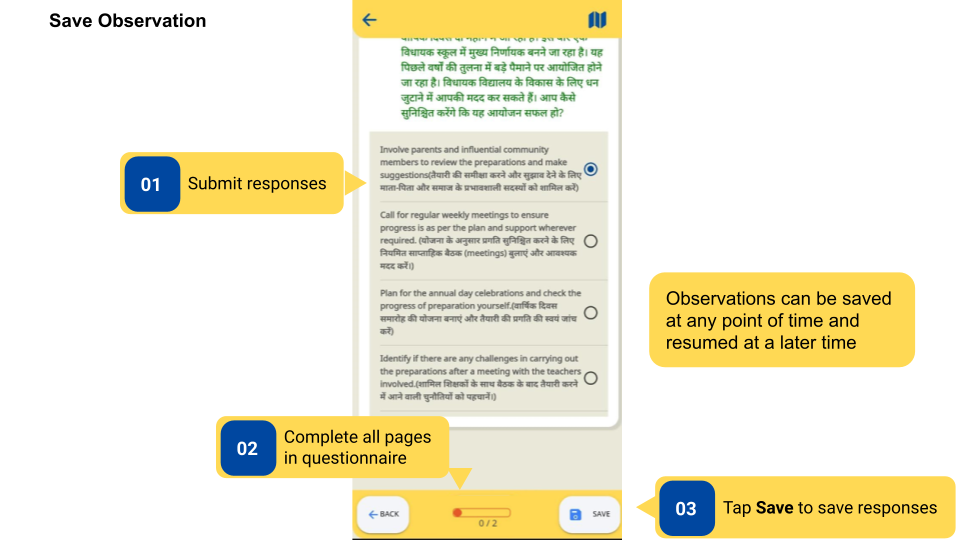
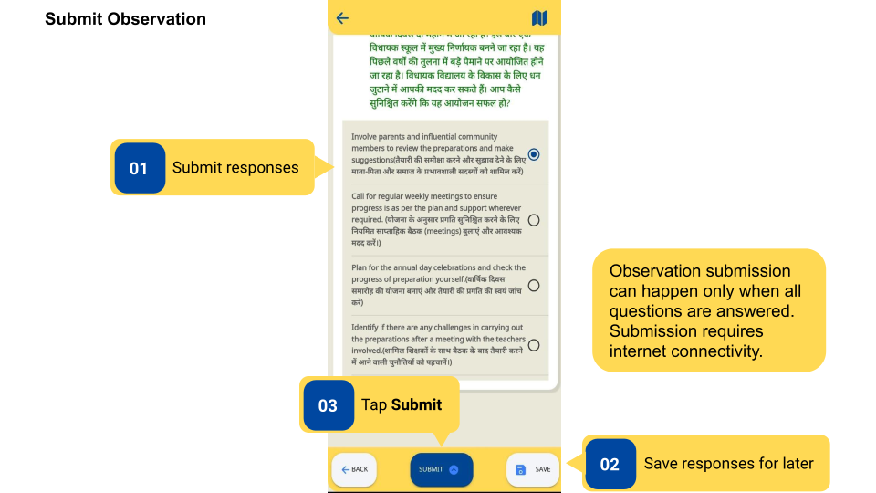
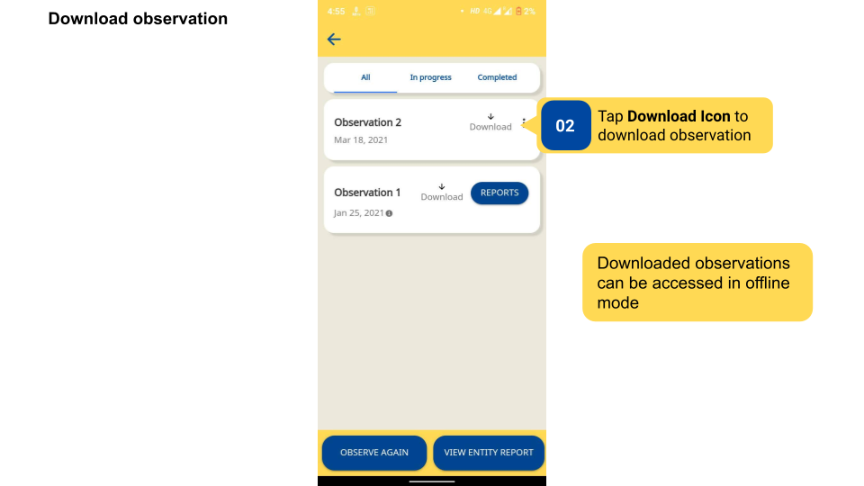

### Overview

- An observation questionnaire has different kinds of questions and features that can be used to navigate through the questionnaire.

- Observations can be saved before submitting to save the progress of responses filled. Users can come back to saved responses at any point before submitting the observation.

- After all the questions have been answered in an Observation, the **Submit** button gets enabled, and users can submit the observation.

- Users can download an observation to be filled offline. The observation can be saved offline and submitted when an internet connection is available. Downloaded observations can be accessed using the **Download** tab in the bottom navigation panel of DIKSHA app.

### Before You Begin

<table>
  <tr><td>Who can access Observations?</td>
   <td>HTs and Officials, Teachers</td>
  </tr>
  <tr><td>What is needed?</td>
  <td><ul><li>An Observation is started, and the user is on the questionnaire page.</li>
  <li>Active internet connection to save the observation form online.</li></ul></td>
  </tr>
</table>

### Outcome

<table>
 <tr><td>What will be the outcome?</td>
  <td><ul><li>Identify types of questions and features that can be used for navigation.</li>
  <li>Observation progress is saved before submission.</li>
  <li>Observation is submitted.</li>
  <li>The observation questionnaire is saved offline.</li></ul></td>
  </tr>
</table>
  

Observation Features

<table>
<tr>
  <th>Image with instructions</th>
</tr>
  <tr>
    <td></td>
    </tr>
    <tr>
    <td></td>
    </tr>
    <tr>
    <td></td>
    </tr>
    <tr>
    <td></td>
    </tr>
    <tr>
    <td></td>
    </tr>
    <tr>
    <td></td>
    </tr>
    <tr>
    <td></td>
    </tr>
</table>

### Save Observation

To save an observation

<table>
<tr>
  <th>Image with instructions</th>
</tr>
<tr>
    <td></td>
    </tr>
</table>

### Submit Observation   

<table>
<tr>
  <th>Image with instructions</th>
</tr>
<tr>
    <td></td>
    </tr>
</table>

### Download Observation

<table>
<tr>
  <th>Image with instructions</th>
</tr>
<tr>
    <td></td>
    </tr>
</table>

### Additional Notes

- After a response is recorded, the question turns green. 

- After the Observation is submitted, no edits can be made to it.

### What's Next?

- [Observation Report on DIKSHA App](../observation-reports/index.html){:target="_blank"}  
- [Observation Report on DIKSHA Portal](../observation-reports/observation-report-on-diksha-portal.html){:target="_blank"}  
- [Observation Creation](../observation-creation/index.html){:target="_blank"}  
