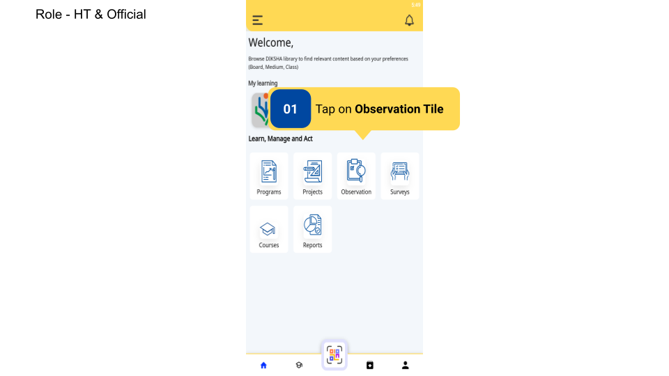
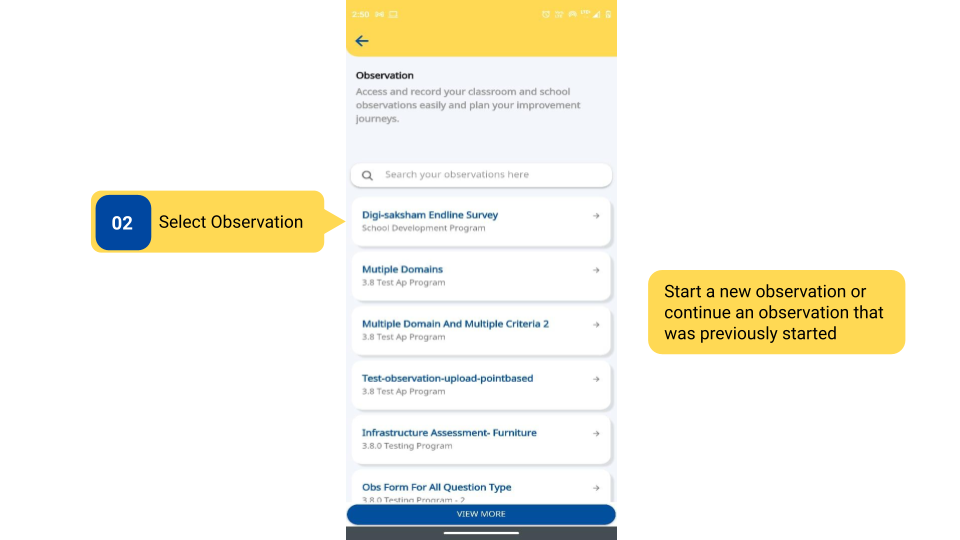
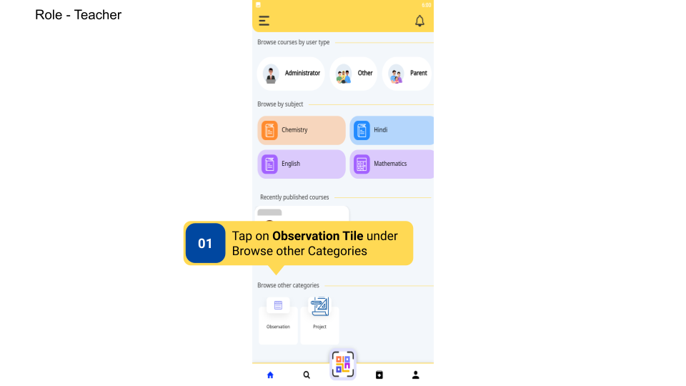
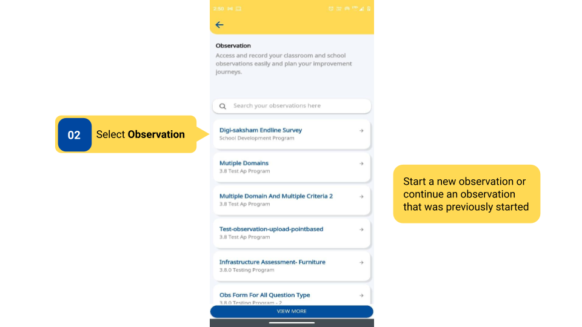
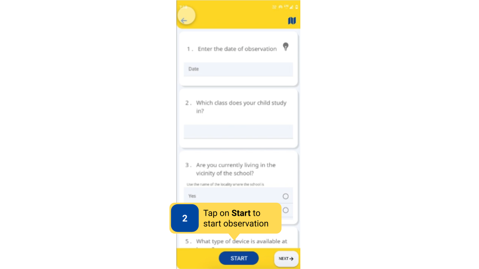
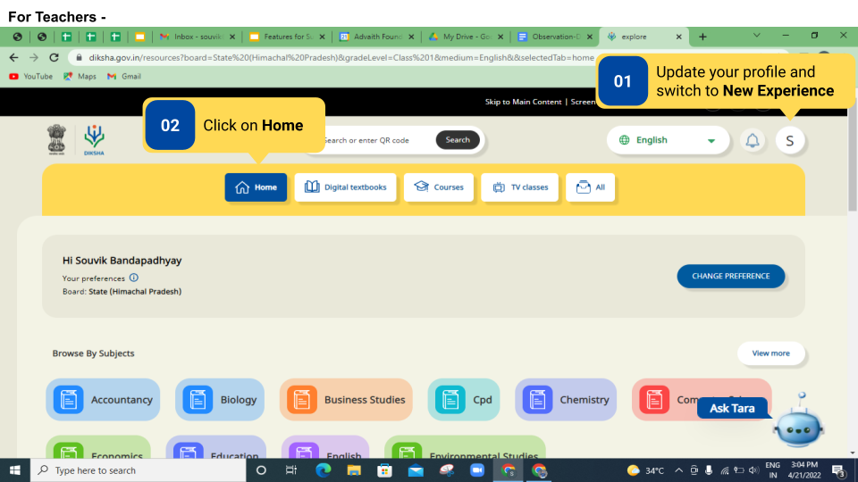
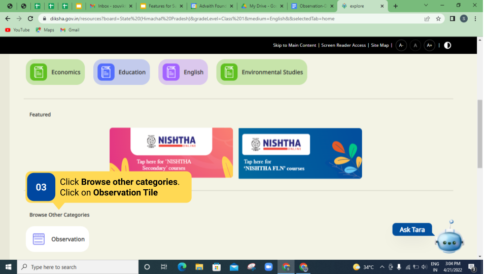
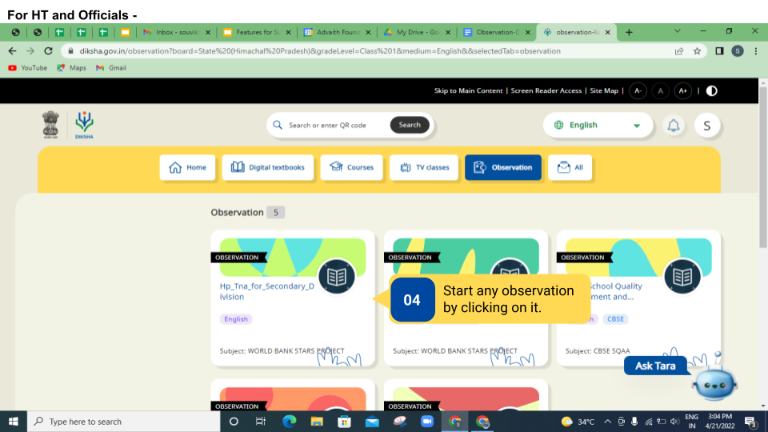

### Overview  

- DIKSHA Observations are created by Content Creator and can be viewed by signed-in users who are logged in as HT & Officials or teacher profiles.

- Users can access their mapped Observations using the portal as well. The Observations on the portal are also available for the targeted users only (HT & Officials and Teachers).

- **HT and Officials** can access Observations on the App through observation tile, link, or QR code.

- **Teachers** can access Observations using the Observation tile in the **Browse other categories** section, through links and QR codes, provided it is enabled for the board selected in the profile.

### Before You Begin

<table>
  <tr><td>Who can access Observations?</td>
   <td>HTs and Officials, Teachers</td>
  </tr>
  <tr><td>What ways can Observation be accessed?</td>
  <td><ul><li>On the DIKSHA app, using the Observation tile, link, or QR Code</li>
  <li>On the DIKSHA Portal</li></ul></td>
  </tr>
  <tr><td>What is required for HT and Officials to access Observations?</td>
   <td><ul><li>Updated profile with the board, sub role, and location (state, district, and other details)</li>
   <li>User should be on the Home page.</li></ul></td>
  </tr>
  <tr><td>What is required for Teachers to access Observations?</td>
   <td><ul><li>Updated profile with board and location (state, district, and other details)</li>
   <li><b>New experience</b> needs to be selected from the side menu.</li>
   <li>Teachers should be on Homepage in the <b>Browse other categories section</b>.</li></ul></td>
  </tr>
</table>

### Outcome

<table>
 <tr><td>What will be the outcome?</td>
  <td><ul><li>A list of observations that can be recorded is displayed on the app.</li>
  <li>A list of observations that can be recorded is displayed on the portal.</li></ul></td>
  </tr>
</table>
  
### Access Observations on DIKSHA App

To access Observation on DIKSHA app

<table>
<tr>
  <th>Image with instructions</th>
</tr>
  <tr>
    <td></td>
    </tr>
    <tr>
    <td></td>
    </tr>
    <tr>
    <td></td>
    </tr>
    <tr>
    <td></td>
    </tr>
    <tr>
    <td></td>
    </tr>
    <tr>
    <td></td>
    </tr>
</table>

### Access Observations on DIKSHA Portal

To access Observation on DIKSHA Portal

<table>
<tr>
  <th>Image with instructions</th>
</tr>
  <tr>
    <td></td>
    </tr>
    <tr>
    <td></td>
    </tr>
    <tr>
    <td></td>
    </tr>
</table>

### Additional Notes

The observation tile is available only if it has been enabled for your board. To enable Observation, send the request <a href="mailto:surveysupport@teamdiksha.org" target="_blank">DIKSHA Support Team</a>. 

### What's Next?

[Start Observation](./start-observation.html){:target="_blank"}