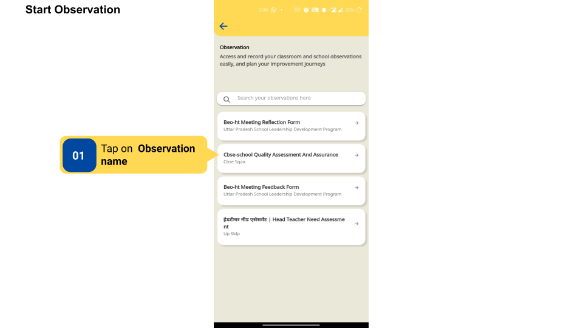
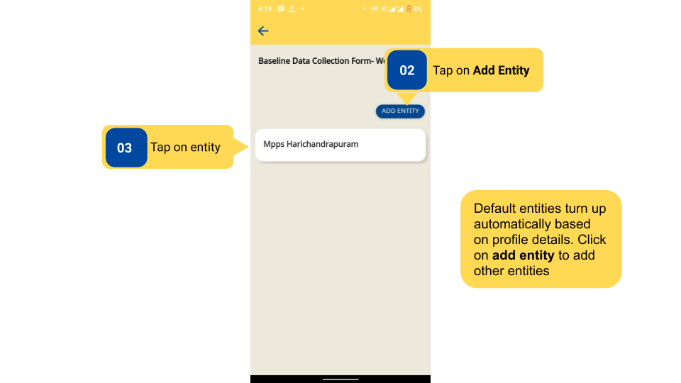
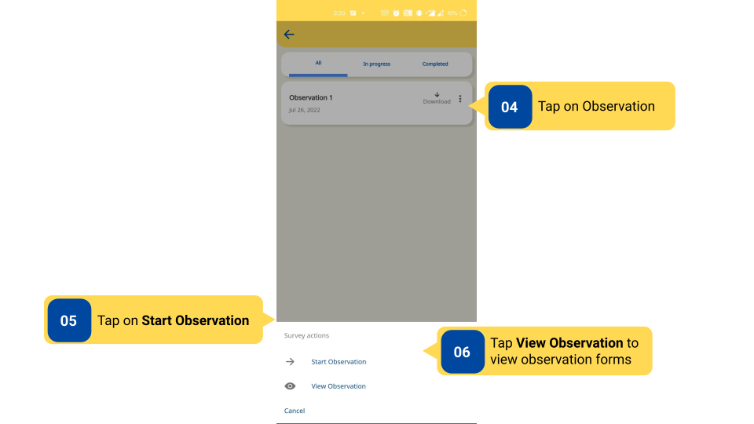
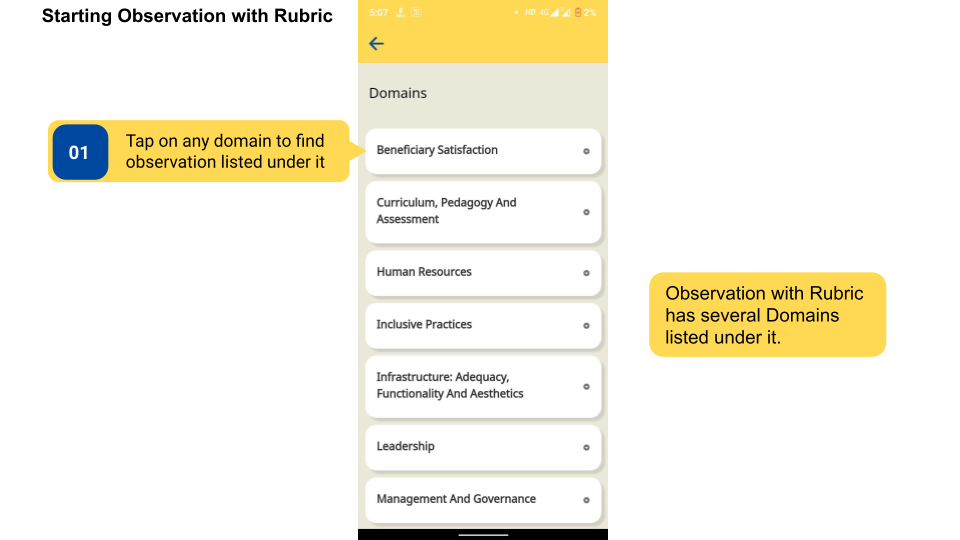
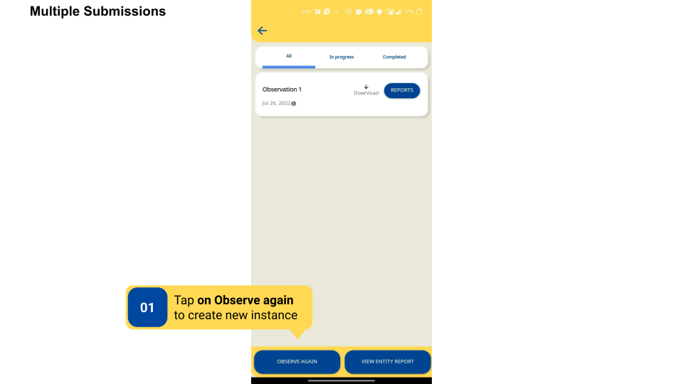
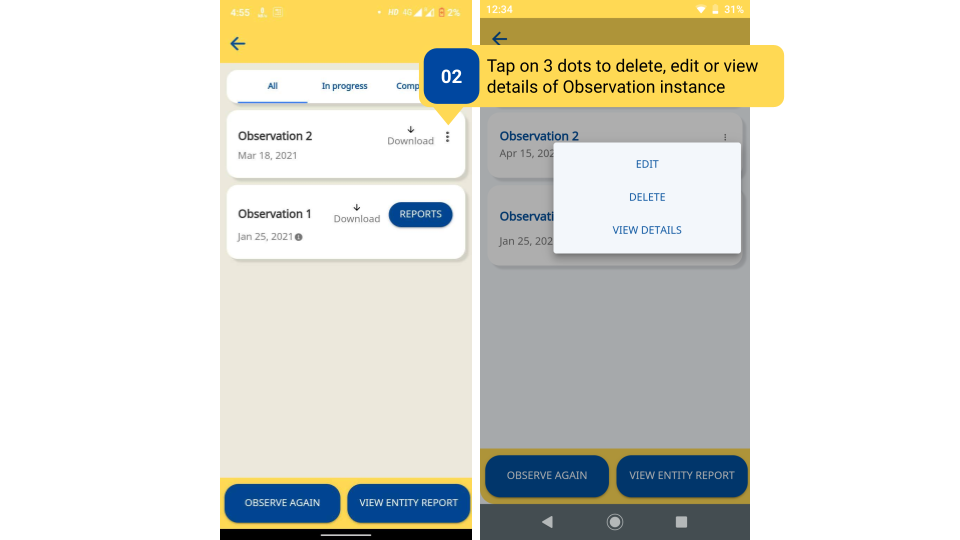

### Overview

- The Observation forms are designed to capture data for a certain entity (entity is the district, block, or school that is mapped to the user based on the role that is selected on the profile). Thus, entities can be selected for observation, followed by filling up a questionnaire to record all data for that entity. On selecting an observation, users are prompted to select an entity on the entity page.

- Observations with Rubric have Domains and questionnaires linked to each domain. Domains are the different areas of focus that the observation wants to record information about. Each domain has its observation questionnaire.

- Same observation can be filled and submitted multiple times for an entity  (entity is the district, block, or school that is mapped to the user based on the role that is selected on the profile). All observation instances of an entity can be viewed on the same page. 

### Before You Begin

<table>
  <tr><td>Who can access Observations?</td>
   <td>HTs and Officials, Teachers</td>
  </tr>
  <tr><td>What is needed?</td>
  <td><ul><li>Log in as a <b>Teacher</b> or <b>HT and Officials</b>.</li>
  <li>Select entity or add a new entity from the entity page.</li></ul>
</td>
  </tr>
</table>

### Outcome

<table>
 <tr><td>What will be the outcome?</td>
  <td><ul><li>Observation is started.</li>
  <li>Observation linked to a domain is started.</li>
<li>An instance of observation is created.</li></ul> 
</td>
  </tr>
</table>

### Start Observation

To start an observation

<table>
<tr>
  <th>Image with instructions</th>
</tr>
  <tr>
    <td></td>
    </tr>
    <tr>
    <td></td>
    </tr>
    <tr>
    <td></td>
    </tr>
</table>

### Starting Observation with Rubric 

To start observation with rubric

<table>
  <tr>
    <th>Image with instructions</th>
  </tr>
  <tr>
    <td></td>
    </tr>
</table>

### Multiple Submissions

<table>
<tr>
  <th>Image with instructions</th>
</tr>
  <tr>
    <td></td>
    </tr>
    <tr>
    <td></td>
    </tr>
</table>

#### Additional Notes

- Observation questionnaire can be viewed before starting.

- More than one entity can be added for the same observation questionnaire.

- Observations can be downloaded, edited, or deleted.

- If multiple observation instances are created for the same entity, then individual and consolidated observation reports of all observation instances will be generated.

### What's Next?

[Features in observation](./features-in-observation.html){:target="_blank"}