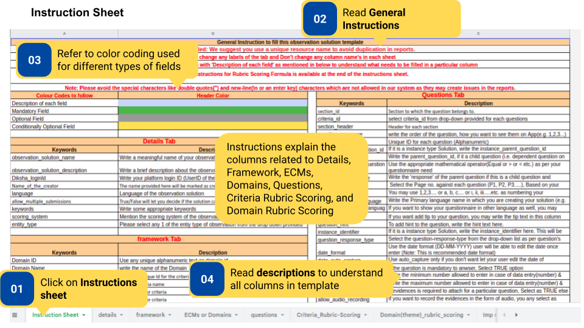
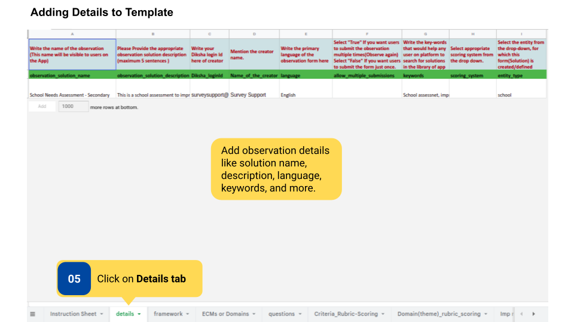
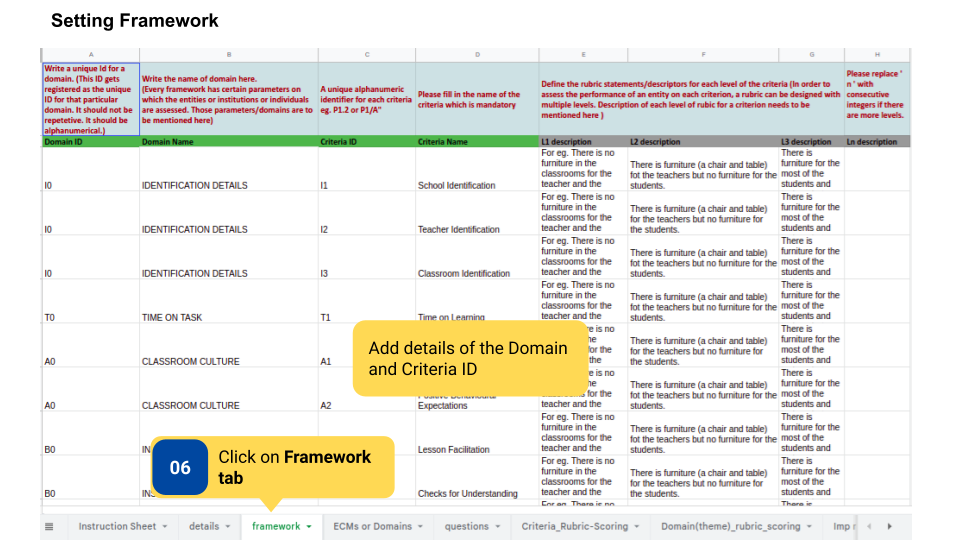
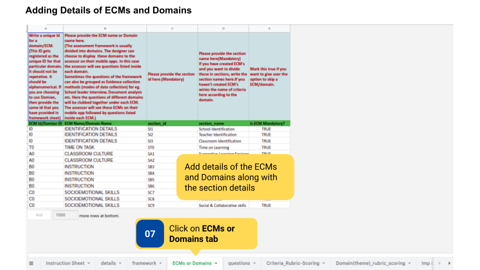
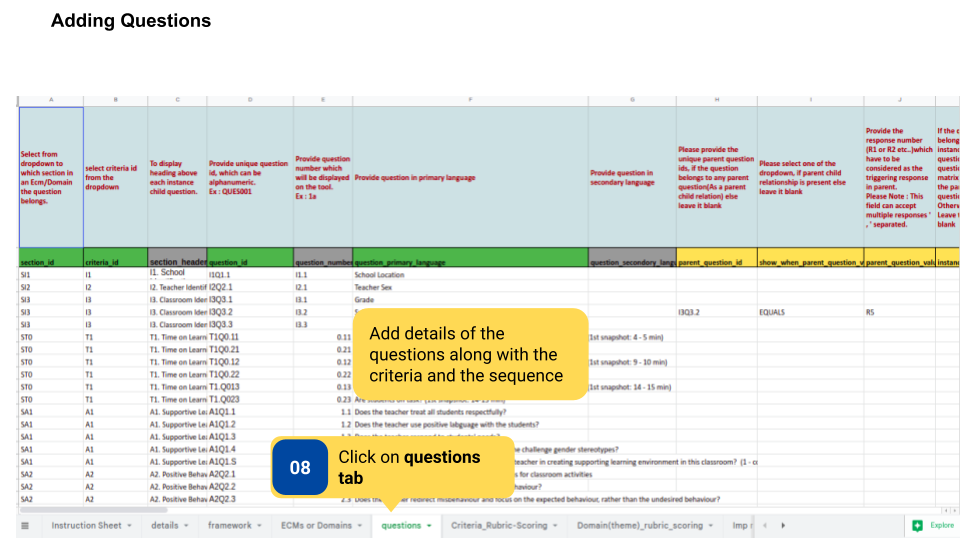
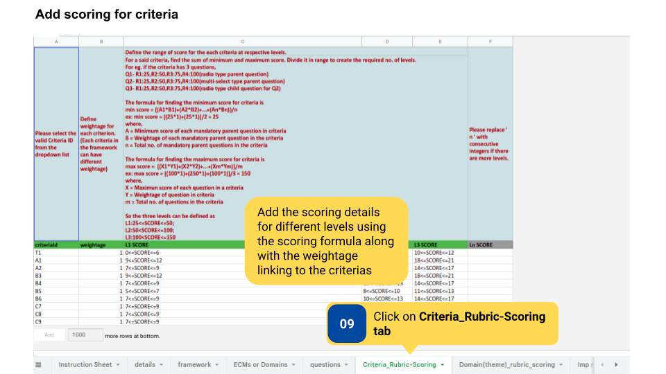
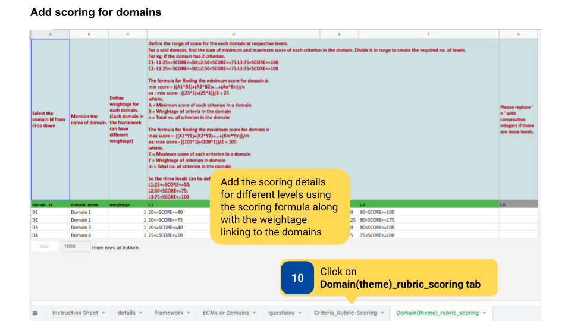
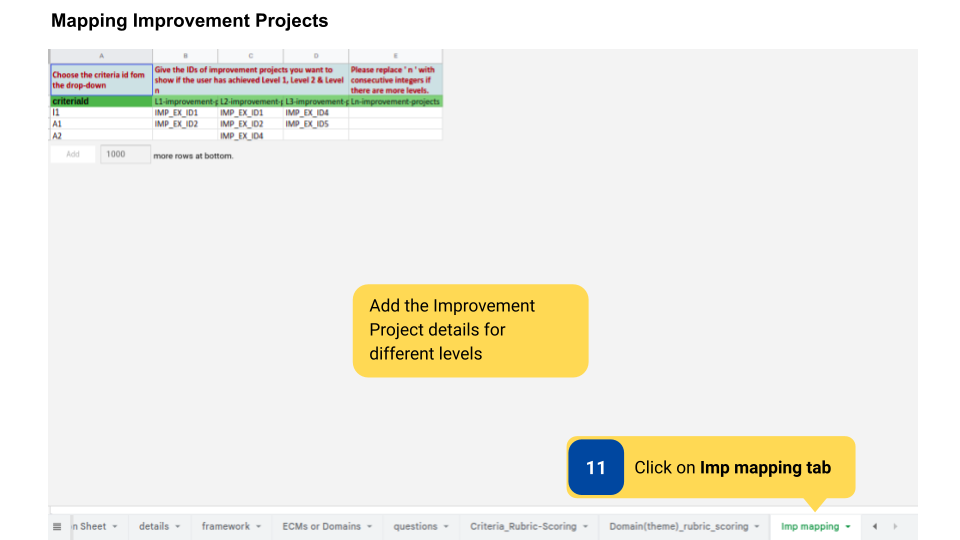

### Overview

Observations are created and updated by the content creator using a template. After the filled template is sent over email to the <a href="mailto:surveysupport@teamdiksha.org" target="_blank">DIKSHA support team</a>, the team will then upload the observation on DIKSHA. 

Observation-led Improvements are observations with rubrics with Improvement Projects mapped to each level. Users get suggestions for starting an Improvement Project based on the level they are at after completing the observation. There are 8 tabs in Observation without rubric- Instructions, Details, Framework, ECMs or Domains, Questions, Criteria Rubric Scoring, Domain Rubric Scoring, Imp Mapping. The template is colour-coded for description of columns, mandatory fields, optional fields, and conditionally optional fields, so that the content creator knows what to fill.

### Before You Begin

<table>
  <tr><td>Who can create an observation?</td>
   <td>User with Content Creator role</td>
  </tr>
  <tr><td>What is needed?</td>
  <td>Editable copy of <a href="https://docs.google.com/spreadsheets/d/1GL_vImNemnBEaMRL64dOpul3Xc5-WKAV7S-pY2tmx6k/edit" target="_blank">Template for creating Observation-led Improvement</a></td>
  </tr>
</table>

### Outcome

<table>
 <tr><td>What will be the outcome?</td>
  <td>Content creator fills template for the creation of observation-led improvement</td>
  </tr>
</table>
  

### Creating Observation-Led Improvement

To create observation led improvement projects

<table>
<tr>
  <th>Image with instructions</th>
</tr>
  <tr>
    <td></td>
    </tr>
    <tr>
    <td></td>
    </tr>
    <tr>
    <td></td>
    </tr>
    <tr>
    <td></td>
    </tr>
    <tr>
    <td></td>
    </tr>
    <tr>
    <td></td>
    </tr>
    <tr>
    <td></td>
    </tr>
    <tr>
    <td></td>
    </tr>
</table>

### Additional Notes

- Download and fill the template.    
- Observation template should be added to <a href="https://docs.google.com/spreadsheets/d/1Q4z1d1aUHY5VVrco2TvHPuWEq7314glUjFxB-jYjfiY/edit?usp=sharing">program template</a> by the Program Designer to make it available on the platform.
