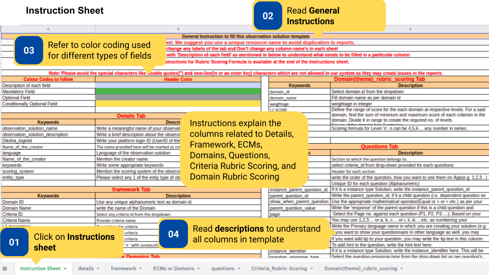
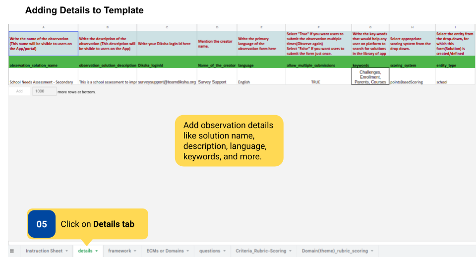
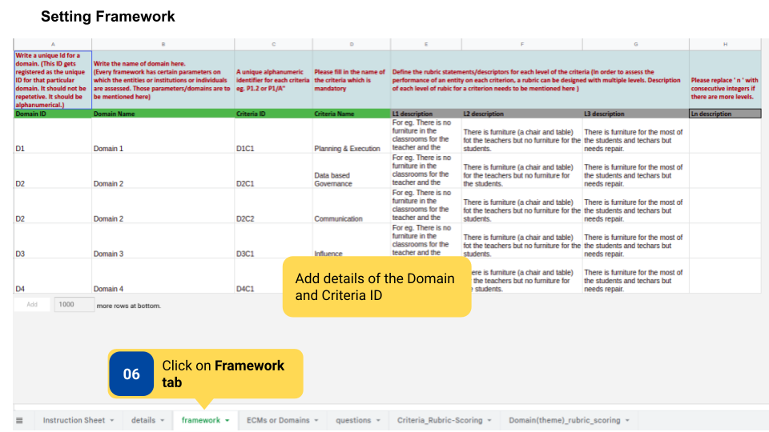
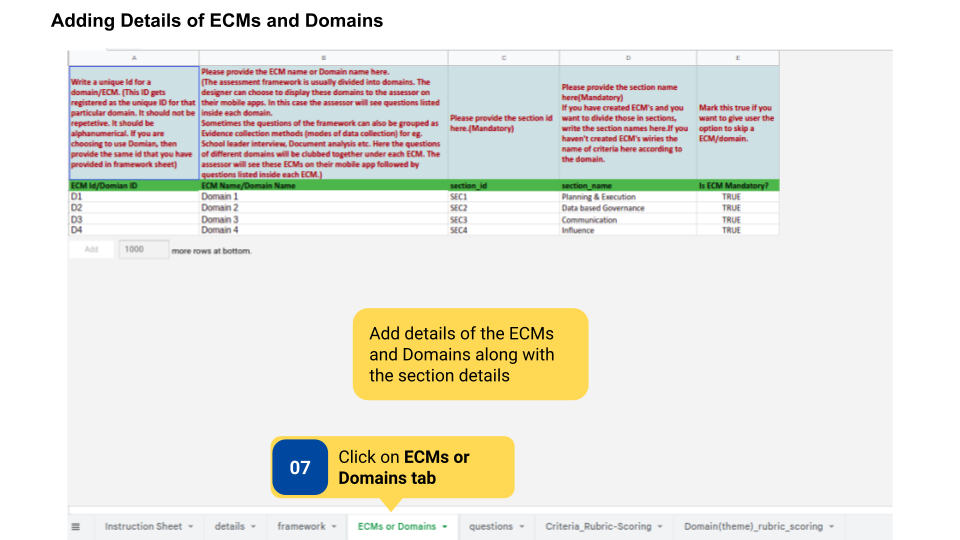
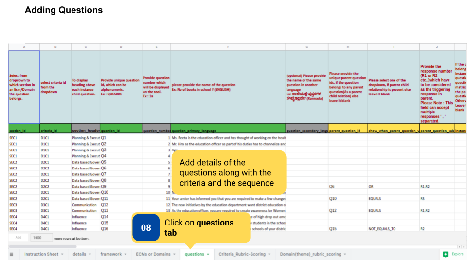
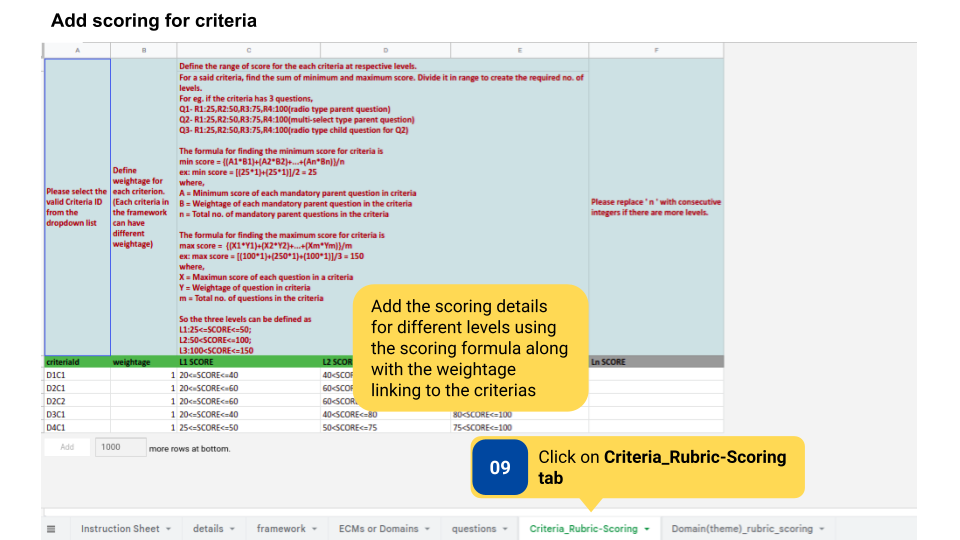

### Overview

Observations are created and updated by the content creator using a template. After the filled template is sent over email to the <a href = "mailto:surveysupport@teamdiksha.org" target="_blank">DIKSHA Support Team</a>, the team then uploads the observation on DIKSHA.

Observation with rubric has specific domains and criteria. Scores are set for each criterion. Based on the scores users get on taking up an observation, they are shown the level (L1, L2, L3) their school is at concerning the observation that was conducted.

There are 7 tabs in Observation without rubric- Instructions, Details, Framework, ECMs or Domains, Questions, Criteria Rubric Scoring, Domain Rubric Scoring. The entire template is color-coded to focus user attention on areas that require filing of some sort of description, mandatory fields, optional fields, and conditionally optional fields. 

### Before You Begin

<table>
  <tr><td>Who can create an observation?</td>
   <td>User with Content Creator role</td>
  </tr>
  <tr><td>What is needed?</td>
  <td>Editable copy of <a href="https://docs.google.com/spreadsheets/d/1doPfZrAlKc62E6YAS050E0keMyiPbDGLDQAjFNIn1AY/edit#gid=1621065409" target="_blank">Template for creating Observation with Rubric</a></td>
  </tr>
</table>

### Outcome

<table>
 <tr><td>What will be the outcome?</td>
  <td>Content creator fills template for the creation of observation with rubric</td>
  </tr>
</table>
  

To create observation with rubric

<table>
  <tr>
    <td></td>
    </tr>
    <tr>
    <td></td>
    </tr>
    <tr>
    <td></td>
    </tr>
    <tr>
    <td></td>
    </tr>
    <tr>
    <td></td>
    </tr>
    <tr>
    <td></td>
    </tr>
    <tr>
    <td></td>
    </tr>
</table>

### Additional Notes  

- Download the template to fill it.
- Observation template should be added to <a href="https://docs.google.com/spreadsheets/d/1Q4z1d1aUHY5VVrco2TvHPuWEq7314glUjFxB-jYjfiY/edit?usp=sharing">program template </a></td> by the Program Designer to make it available on the platform.

### What's Next?

[Create observation led improvement](./creating-observation-led-improvement.html){:target="_blank"}