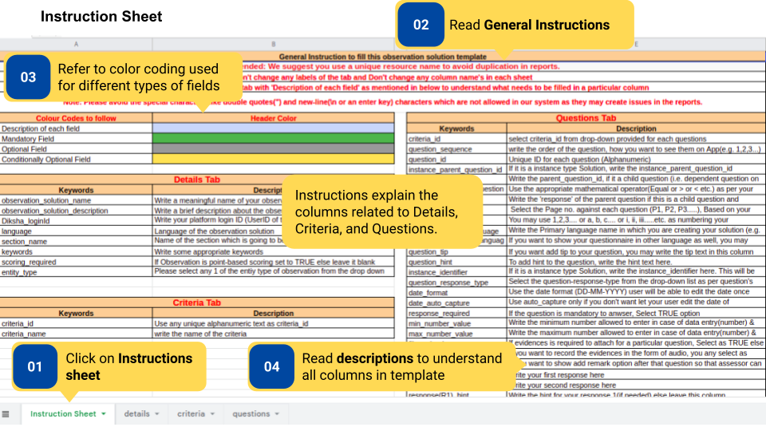
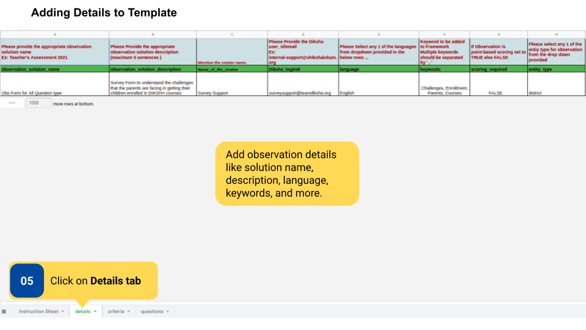
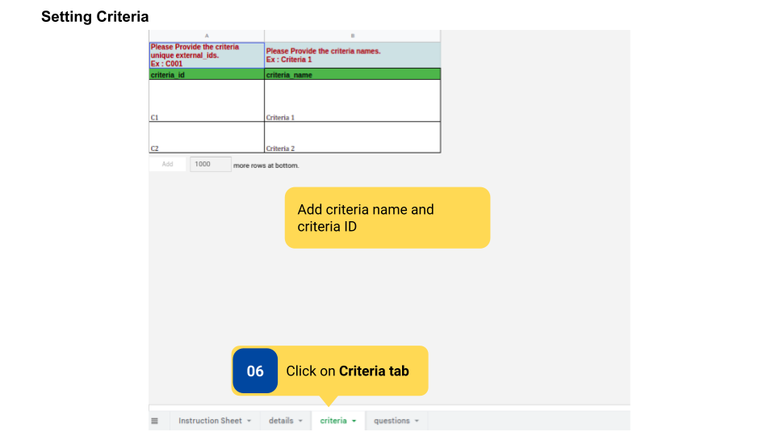
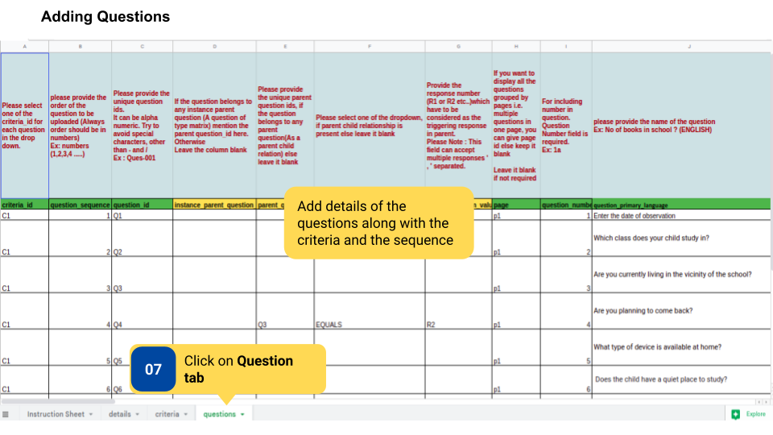

### Overview

Observations are created and updated by the content creator using a template. After the filled template is sent over email to the <a href="mailto:surveysupport@teamdiksha.org" target="_blank">DIKSHA Support Team</a>, the team then uploads the observation on DIKSHA.

Observation without rubrics is a simple questionnaire. Content creators can specify multiple criteria in an observation without rubric. There are 4 tabs in the template for Observation without rubric- Instructions, Details, Criteria, Questions.The template is color-coded for description of columns, mandatory fields, optional fields, and conditionally optional fields, so that the content creator knows what to fill.

### Before You Begin

<table>
  <tr><td>Who can create an observation?</td>
   <td>User with Content Creator role</td>
  </tr>
  <tr><td>What is needed?</td>
  <td>Editable copy of <a href="https://docs.google.com/spreadsheets/d/1uErekrCkuOXMdIvXsCSOr7YiBk4HcS4iJrh0tdALlsw/edit?usp=sharing">Template for creating Observation without Rubric</a></td>
  </tr>
</table>

### Outcome

<table>
 <tr><td>What will be the outcome?</td>
  <td>Content creator fills template for the creation of observation without rubric</td>
  </tr>
</table>
  

To create observation without Rubric  

<table>
<tr>
  <th>Image with instructions</th>
</tr>
  <tr>
    <td></td>
    </tr>
    <tr>
    <td></td>
    </tr>
    <tr>
    <td></td>
    </tr>
    <tr>
    <td></td>
    </tr>
</table>

### Additional Notes

- Download the template to fill it.
- Observation template should be added to <a href="https://docs.google.com/spreadsheets/d/1Q4z1d1aUHY5VVrco2TvHPuWEq7314glUjFxB-jYjfiY/edit?usp=sharing">program template </a></td> by Program Designer to make it available on the platform.
- Criteria are the segregations that content creators may want to set within the observation. The criteria are not visible to the users on the DIKSHA interface.  

### What's Next?

- [Create observation with rubric](./creating-observation-with-rubric.html){:target="_blank"}
- [Create observation-led improvement](./creating-observation-led-improvement.html){:target="_blank"}