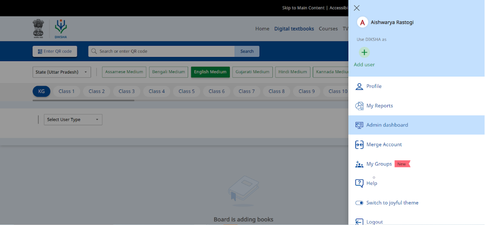

### Overview

Users who are State administrators and report viewers can view and generate aggregated Observation reports published for their tenant. These are aggregated reports of all the programs rolled out in a state with Observations. Each State has access to its own usage reports. 

Administrators can view the reports as graphs or in a tabular format. These reports can, be viewed and downloaded. Reports are updated on a daily basis and gives cumulative data as of date.

### Before You Begin

<table>
  <tr><td>Who can access Observation reports?</td>
   <td>State admins with Report viewer rights</td>
  </tr>
  <tr><td>How can State admins access Reports?</td>
  <td>Using Admin Dashboard on DIKSHA Portal</td>
  </tr>
    <tr><td>Can State admins access district-level data?</td>
  <td>Yes, state admins can access district-level aggregated data.</td>
  </tr>
</table>

### Outcome

<table>
 <tr><td>What will be the outcome?</td>
  <td>View Observation Report and get insights on different programs and their usage in different districts.</td>
  </tr>
</table>

To view Observation Reports

<table>
  <tr>
    <th style="width:35%;">Step</th>
    <th style="width:65%;">Screen</th>
  </tr>
  <tr>
    <td>
    <ol><li>Log in as a State administrator or report viewer.</li>
    <li>Click <b>Admin Dashboard</b> from the profile drop-down.</li></ol>
    </td>
    <td></td>
  </tr>
  </table>

### Type of Reports

The following reports are specific to the consumption of Observations across all programs rolled out in a state.

| **Report name**         | **What does it contain?**        | **Who can request for the report?**  | **Additional instructions**|
| --------------- | ------------------------------------------------------------ | ------------------------------------------------------------ | ------------------------------------------------------------ |
| Observation with rubric report|This report provides aggregated data on the adoption, usage, and completion of observations with rubric across programs in a state.|Report viewers of a particular tenant.|This report is open to all the tenants.|
|Observation Consumption Report|Aggregated report gives information on the status of all the observations happening on the platform across programs and across states.|Report viewer of NCERT tenant|This report is only available and open for NCERT tenants.|
|CBSE SQAA report|Aggregated report that provides the operational and insight charts for observation with rubric forms.|Report viewer of CBSE tenant|This report is only available and open for CBSE tenant.|
|Observation report|This report provides  aggregated data on the adoption, usage and completion of observations across programs in a state.|Report viewers of a particular tenant|This report is open to all the tenants.|

### Additional Notes

- The report has to be published for the tenant for report viewers to access them.

- The reports get updated on daily basis.

- The reports give data to district level in form of graphs and tables.

