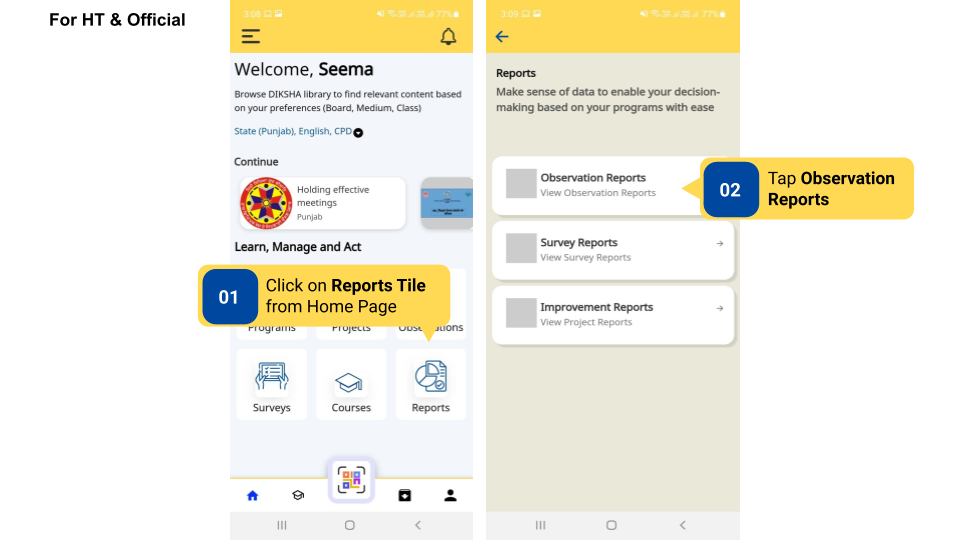
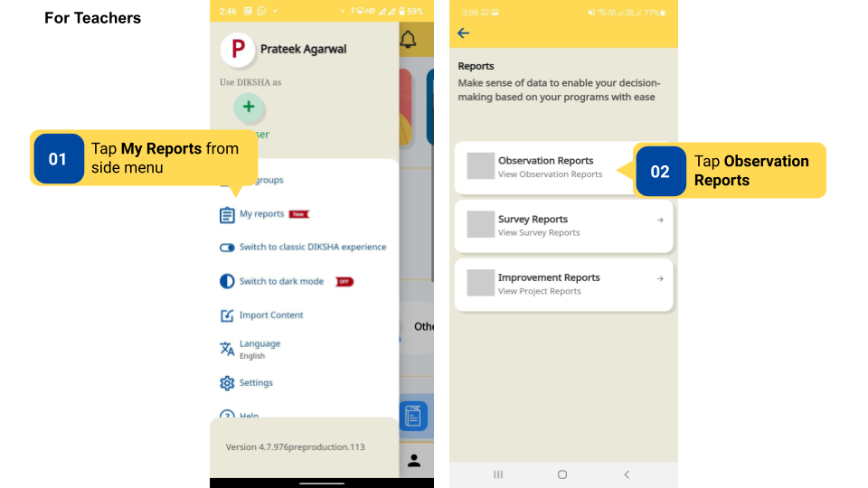
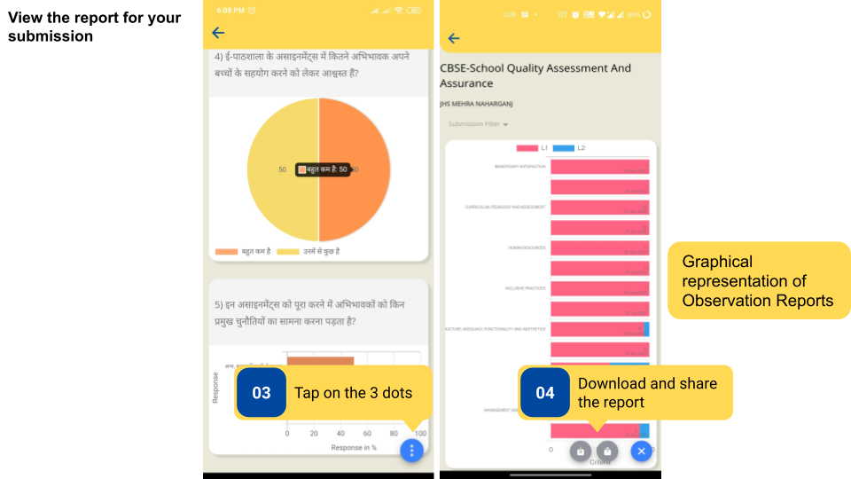

### Overview

On the DIKSHA app, reports are generated for the Observation after submission. Reports can also be shared and downloaded as PDF.

### Before You Begin

<table>
  <tr><td>Who can access Observations?</td>
   <td>HTs and Officials, Teachers</td>
  </tr>
  <tr><td>How can HT and Officials access Observation Reports?</td>
  <td> Using <b>My Reports</b> Tile on the Home Page</td>
  </tr>
    <tr><td>How can Teachers access Observation Reports?</td>
  <td> Using <b>My Reports</b> Section in the side menu</td>
  </tr>
</table>

### Outcome

<table>
 <tr><td>What will be the outcome?</td>
  <td>View the observation report and share it as a PDF.</td>
  </tr>
</table>
  

To view the reports 

<table>
<tr>
  <th>Image with instructions</th>
</tr>
  <tr>
    <td></td>
    </tr>
    <tr>
    <td></td>
    </tr>
    <tr>
    <td></td>
    </tr>
</table>

### What's Next?

[Observation report on DIKSHA portal](./observation-report-on-diksha-portal.html){:target="_blank"}