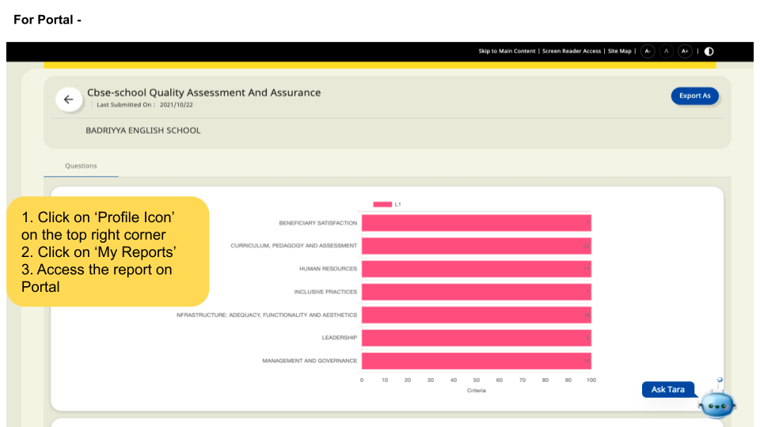

### Overview

Reports can also be accessed using the DIKSHA Portal.

### Before You Begin

<table>
  <tr><td>Who can access Observations?</td>
   <td>HTs and Officials, Teachers</td>
  </tr>
  <tr><td>What is needed?</td>
  <td><ul><li>Updated profile with the board, sub role, and location (state, district, and other details)</li>
  <li>Select <b>My reports</b> from the profile section.</li></ul></td>
  </tr>
</table>

### Outcome

<table>
 <tr><td>What will be the outcome?</td>
  <td>View the observation report.</td>
  </tr>
</table>
  
  
To view observation report on DIKSHA portal

<table>
<tr>
  <th>Image with instructions</th>
</tr>
  <tr>
    <td></td>
    </tr>
</table>