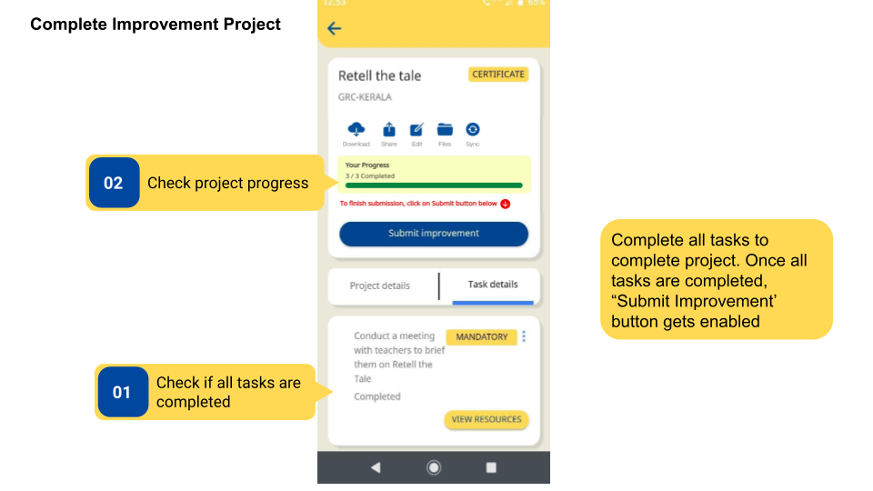
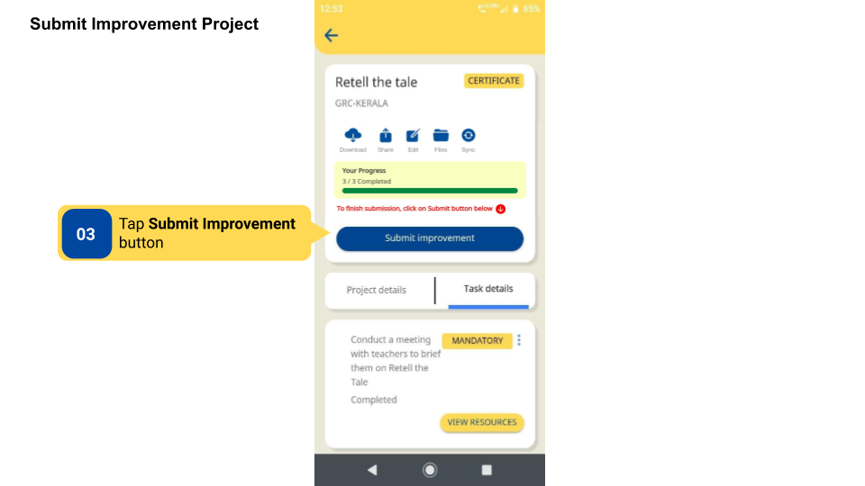
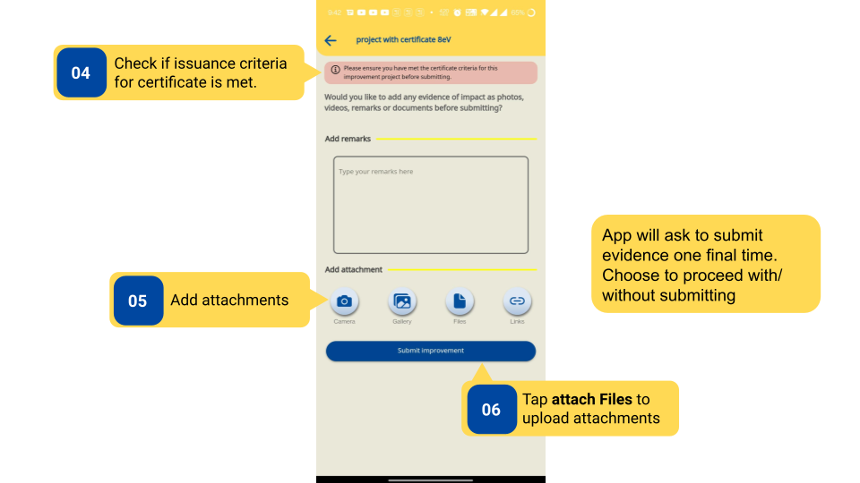
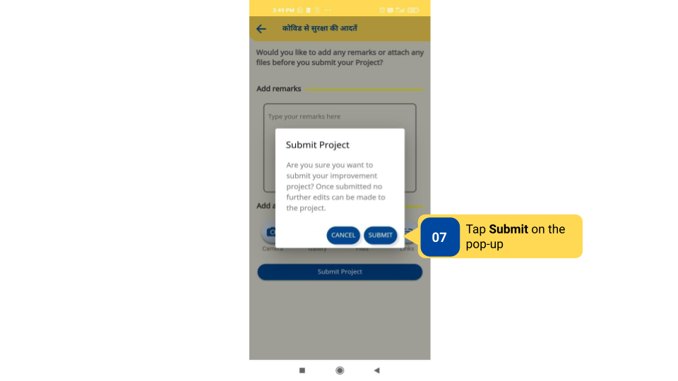
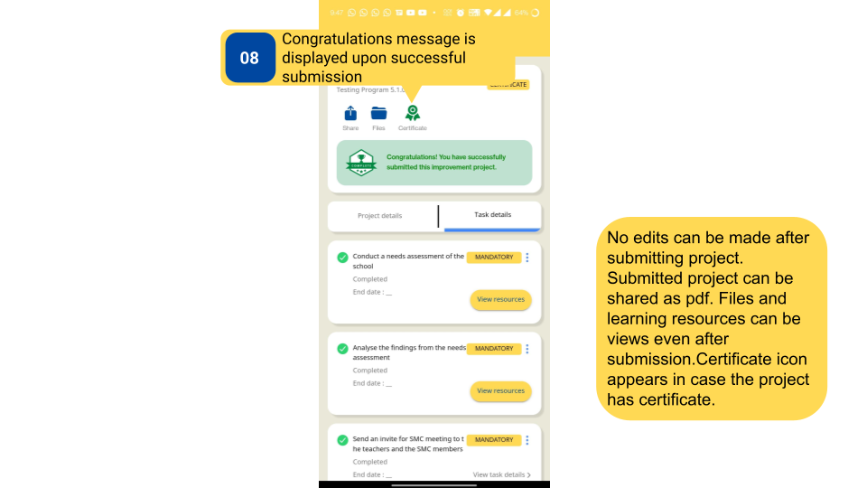

### Overview

An Improvement Project is marked completed only when all its tasks and subtasks are completed. Users can check the progress of their project in the progress bar section. 

Once all tasks have been completed in an Improvement Project, the **Submit Improvement** button gets enabled, and users can submit their project. Users will be asked to upload files or evidence one final time before submitting the project. Users can choose to add more files or evidence or proceed to submit the project without it. Certificates attached to Projects will only be issued to users if the issuance criteria have been met during submission.

### Before You Begin

<table>
  <tr><td>Who can access Projects?</td>
   <td>HTs and Officials, Teachers</td>
  </tr>
  <tr><td>What is needed?</td>
  <td>All tasks and subtasks should be marked completed.</td>
  </tr>
</table>

### Outcome

<table>
 <tr><td>What will be the outcome?</td>
  <td><ul><li>Project is completed and <b>Submit Improvement</b> button is enabled.</li>
  <li>Submit Improvement Project and add files or evidence at a project level.</li></ul></td>
  </tr>
</table>
  

### Complete Improvement Project

To Complete and Submit Improvement Project

<table>
<tr>
  <th>Image with instructions</th>
</tr>
  <tr>
    <td></td>
    </tr>
</table>

### Submit Improvement Project

To submit Improvement Project 

<table>
<tr>
  <th>Image with instructions</th>
</tr>
  <tr>
    <td></td>
  </tr>
  <tr>
    <td></td>
  </tr>
  <tr>
    <td></td>
  </tr>
  <tr>
    <td></td>
  </tr>
</table>

### Additional Notes

- **Submit Improvement** button is not enabled unless all tasks are completed.

- A task with subtasks will be completed only when all of its subtasks are marked completed.

- It is not mandatory to add files or evidence at a project level.

- After a Project is submitted, no edits can be made to it.

### What's Next?

[Receive and Access Certificates](./receive-and-access-certificates.html){:target="_blank"}

