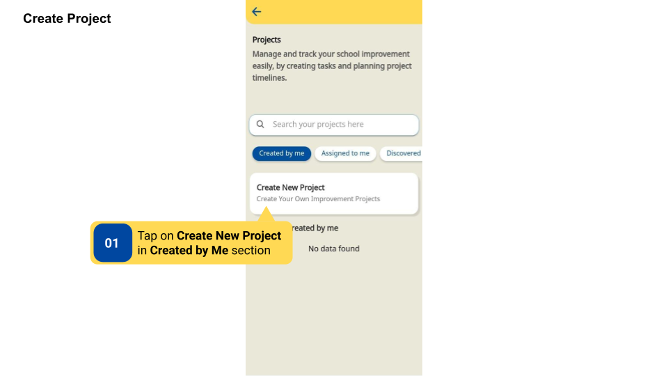
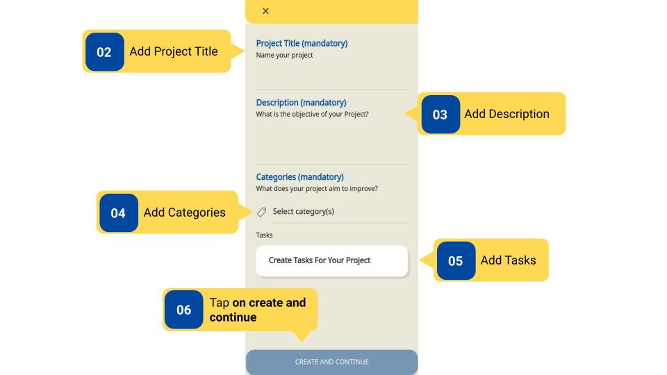

### Overview

On the DIKSHA app users can create their project using the **Create New Project** option under the **Created by me** tab. These Projects will be created and saved on the user's device. Users can also access the reports of the Project they created in the Reports section under the Improvement Reports tab.

### Before You Begin

<table>
  <tr><td>Who can create projects on the app?</td>
   <td>HTs and Officials, Teachers</td>
  </tr>
  <tr><td>What is needed?</td>
  <td><ul><li>Log in as a <b>Teacher</b> or <b>HT and Officials</b>.</li>
  <li>User is in the <b>Created by me</b> Section of the Improvement Project page.</li>
  <li> Add Project Details like- Project title, Description/Objective of project, Project category, List of tasks.</li></ul></td>
  </tr>
</table>

### Outcome

<table>
 <tr><td>What will be the outcome?</td>
  <td>Project is created by the end-user using the template provided in the DIKSHA app.</td>
  </tr>
</table>
  
### Creating Improvement Project 

To create Improvement Project

<table>
<tr>
  <th>Image with instructions</th>
</tr>
  <tr>
    <td></td>
  </tr>
  <tr>
    <td></td>
  </tr>
</table>

### What's Next?

[Project Reports](../project-reports/index.html){:target="_blank"}  

[Project Creation](../project-creation/index.html){:target="_blank"}  

