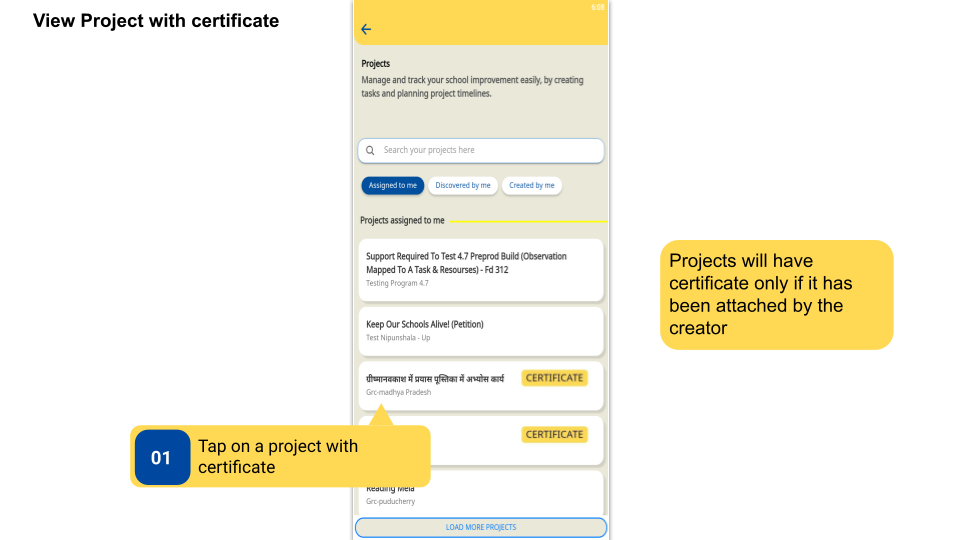
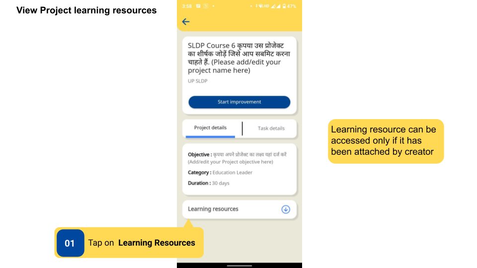
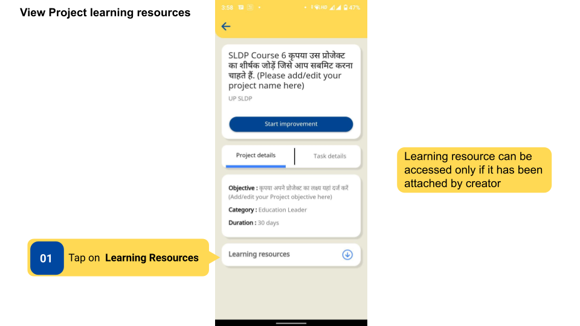
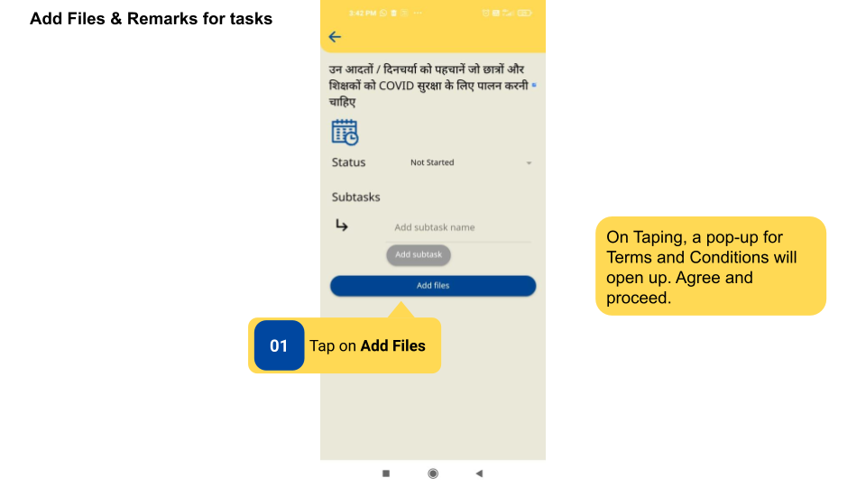
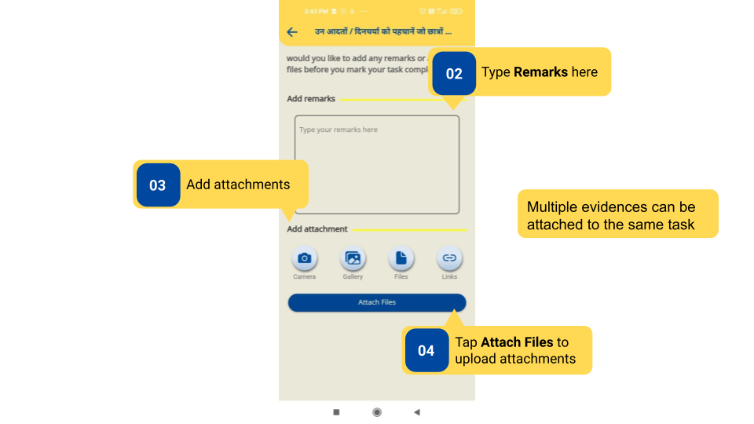
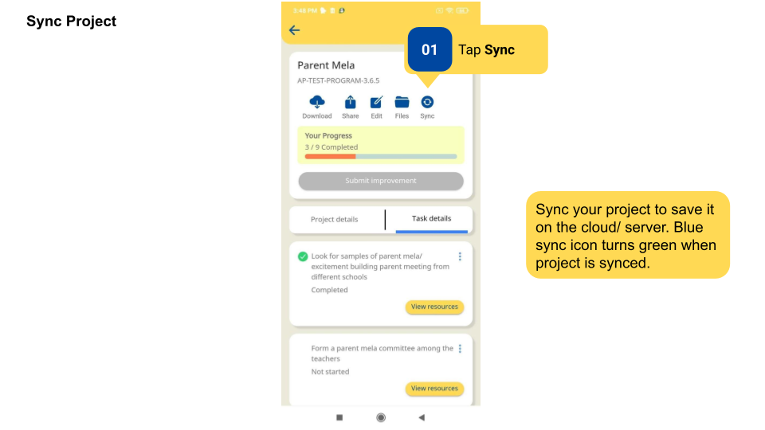

### Overview

Users can receive certificates for certain projects, view Project Learning Resource, add files and remarks, and sync project to DIKSHA Database.

- Some projects have Certificates attached. The certificates are issued to users after submission  of project.
- Improvement Projects may have learning resources that help users gain a broader understanding before starting a project. Learning Resources are not mandatory to be taken up for the completion of the project.

- Users can add multiple evidences as images, videos, PDF files, and links to each task. Any specific remarks can also be typed. 

- Users can sync their project to the cloud or server by clicking on the **Sync** button. Syncing means uploading the project details to the DIKSHA Database. Without syncing a project, the data is only saved on the user's device. In case of app uninstallation or cache clearing, the project data will get deleted if it is not synced to the server. Without syncing the project, the data will also not reflect in the dashboard, and states will not receive information about project completion. 

### Before You Begin

<table>
  <tr><td>Who can access projects?</td>
      <td><ul><li>Users with HTs and Officials, Teachers roles</li>
      <li>Improvement Project is started by clicking on <b>Start Improvement.</b></li>
      <li>Evidence in the form of images (PNG), videos, files (PDF), or links to be attached</li>
      <li>User is on the Project Details page for syncing project.</li></ul></td>
  </tr>
  <tr><td>What is needed?</td>
      <td>User is on Project details page.</td>
  </tr>
</table>

### Outcome

<table>
 <tr><td>What will be the outcome?</td>
  <td><ul><li>View project with certificate and learning resources before starting the project.</li>
  <li>Add remarks and attach evidence on a task level.</li>
  <li>Sync Improvement Project to database</li></ul></td>
  </tr>
</table>

### View Project with Certificates

To view project with certificates

<table>
<tr>
  <th>Image with instructions</th>
</tr>
  <tr>
    <td></td>
  </tr>
</table>

### View Project Learning Resource

To view project learning resources

<table>
<tr>
  <th>Image with instructions</th>
</tr>
  <tr>
    <td></td>
  </tr>
</table>

### View Project Learning Resource

To view project learning resources

<table>
<tr>
  <th>Image with instructions</th>
</tr>
  <tr>
    <td></td>
  </tr>
</table>

### Add Files and Remarks 

To add files and remarks for tasks

<table>
<tr>
  <th>Image with instructions</th>
</tr>
  <tr>
    <td></td>
  </tr>
  <tr>
    <td></td>
  </tr>
</table>

### Sync Project

To sync a project

<table>
<tr>
  <th>Image with instructions</th>
</tr>
  <tr>
    <td></td>
  </tr>
</table>

### Additional Notes

- Learning resources can be accessed only if it has been attached by the Content Creator. 
- It is not mandatory to view Learning resources to Start or Submit a Project.
- Users can add files up to 50Mb in size.
- Users can add multiple evidences as images, videos, PDF files, and links to each task. Any specific remarks can also be typed.
- Synced Projects can be viewed by state officials.

### What's Next?

- [Complete and Submit Improvement Project](./complete-improvement-project.html){:target="_blank"}