### Overview

- DIKSHA Improvement Projects are created by **Content Creator**. They can be viewed only by signed-in users who are logged in either as **HT & officials** or **Teachers**. 

- **HT and other officials** can access Improvement Projects through project tile, project link, or QR code.

- **Teachers** can access the improvement project from the project tile in the **Browse other categories** section, through links and QR codes. Project tile for Teachers is available only if it has been enabled for the board. DIKSHA state coordinators can request the <a href = "mailto:projectsupport@teamdiksha.org" target="_blank">DIKSHA Support Team</a> to enable Project tile.

- Improvement Projects are designed to help users’ improvement journey with actionable easy tasks. Each Improvement Project has objectives, timelines, and lists of tasks in the project. Some Improvement Projects may also have certificates attached.

### Before You Begin

<table>
  <tr><td>Who can access projects?</td>
      <td>Users with HT and Official, Teacher roles</td>
  </tr>
  <tr><td>What ways can a project be accessed?</td>
      <td>Project tile on DIKSHA app, link, or QR code</td>
  </tr>
  <tr><td>What is required for HT and Officials to access Projects?</td>
      <td><ul><li>Updated profile with the board, sub role, and location (state, district, and other details)</li>
  <li>User should be on the Home page.</li></ul></td>
  </tr>
  <tr><td>What is required for Teachers to access Projects?</td>
      <td><ul><li>Updated profile with the board, sub role, and location (state, district, and other details)</li>
  <li><b>New experience</b> needs to be selected from the side menu.</li>
  <li>Teacher should be on Home page in the <b>Browse other categories</b> section.</li></ul></td>
  </tr>
</table>

### Outcome

<table>
 <tr><td>What will be the outcome?</td>
  <td>Access a list of Improvement Project</td>
  </tr>
</table>
  

### Access Projects on DIKSHA App

To access Projects on DIKSHA app

<table>
<tr>
  <th>Image with instructions</th>
</tr>
  <tr>
    <td>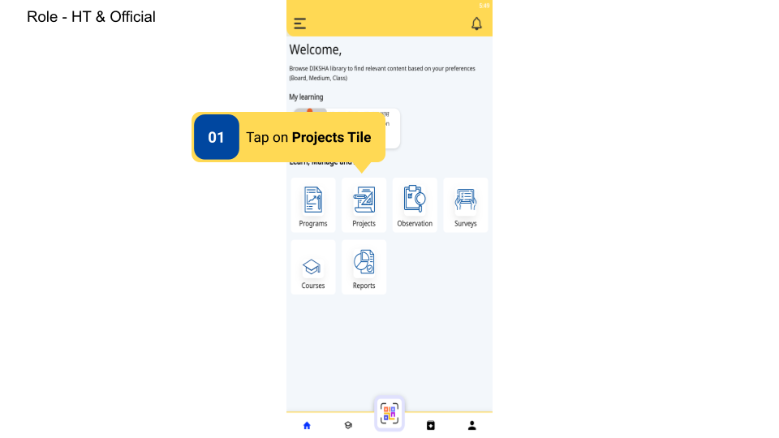</td>
    </tr>
    <tr>
    <td>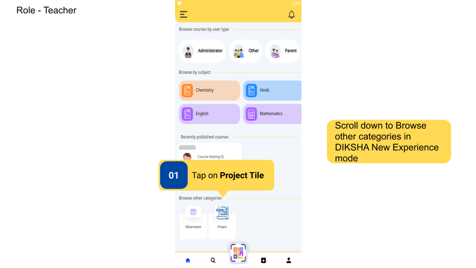</td>
    </tr>
    <tr>
    <td>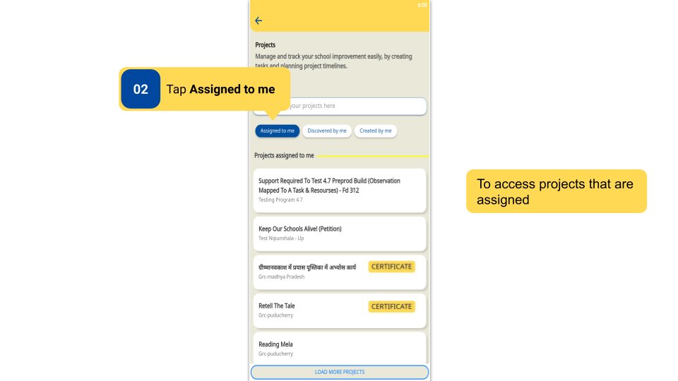</td>
    </tr>
    <tr>
    <td>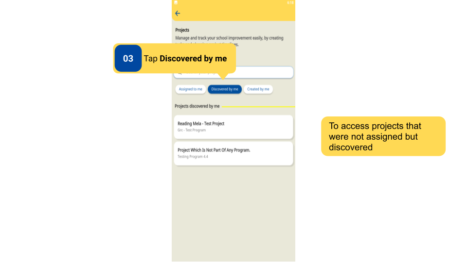</td>
    </tr>
    <tr>
    <td>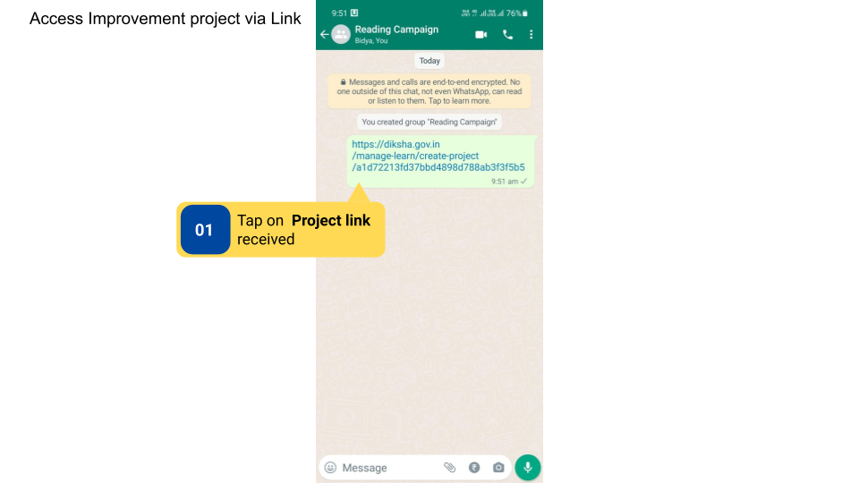</td>
    </tr>
    <tr>
    <td>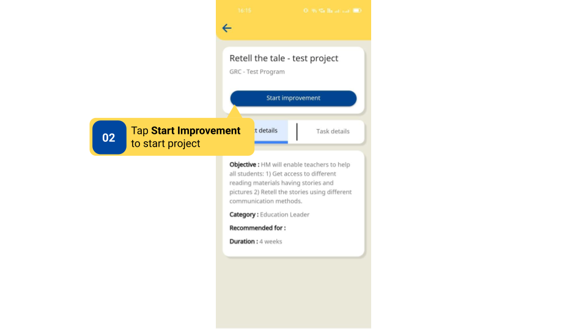</td>
    </tr>
    <tr>
    <td>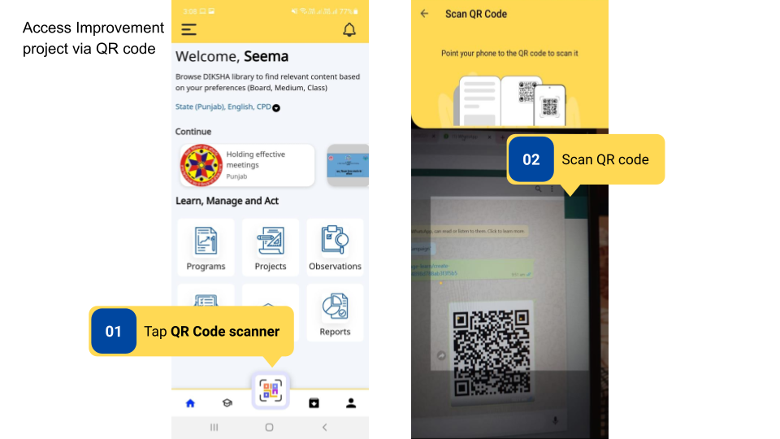</td>
    </tr>
    <tr>
    <td>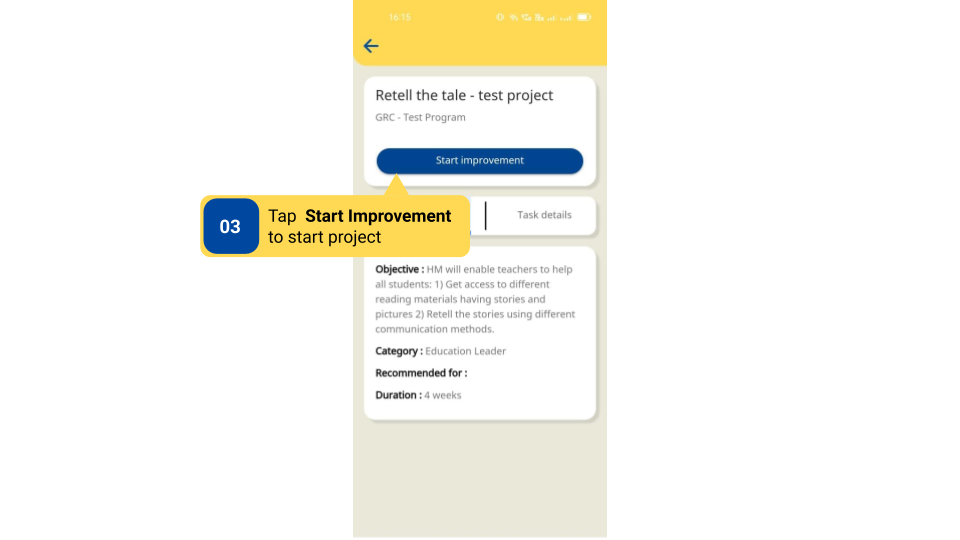</td>
    </tr>
</table>

### Start Project 

To start a Project  

<table>
<tr>
  <th>Image with instructions</th>
</tr>
  <tr>
    <td>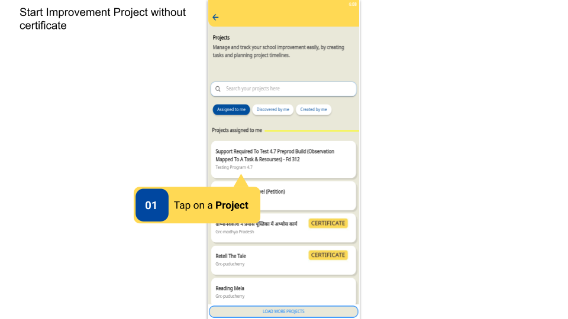</td>
    </tr>
    <tr>
    <td>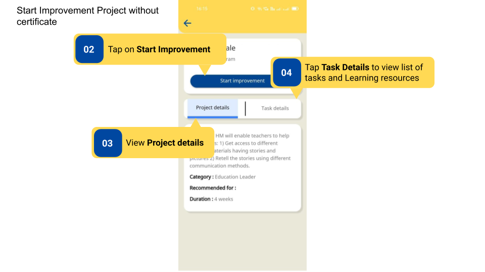</td>
    </tr>
    <tr>
    <td>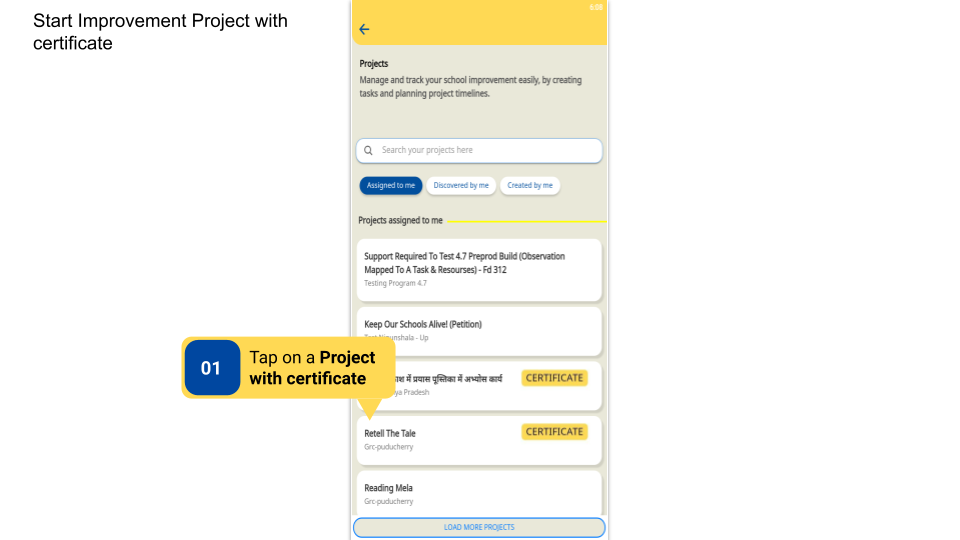</td>
    </tr>
    <tr>
    <td>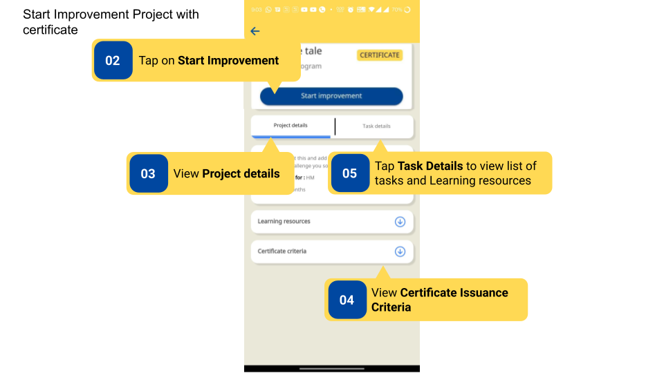</td>
    </tr>
    <tr>
    <td>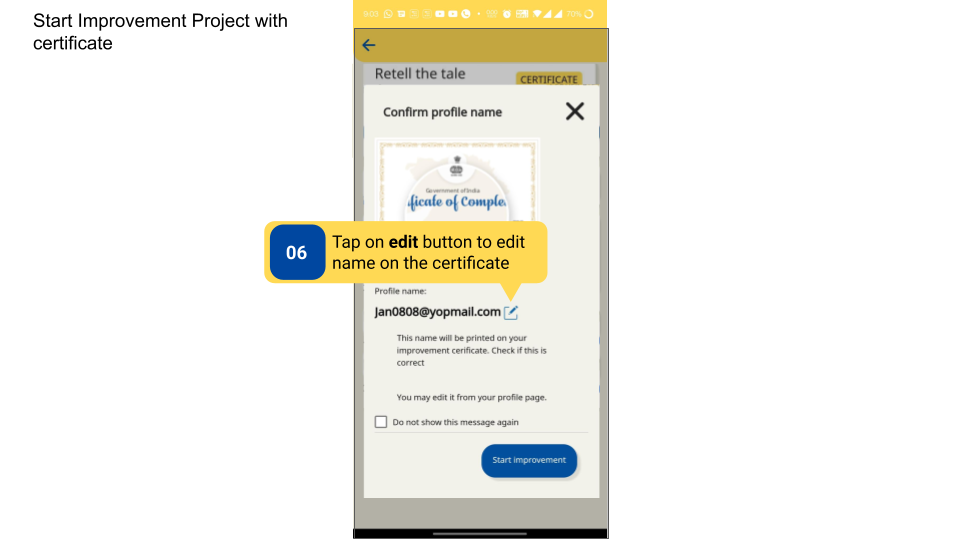</td>
    </tr>
</table>

### Additional Notes

  - Projects that are not directly mapped to the role selected in the profile but were shared through Link or QR Code will appear in the **Discovered by me** Section.

  - Users cannot view or start attached observations before starting the Improvement Project. 

  - Projects with certificate can be identified by the certificate tag. Certificates are issued if the issuance criteria is met during project submission. The name on the certificate can be edited only during the beginning of the project through ‘confirm profile name’ pop-up. 

### What's Next?

[Tasks and Subtasks](project-tasks-and-subtasks-app.html){:target="_blank"}
