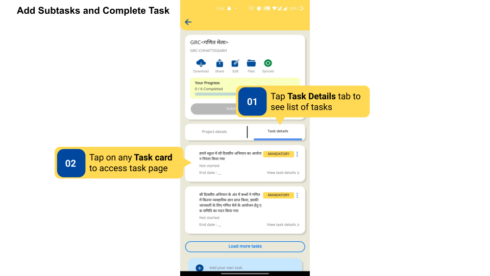
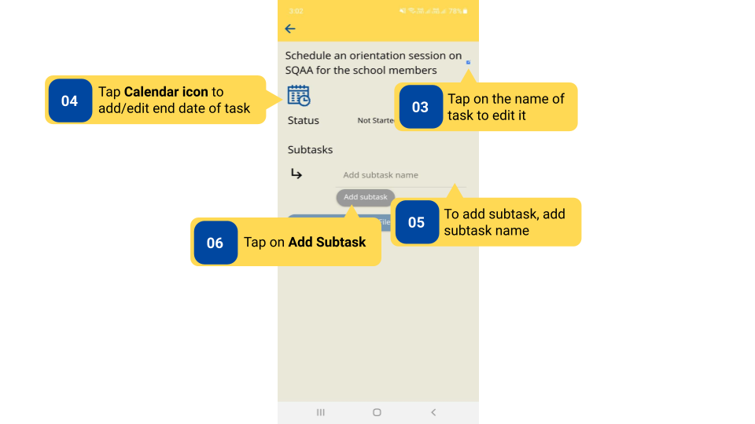
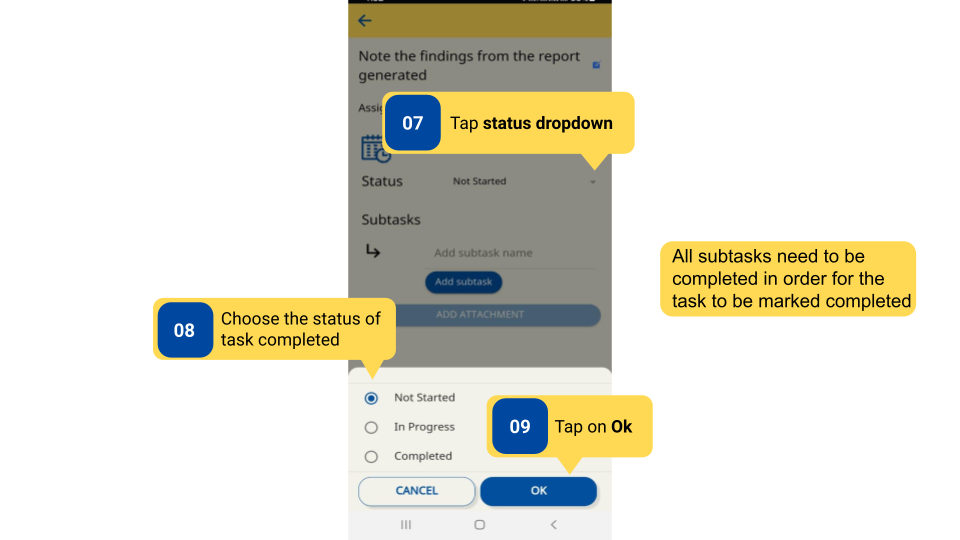
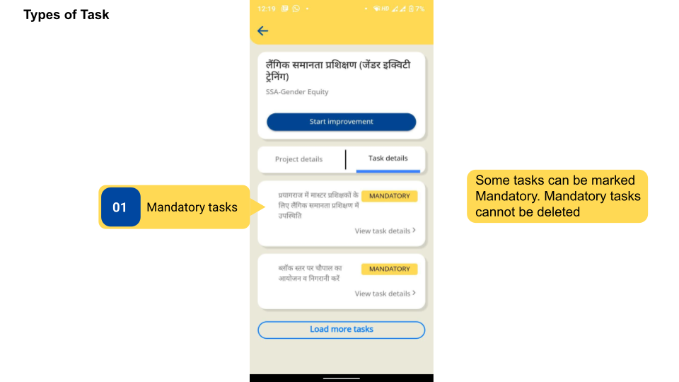
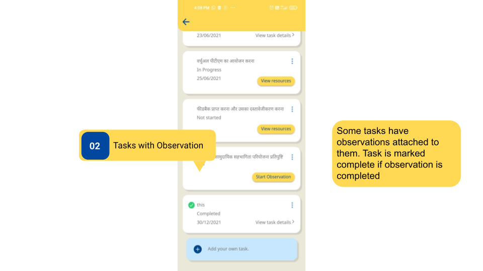
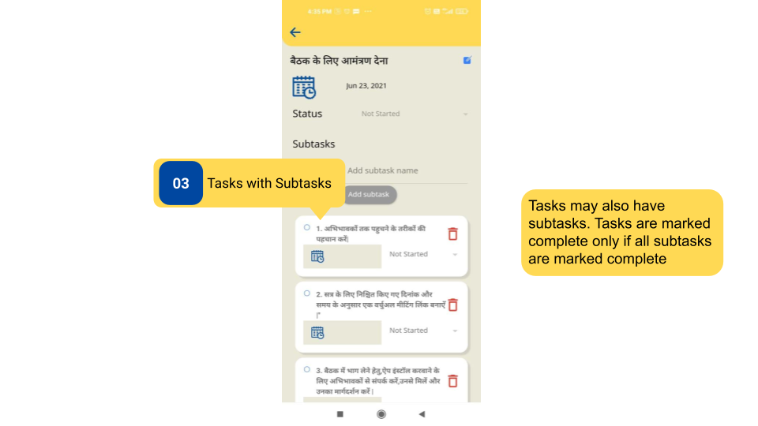
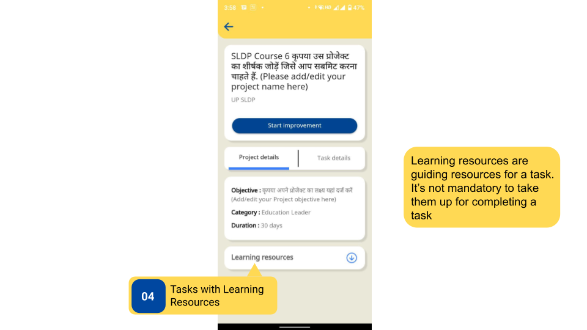

### Overview

Tasks are steps that need to be taken to complete the project. The Content Creator creates tasks, however, users can also add their tasks. Furthermore, subtasks can be added to tasks.

Tasks can be of 4 types:

- Mandatory tasks
- Tasks with observation
- Tasks with Subtasks
- Tasks with Learning Resources.

### Before You Begin

<table>
  <tr><td>What is needed?</td>
      <td>Click <b>Start Improvement</b> to start Improvement project</td>
  </tr>
  <tr><td>Who creates tasks?</td>
      <td><ul><li>Content Creator with registered email ID</li>
          <li>End users (Teachers, HTs and Officials)</li></ul></td>
  </tr>
  <tr><td>Who can add subtasks?</td>
      <td><ul><li>Content Creator with registered email ID</li>
          <li>End users (Teachers, HTs and Officials)</li></ul></td>
  </tr>
    <tr><td>Who can add observations and learning resources to tasks?</td>
      <td>Content creators only</td>
  </tr>
    <tr><td>Who marks tasks mandatory?</td>
      <td>Content creators only </td>
  </tr>
</table>

### Outcome

<table>
 <tr>
 <td>What will be the outcome?</td>
 <td>Subtasks are added to a task, task is marked completed, and different types of tasks are identified.</td>
 </tr>
</table>
  
### Add Subtasks and Complete Tasks

To add a subtask and complete the task 

<table>
<tr>
  <th>Image with instructions</th>
</tr>
  <tr>
    <td></td>
  </tr>
  <tr>
    <td></td>
  </tr>
  <tr>
    <td></td>
  </tr>
</table>

### Types of Tasks  

<table>
<tr><th>Image with instructions</th> </tr>
  <tr><td></td></tr>
  <tr> <td></td> </tr> 
  <tr> <td></td> </tr>
  <tr><td></td></tr>
</table>

### Additional Notes

- Tasks cannot be marked completed if the project has not been started.
- All subtasks must be marked complete for the task to be completed.
- All tasks must be marked completed for the Submit Improvement button to be enabled.
- It is not mandatory to view Learning resources to Start or Submit a Project.

### What's Next?

[Features of Improvement Project](./features-in-projects.html){:target="_blank"}
