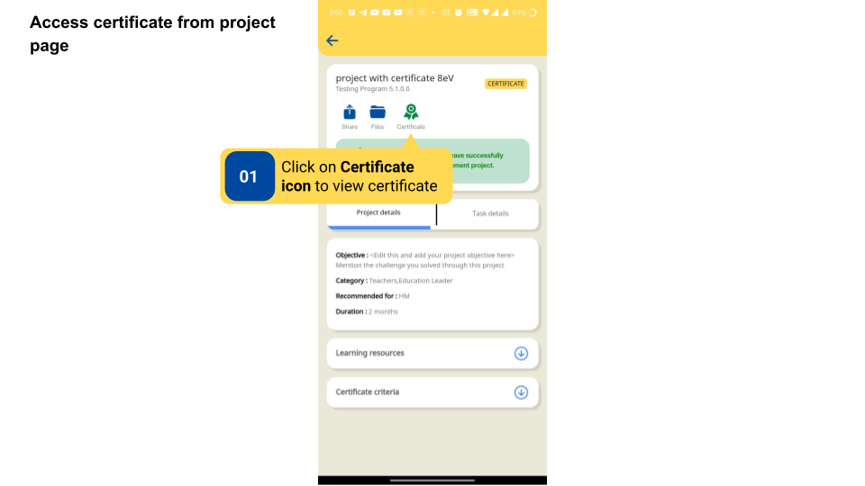
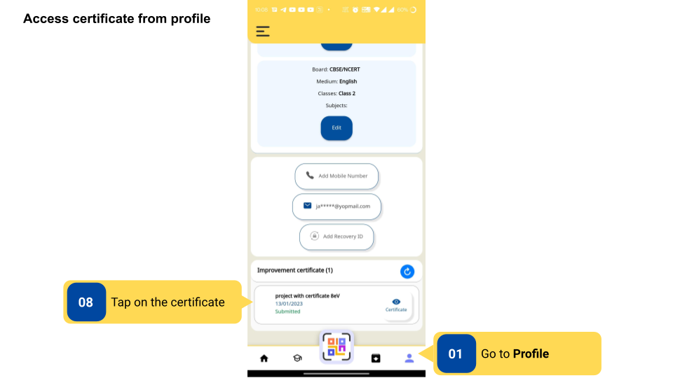
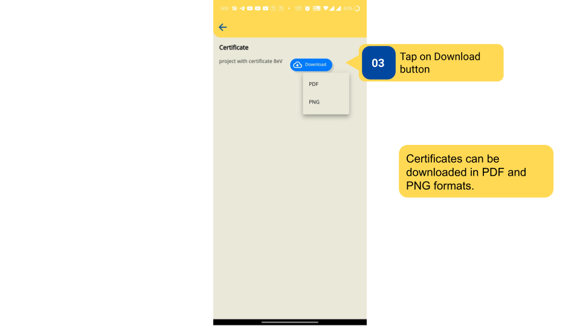
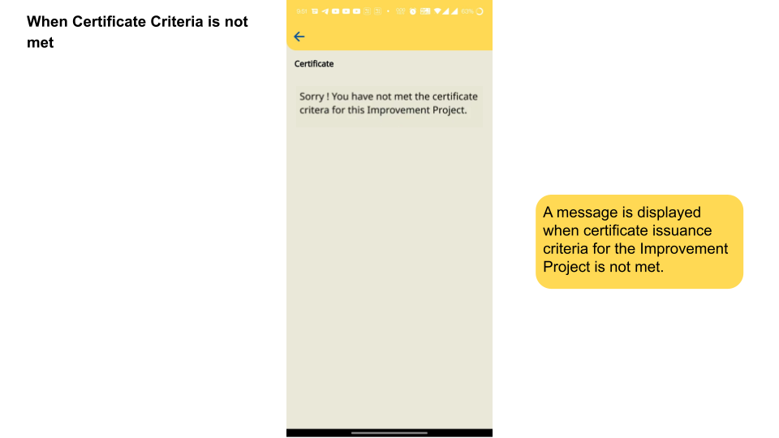

### Overview

A certificate  may or may not be attached with a project A certificate is received by the user only if the project is enabled with a certificate and they have met the issuance criteria. The Content Creator sets the issuance criteria for receiving certificates.
The issued certificate can be viewed and downloaded from the profile section.

### Before You Begin

<table>
  <tr><td>Who gets a Certificate?</td>
      <td><ul><li>User who submits a project on DIKSHA</li>
      <li>App that has a certificate attached</li></ul></td>
  </tr>
  <tr><td>What is needed to get a completion certificate?</td>
      <td>User should meet the certificate issuance criteria set by the Content Creator during the project submission.</td>
  </tr>
</table>

### Outcome

<table>
 <tr><td>What will be the outcome?</td>
  <td><ul><li>Access certificate from the project page and profile page.</li>
  <li>Receive and download certificate if the issuance criteria is met.</li></ul></td>
  </tr>
</table>

### Receive and Access Certificates

To receive and access certificates 

<table>
<tr>
  <th>Image with instructions</th>
</tr>
  <tr>
    <td></td>
  </tr>
  <tr>
    <td></td>
  </tr>
  <tr>
    <td></td>
  </tr>
  <tr>
    <td></td>
  </tr>
</table>

### Additional Notes

- Users will be able to edit their name, which will appear on the certificate when they start the project.

- Users can verify their certificates by scanning the QR code on the certificate.

### What's Next?

[Scan Certificates](./scan-certificate.html){:target="_blank"}

