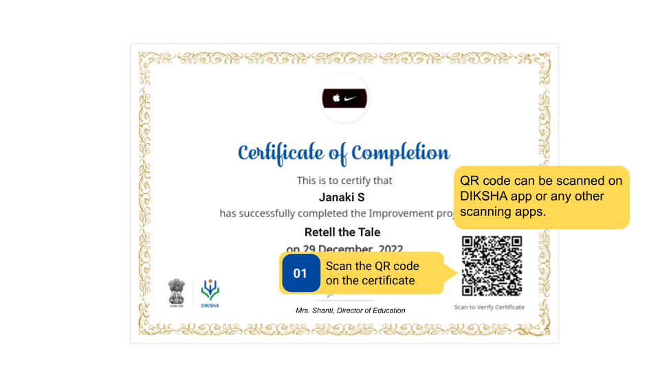
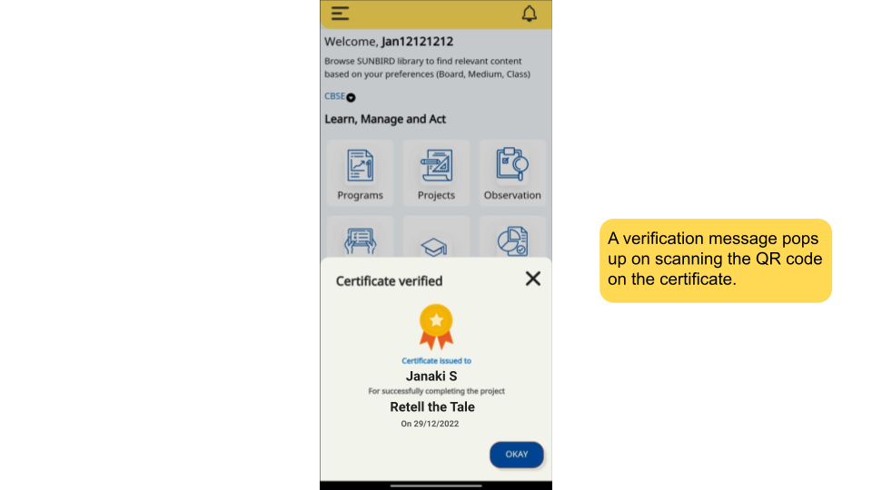

### Overview 

Scanning QR codes is a way to digitally validate the certificate and avoid any misuse and malpractice of the certificate.

### Before You Begin

<table>
  <tr><td>Who scans the certificate QR code?</td>
      <td>Any user who has access to the certificate QR code</td>
  </tr>
  <tr><td>What is needed to scan QR code?</td>
      <td>An issued certificate with the QR code</td>
  </tr>
</table>

### Outcome

<table>
  <tr><td>What will be the outcome?</td>
      <td>The certificate is digitally verified.</td>
  </tr>
</table>

### Scan Certificate

To scan a certificate

<table>
<tr>
  <th>Image with instructions</th>
</tr>
  <tr>
    <td></td>
  </tr>
  <tr>
    <td></td>
  </tr>
</table>

### Additional Notes

Use DIKSHA app or any other scanning app to scan the QR code.

### What's Next?

[View and Share Improvement Project](./share-project.html){:target="_blank"}

