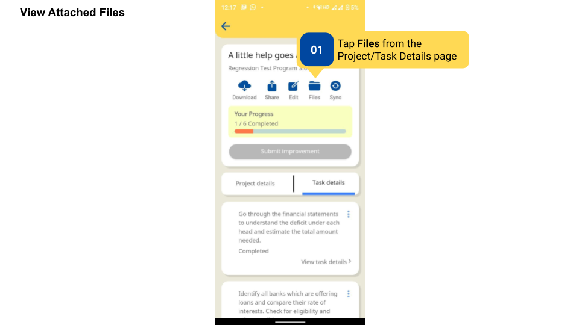
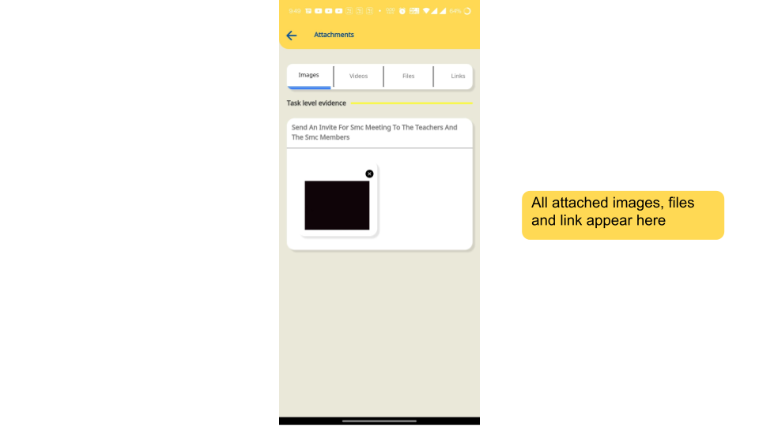
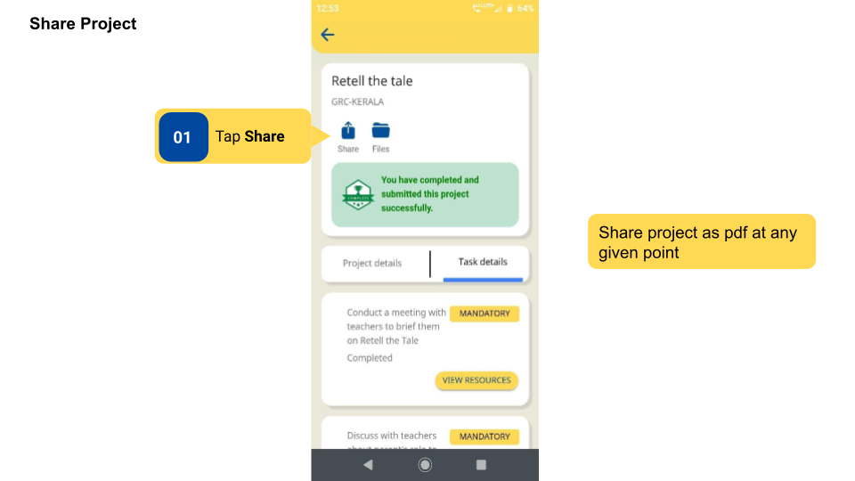
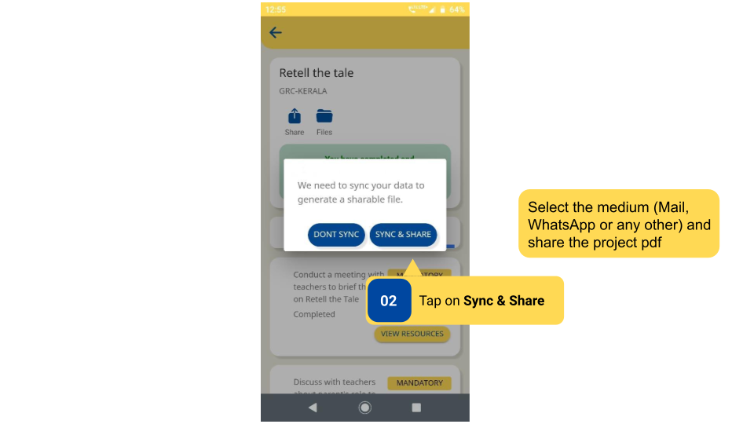

### Overview

File or Evidence attached to an Improvement Project can be viewed by users. Users can also share Improvement Project as PDF files. 

### Before You Begin

<table>
  <tr><td>Who can access Projects?</td>
   <td>HTs and Officials, Teachers</td>
  </tr>
  <tr><td>What is needed?</td>
  <td><ul><li>Files/Evidence to be added by users to tasks</li>
  <li>The project is synced. Project PDF cannot be shared without syncing</li></ul></td>
  </tr>
</table>

### Outcome

<table>
 <tr><td>What will be the outcome?</td>
  <td><ul><li>View all files attached to tasks in the project.</li>
  <li>Sharing project as a PDF file.</li></ul></td>
  </tr>
</table>
  
### View Attached Files

To view attached files 

<table>
<tr>
  <th>Image with instructions</th>
</tr>
  <tr>
    <td></td>
  </tr>
    <tr>
    <td></td>
  </tr>
</table>

#### Additional Notes

- Users can add files up to 50Mb in size
- Multiple evidence can be submitted for a single task 
- All files attached to tasks can be viewed at once in the **Files** section

### Share Project

To share a project  

<table>
<tr>
  <th>Image with instructions</th>
</tr>
  <tr>
    <td></td>
  </tr>
    <tr>
    <td></td>
  </tr>
</table>

### Additional Notes

- Users can add files up to 50Mb in size.

- Multiple evidence can be submitted for a single task.

- All files attached to tasks can be viewed at once in the Files section.

- Syncing means uploading the project details to the DIKSHA Database.

### What's Next?

[Create Improvement Project](./create-improvement-project.html){:target="_blank"}