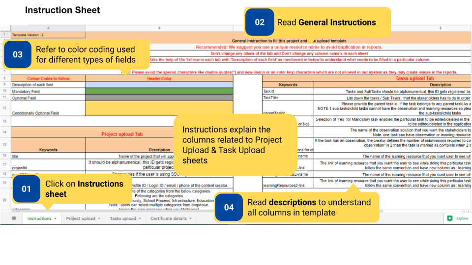
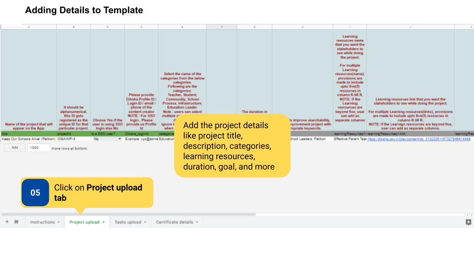
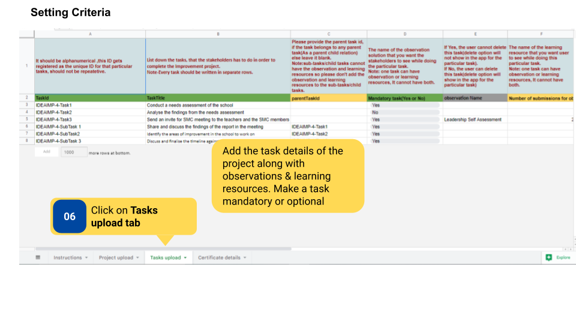
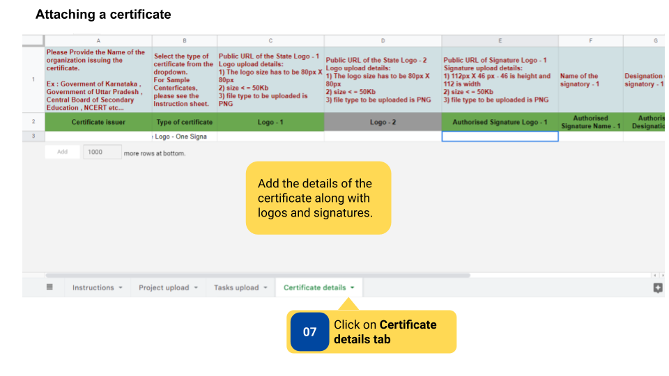

### Overview

Improvement Project are created and updated by the content creator using a template. After the filled template is sent over email to the <a href = "mailto:projectsupport@teamdiksha.org" target="_blank">DIKSHA Support Team</a> by the authorized or whitelisted users, the team will then upload the Project on DIKSHA.
If the content creator is not a whitelisted user, the project can be uploaded only if one whitelisted user is included in the cc list
 
DIKSHA Improvement Projects are created by Content Creators and can be viewed only by users who are logged in either as **HT & Officials** or as **Teacher**. In case certificates is to be added to projects, the content creator is also responsible for setting the issuance criteria for the certificates. The certificate is issued to the users of the particular project when they fulfill the issuance criteria. A certificate can be added to a project by adding certificate related details in existing project template.

There are 3 tabs in the Improvement Project Template- Instructions, Project Upload, and Tasks Upload. The template is color-coded for the description of columns, mandatory fields, optional fields, and conditionally optional fields, so that the content creator knows what to fill. 

#### Before You Begin

<table>
  <tr><td>Who can create a project?</td>
      <td>User with Content Creator role</td>
  </tr>
  <tr><td>What is needed?</td>
      <td>Editable copy of the Template for <a href="https://docs.google.com/spreadsheets/d/1YnWTcHrmvDYVedGktKr2V25G7qBNUmYjwk1huHwGwNc/edit#gid=65026616" target="_blank">
      Creating Improvement Project</a></td>
  </tr>
</table>

#### Outcome

<table>
 <tr><td>What will be the outcome?</td>
  <td><ul><li>Content creator fills template for the creation of Improvement Project.</li>
  <li>A certificate is added to the project.</li></ul></td>
  </tr>
</table>

To create an Improvement Project

<table>
<tr>
  <th>Image with instructions</th>
</tr>
  <tr>
    <td></td>
  </tr>
  <tr>
    <td></td>
  </tr>
  <tr>
    <td></td>
  </tr>
  <tr>
    <td></td>
  </tr>
</table>

### Additional Notes

- Download the template to fill it.

- Project template should be added to <a href="https://docs.google.com/spreadsheets/d/1Q4z1d1aUHY5VVrco2TvHPuWEq7314glUjFxB-jYjfiY/edit?usp=sharing">program template</a> by Program Designer to make it available on the platform.

- Adding a certificate to a project is optional.

- Submitting a project is a default criteria for receiving a certificate.

### What's Next?

[Project Reports](../project-reports/index.html){:target="_blank"} 
