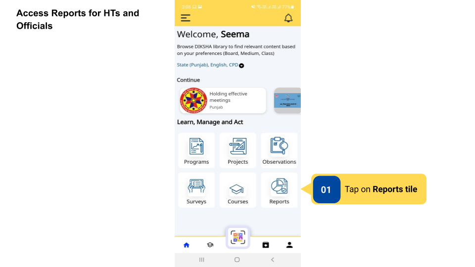
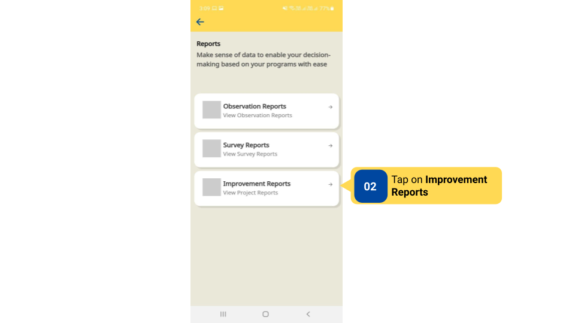
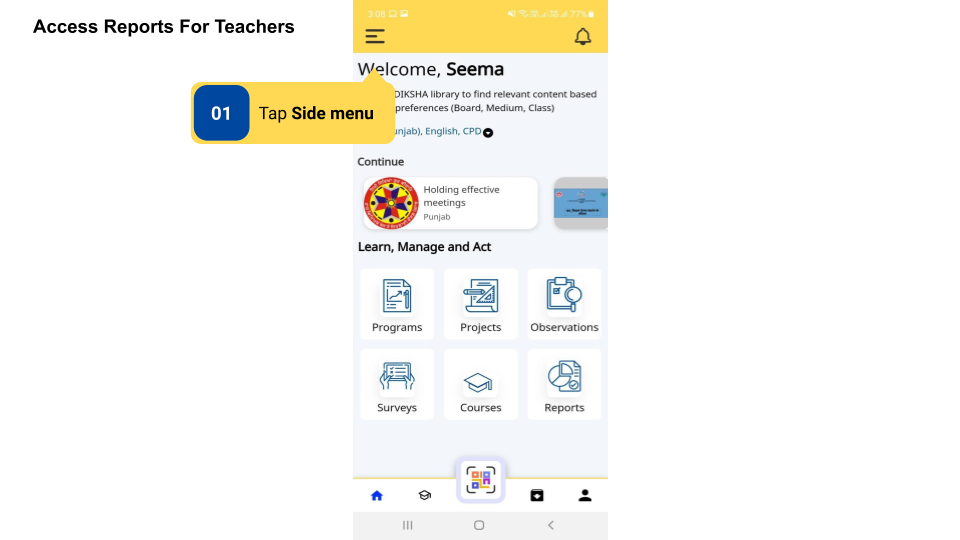
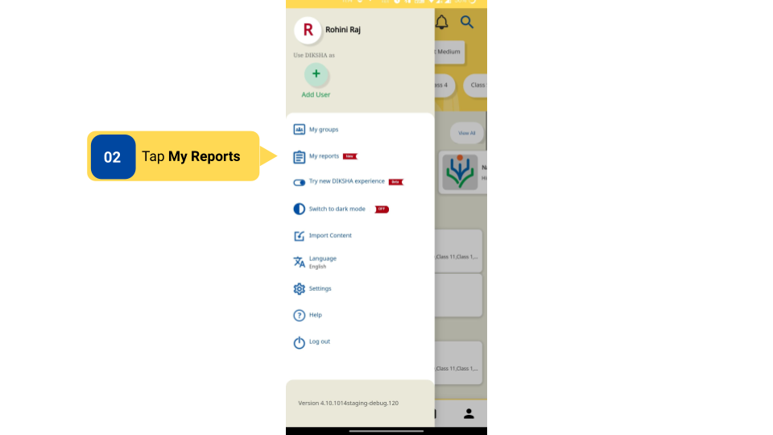
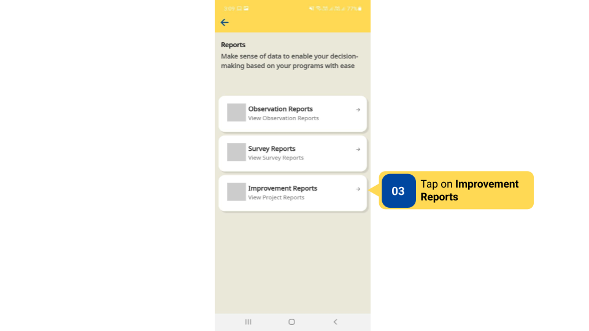
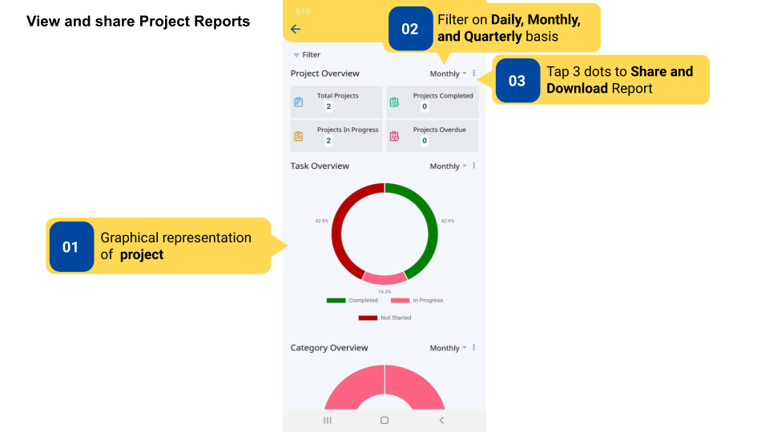
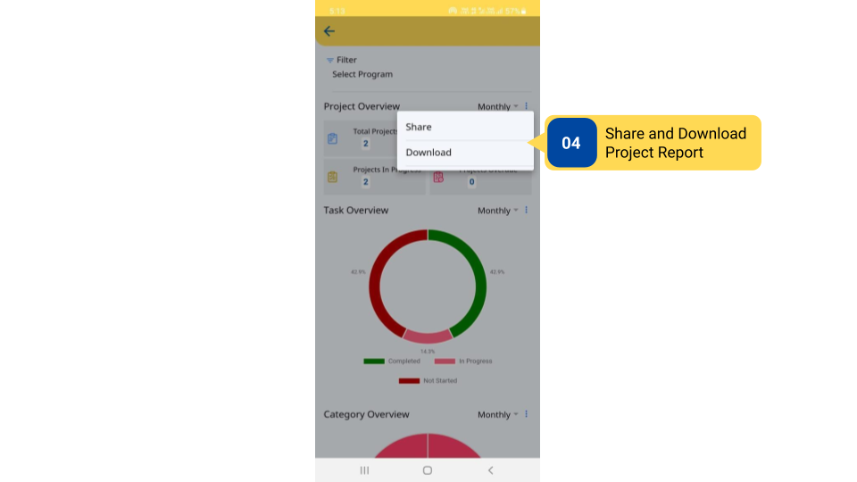

### Overview

On the DIKSHA app, reports are generated for the Improvement Projects after submission. Reports provide an overview of total projects, total projects submitted/ in progress/ started, graphical data of Tasks overview, and category overview. The report data can also be filtered on a weekly, monthly, and quarterly intervals. Reports can also be shared and downloaded as PDF files.

### Before You Begin

<table>
  <tr><td>Who can access projects?</td>
   <td>HTs and Officials, Teachers</td>
  </tr>
  <tr><td>How can HT and Officials access Projects Reports?</td>
  <td>
  
Using <b>My Reports</b> tile on the Home page</td>
  </tr>
  <tr><td>How can Teachers access Project Reports?</td>
   <td>Using <b>My Reports</b> section in the side menu
</td>
  </tr>
</table>

### Outcome

<table>
<tr><td>What will be the outcome?</td>
  <td>View Project Report and get graphical insights about tasks and categories of the projects taken up. Share Project Report as PDF files.  </td>
</tr>
</table>
  
To view and share Project Reports

<table>
<tr>
  <th>Image with instructions</th>
</tr>
  <tr>
    <td></td>
  </tr>
  <tr>
    <td></td>
  </tr>
  <tr>
    <td></td>
  </tr>
  <tr>
    <td></td>
  </tr>
  <tr>
    <td></td>
  </tr>
  <tr>
    <td></td>
  </tr><tr>
    <td></td>
  </tr>
</table>
