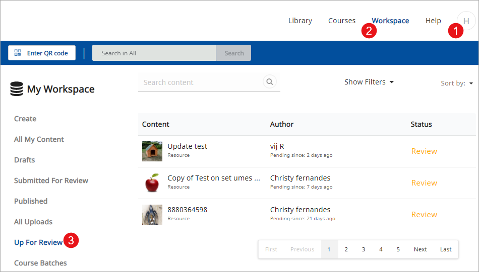
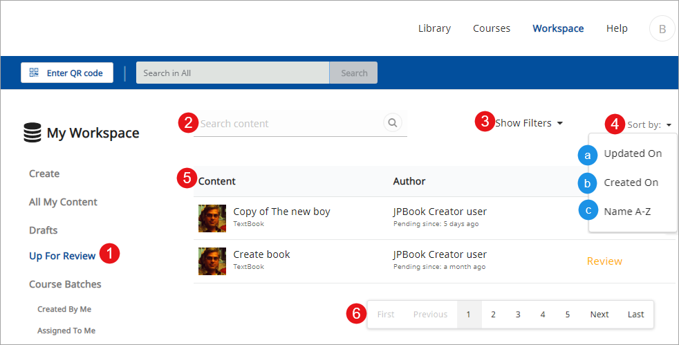
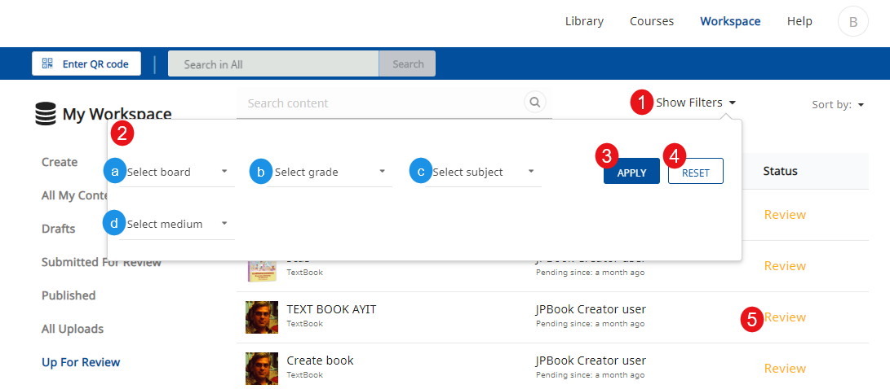
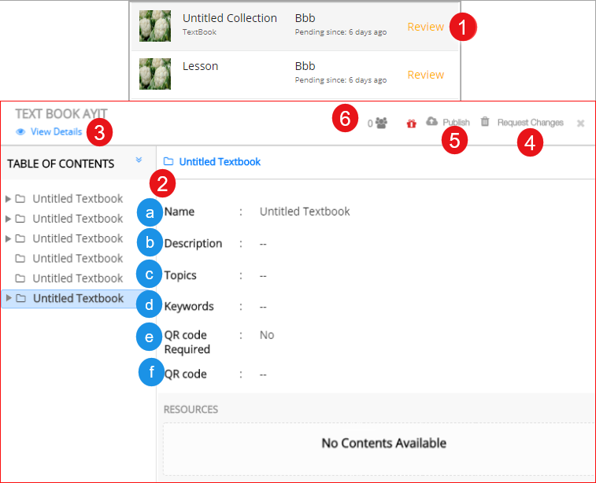
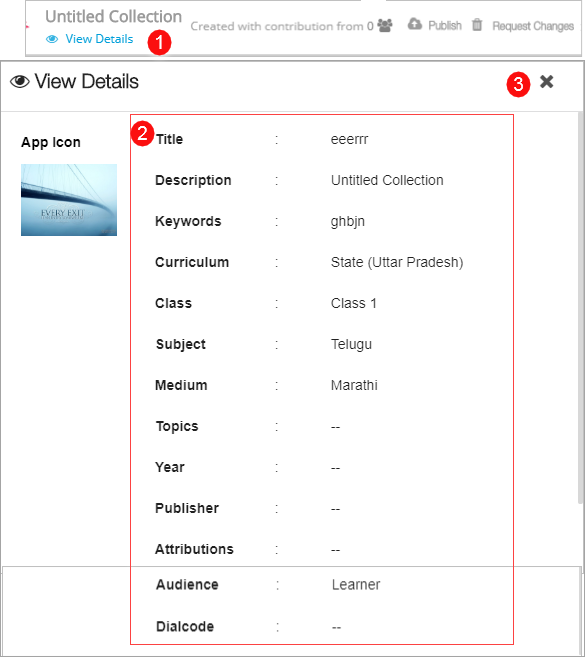
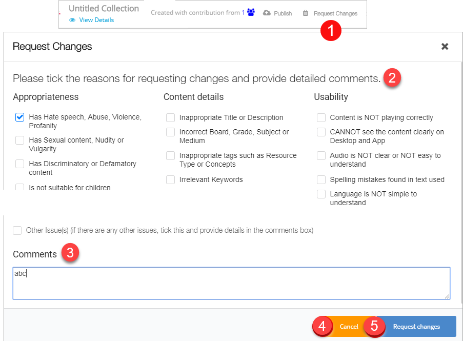
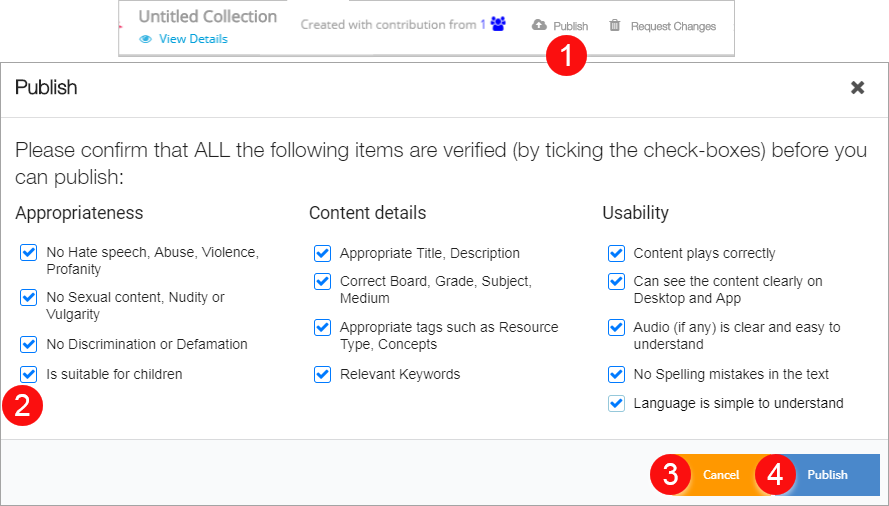

To ensure that books uploaded and available on DIKSHA are quality driven and adheres to standard guidelines, books can be published only after it undergoes a review. Organizations can assign reviewer rights to users and set guidelines to ensure the quality of the published content.  

## Prerequisites

<table>
  <tr>
    <th style="width:35%;">Step</th>
    <th style="width:65%;">Screen</th>
  </tr>
  <tr>
    <td> 1. You are logged in as the book reviewer
     2. You are on the <b>Workspace</b> tab
     3. You have clicked <b>Up for Review</b>
    </td>
    <td></td>
  </tr>
</table>

## Searching Book for Review
<table>
  <tr>
    <th style="width:35%;">Step</th>
    <th style="width:65%;">Screen</th>
  </tr>
 <tr>
    <td>1. Click <b>Up for Review</b>
     2. Type keywords to search any particular book to review. Keywords can be details of book name, author, concept
     3. Alternatively, apply filters to search for book
     4. Click <b>Sort by</b> to sort book. You can sort book based on:
       &emsp;a. Updated on
       &emsp;b. Created on
       &emsp;c. Alphabetically
     5. List of books which are up for review is displayed here
     6. Click on the page navigation to access the required list on a particular page
  </td>
  <td></td>
  </tr>
</table>

### Filtering Book 
<table>
  <tr>
    <th style="width:35%;">Step</th>
    <th style="width:65%;">Screen</th>
  </tr>
  <tr>
    <td>
      1. Click <b>Show Filters</b> to apply filters 
      2. Select the respective options from the following drop-down menus:
       &emsp;a. <b>Board</b>
       &emsp;b. <b>Class</b>
       &emsp;c. <b>Subject</b>
       &emsp;d. <b>Medium</b>
        3. Click <b>Apply</b> to apply filters and fetch the search results
      4. Click <b>Reset</b> to reset selected filter options
      5. Click <b>Review</b> to open the book which is sent for review. The review page is displayed
    </td>
    <td></td>
  </tr>
  </table>
  
## Reviewing Book
<table>
  <tr>
    <th style="width:35%;">Step</th>
    <th style="width:65%;">Screen</th>
  </tr>
  <tr>
    <td>1. Click <b>Review</b> to open the associated book content
     2. You can view the following details of the book:
     &emsp;a. <b>Name</b>
     &emsp;b. <b>Description</b>
     &emsp;c. <b>Topics</b>
     &emsp;d. <b>Keywords</b>
     &emsp;e. <b>QR code Required</b>
     &emsp;f. <b>QR code</b>
     3. Click <b>View Details</b> to view the book deatils 
     4. Click <b>Request Changes</b> to notify the creator to make changes in the book according to guidelines
     5. Click <b>Publish</b> to publish the book 
     6. Click <b>Contributor</b> icon to view the list of contributor 
   </td>
    <td></td>
   </tr>
  </table>

### Viewing Book Details
<table>
  <tr>
    <th style="width:35%;">Step</th>
    <th style="width:65%;">Screen</th>
  </tr>
  <tr>
    <td>1. Click <b>View Details</b> to view all details about the book
     2. Details such as Name, Description, Keyword, QR Code etc are displayed 
     3. Click <b>X</b> icon to exit the page
    </td>
    <td></td>
  </tr>
</table>

### Requesting Change in Book

<table>
  <tr>
    <th style="width:35%;">Step</th>
    <th style="width:65%;">Screen</th>
  </tr>
  <tr>
   <td>1. Click <b>Request Changes</b> to notify the creator to make changes in the book according to the guidelines. The <b>Request Changes</b> page is displayed
    2. Select the appropriate reason from the list 
    3. Enter comment in the <b>Comment</b> section
    4. Click <b>Cancel</b> to cancel  
    5. Click <b>Request Changes</b>   
    <b>Note:</b> Once changes are requested in the book, the creator is notified of the same and the book is rolled to draft stage</td> 
   <td></td>
  </tr>
</table>

### Publishing Book
<table>
  <tr>
    <th style="width:35%;">Step</th>
    <th style="width:65%;">Screen</th>
  </tr>
  <tr>
   <td>1. Click <b>Publish</b> to publish the book. The <b>Publish</b> page is displayed
    2. Select all check boxes to confirm appropriateness, relevance, and usability of the book
    3. Click <b>Cancel</b> to cancel 
    4. Click <b>Publish</b> to publish the book
      <b>Note:</b> Once published the creator is notified of the same and the book becomes available in the Library section of DIKSHA  
   </td>
    <td></td>
  </tr>
  </table>
