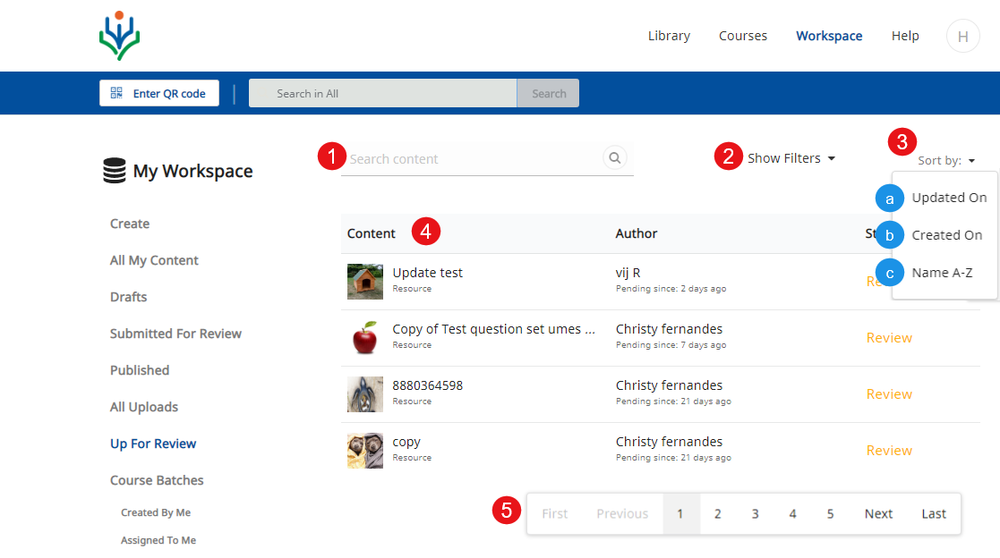
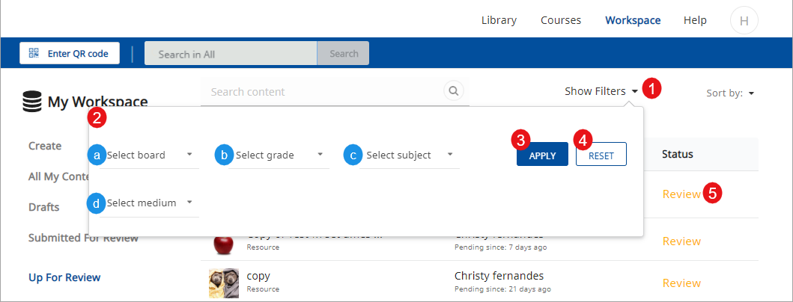
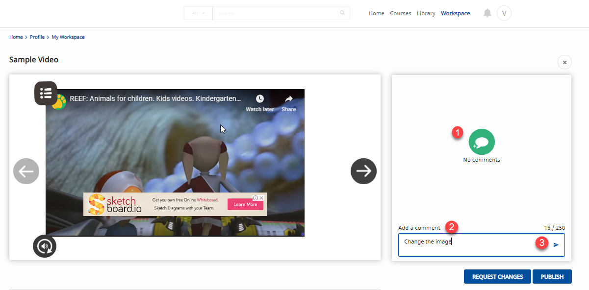

To ensure that content uploaded and available on DIKSHA are quality driven and adheres to standard guidelines. Content can be published only after it undergoes a review. Organizations can assign reviewer roles to users and set guidelines to ensure the quality of the published content.

## Prerequisites

<table>
  <tr>
    <th style="width:35%;">Step</th>
    <th style="width:65%;">Screen</th>
  </tr>
  <tr>
    <td>
      1. You are logged in as the content reviewer
      2. You are on the <b>Workspace</b> tab
      3. You have clicked <b>Up for Review</b>
      </td>
      <td></td>
  </tr>
</table>

### Searching Content for Review

<table>
  <tr>
    <th style="width:35%;">Step</th>
    <th style="width:65%;">Screen</th>
  </tr>
 <tr>
    <td>1. Type keywords to search any particular content to review. Keywords can be details of content name, author, concept
      2. Alternatively, apply filters to search for content
      3. Click <b>Sort by</b> to sort content. You can sort content based on:
        &emsp;a. Last updated date
        &emsp;b. Last created date
        &emsp;c. Alphabetically
      4. You can view the list of content which is up for review
      5. Click on the page navigation to access the required list on a particular page
  </td>
    <td></td>
  </tr>
</table>

### Filtering Content

<table>
  <tr>
    <th style="width:35%;">Step</th>
    <th style="width:65%;">Screen</th>
  </tr>
  <tr>
    <td>
      1. Click <b>Show Filters</b> to apply filters
      2. Select the respective options from the following drop-down menus:
        &emsp;a. Board
        &emsp;b. Grade
        &emsp;c. Subject
        &emsp;d. Medium
      3. Click <b>Apply</b> to apply filters and fetch the search results
      4. Click <b>Reset</b> to reset selected filter options
      5. Click <b>Review</b> to open the content which is sent for review. The review page is displayed
    </td>
    <td></td>
  </tr>
</table>

## Reviewing Content

<table>
  <tr>
    <th style="width:35%;">Step</th>
    <th style="width:65%;">Screen</th>
  </tr>
  <tr>
   <td>1. You can view the associated content
     2. Click <b>Menu</b> icon to view, replay, and enable or disable sound
     3. Scroll down to view the <b>Description</b> and <b>Content Information</b>
     4. Click <b>Request Changes</b> to guide the creator to make changes in the content according to the guidelines. The Request Change page is displayed
     5. Click <b>Publish</b> to publish the content. The Publish page is displayed 
    <b>Note</b>: Reviewers can provide review comments at a page level for a resouce. For more information, refer to the <a href="#providing-review-comments-for-resources">Providing Review Comments for Resources</a>
   </td>
    <td></td>
   </tr>
</table>

### Requesting Change in Content

  <table>
  <tr>
    <th style="width:35%;">Step</th>
    <th style="width:65%;">Screen</th>
  </tr>
  <tr>
   <td>1. The <b>Request Changes</b> page appears
    2. Select the appropriate reasons from the list
    3. Enter comment in the <b>Comment</b> section
    4. Click <b>Request Changes</b>
    5. Click <b>Cancel</b> to cancel
      <b>Note:</b> On requesting changes, the creator is notified of the same and the content is rolled back to draft stage.
     </td>
    <td></td>
  </tr>
  </table>

### Providing Review Comments for Resources

  <table>
  <tr>
    <th style="width:35%;">Step</th>
    <th style="width:65%;">Screen</th>
  </tr>
  <tr>
  To add review comments for any particular slide or page in a resource, select the resource from <b>Up for Review</b> tab. A window is displayed
   <td> 1. Click the comment box icon on the left pane of the Resource's window. A field is displayed
    2. Enter your comment in the comment field 
     3. Click the arrow icon to save your comment
      You can provide multiple comments. The comments will be displayed on the left pane. The comment box icon disappears after you provide your first comment
   </td>
    <td></td>
   </tr>
  </table>

### Publishing Content

To publish a content ensure all the resources are published individually. Even when a single resource is not published, the entire collection, book, or a course cannot be published.  
A published book can be made available to the users for consumption. When you publish a course, an open batch is created so that users can enrol and consume content.

<table>
  <tr>
    <th style="width:35%;">Step</th>
    <th style="width:65%;">Screen</th>
  </tr>
  <tr>
   <td>1. The <b>Publish</b> page is displayed
    2. Select all check boxes to confirm appropriateness, relevance, and usability of the content
    3. Click <b>Publish</b> to publish the content
      <b>Note:</b>The creator is notified about the published content and the content will be available on DIKSHA for consumption
    4. Click <b>Cancel</b> to cancel
   </td>
    <td></td>
  </tr>
  </table>